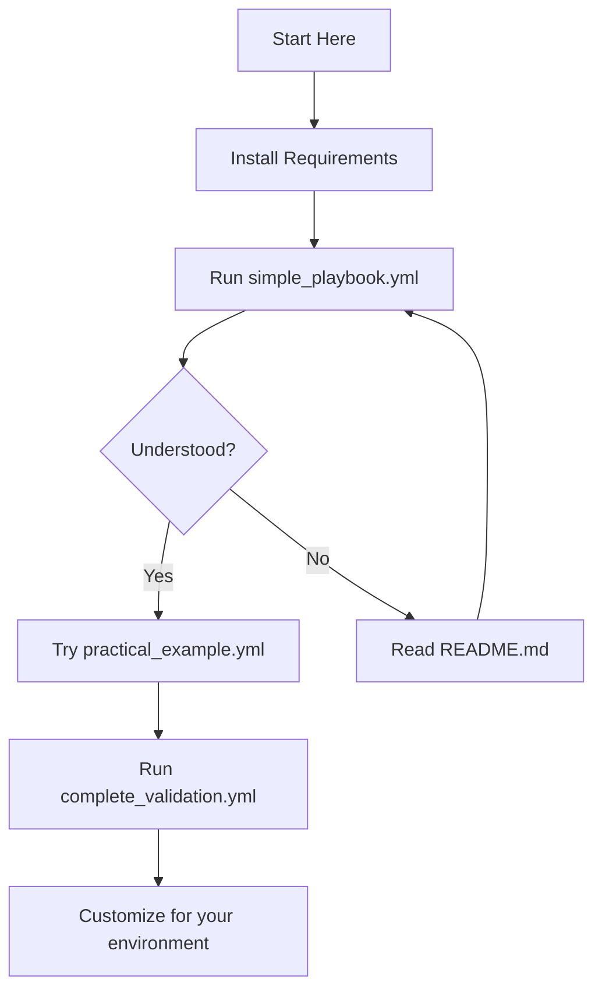

# IP Subnet Validation - Complete Index

## Quick Navigation

| Document | Purpose | When to Use |
|----------|---------|-------------|
| **[README.md](README.md)** | Complete guide with concepts and best practices | Learning and reference |
| **[QUICK-REFERENCE.md](QUICK-REFERENCE.md)** | Code snippets and one-liners | Quick copy-paste solutions |
| **[EXAMPLES.md](EXAMPLES.md)** | Example output and usage patterns | See what to expect |
| **[requirements.yml](requirements.yml)** | Ansible dependencies | Installation |

## Playbooks

### For Learning

| Playbook | Complexity | Purpose | Run Time |
|----------|-----------|---------|----------|
| `simple_playbook.yml` | ⭐ Easy | Basic IP validation | < 5s |
| `practical_example.yml` | ⭐⭐ Medium | Real-world pattern | < 5s |
| `complete_validation.yml` | ⭐⭐⭐ Advanced | Detailed reporting | < 10s |

### For Production

- **`practical_example.yml`** - Best for: Pre-deployment validation, filtering IPs
- **`complete_validation.yml`** - Best for: Audits, compliance checks, detailed reports

## Quick Start Path



### Step-by-Step

1. **Install dependencies** (5 minutes)
   ```bash
   ansible-galaxy collection install ansible.utils
   pip install netaddr
   ```

2. **Run simple example** (2 minutes)
   ```bash
   ansible-playbook simple_playbook.yml
   ```

3. **Understand the output** (5 minutes)
   - See [EXAMPLES.md](EXAMPLES.md#example-1-simple-validation)

4. **Try with your data** (10 minutes)
   ```bash
   ansible-playbook practical_example.yml \
     -e '{"corporate_subnets": ["your", "subnets"], "server_ips": ["your", "ips"]}'
   ```

5. **Read best practices** (15 minutes)
   - See [README.md](README.md#tips-and-best-practices)

## Use Case Index

### I want to...

#### Validate IPs Before Deployment
→ Use `practical_example.yml`
- Shows approved/rejected lists
- Easy to integrate into deployment scripts
- [Example Output](EXAMPLES.md#example-2-practical-validation)

#### Run Compliance Audits
→ Use `complete_validation.yml`
- Detailed reports with matching subnets
- Shows which subnet(s) each IP matches
- Automatically fails on invalid IPs
- [Example Output](EXAMPLES.md#example-3-complete-validation-with-detailed-reporting)

#### Integrate into CI/CD
→ Use `complete_validation.yml`
- Fails pipeline if invalid IPs found
- [Integration Example](EXAMPLES.md#cicd-pipeline)

#### Learn the Basics
→ Start with `simple_playbook.yml`
- Minimal, easy to understand
- [Walkthrough](README.md#1-simple-validation-simple_playbookyml)

#### Get Code Snippets
→ See [QUICK-REFERENCE.md](QUICK-REFERENCE.md)
- Copy-paste ready code
- All common patterns
- One-liners

#### Troubleshoot Issues
→ See [README.md - Troubleshooting](README.md#troubleshooting)
- Common errors and solutions
- Debug commands

## Code Patterns Index

### Basic Patterns

| Pattern | Location | Description |
|---------|----------|-------------|
| Single IP check | [QUICK-REFERENCE.md#check-if-single-ip-is-in-subnet](QUICK-REFERENCE.md#check-if-single-ip-is-in-subnet) | Check one IP against one subnet |
| Multiple subnet check | [QUICK-REFERENCE.md#check-if-ip-is-in-any-subnet-from-list](QUICK-REFERENCE.md#check-if-ip-is-in-any-subnet-from-list) | Check IP against list of subnets |
| Batch validation | [QUICK-REFERENCE.md#validate-list-of-ips](QUICK-REFERENCE.md#validate-list-of-ips) | Validate many IPs at once |

### Advanced Patterns

| Pattern | Location | Description |
|---------|----------|-------------|
| Pre-deployment check | [README.md#1-pre-deployment-validation](README.md#1-pre-deployment-validation) | Validate before deploying |
| Security audit | [README.md#2-security-audit](README.md#2-security-audit) | Find unauthorized IPs |
| CI/CD integration | [EXAMPLES.md#cicd-pipeline](EXAMPLES.md#cicd-pipeline) | Pipeline validation |
| Report generation | [EXAMPLES.md#generate-report-file](EXAMPLES.md#generate-report-file) | Save validation results |

## File Reference

```
008_validate_ip_in_subnets/
├── INDEX.md (this file)                    # Navigation and quick start
├── README.md                               # Complete documentation
├── QUICK-REFERENCE.md                      # Code snippets and one-liners  
├── EXAMPLES.md                             # Example output and usage
├── requirements.yml                        # Ansible dependencies
│
├── simple_playbook.yml                     # ⭐ Start here - basic validation
├── practical_example.yml                   # ⭐⭐ Real-world pattern
├── complete_validation.yml                 # ⭐⭐⭐ Advanced with reporting
│
└── test_examples.sh                        # Run all examples
```

## Common Tasks

### Test Everything
```bash
./test_examples.sh
```

### Customize Variables
```bash
# Create your own config
cat > my_networks.yml <<EOF
allowed_subnets:
  - "10.0.0.0/8"
  - "172.16.0.0/12"
ip_addresses:
  - "10.1.1.1"
  - "192.168.1.1"
EOF

# Use it
ansible-playbook simple_playbook.yml -e @my_networks.yml
```

### One-Liner Test
```bash
ansible localhost -m debug -a "msg={{ '10.1.1.1' | ansible.utils.ipaddr('10.0.0.0/8') }}"
```

## Related Examples

This example is part of a larger collection:

- **Example 1-3**: Basic Ansible patterns
- **Example 4**: [Validate Virtual Media Ejection](../004_validate_virtual_media_ejection/) - Server hardware validation
- **Example 5**: [Block/Rescue/Retry](../005_block_rescue_retry/) - Error handling patterns
- **Example 6**: [Parallel Execution via Bastion](../006_parallel_execution_via_bastion/) - Scaling validation
- **Example 7**: [Monitor ISO Boot](../007_monitor_iso_boot/) - Server monitoring
- **Example 8**: **This example** - Network validation

## Getting Help

### Quick Checks

1. **Collection installed?**
   ```bash
   ansible-galaxy collection list | grep ansible.utils
   ```

2. **Filter working?**
   ```bash
   ansible localhost -m debug -a "msg={{ '10.1.1.1' | ansible.utils.ipaddr('10.0.0.0/8') }}"
   ```

3. **Python netaddr installed?**
   ```bash
   python3 -c "import netaddr; print('OK')"
   ```

### Documentation

- [Ansible Utils Collection](https://docs.ansible.com/ansible/latest/collections/ansible/utils/)
- [netaddr Library](https://netaddr.readthedocs.io/)
- [Ansible Filters](https://docs.ansible.com/ansible/latest/user_guide/playbooks_filters.html)

## Contributing

Found an issue or have a suggestion? This is part of the ansible-examples collection in the gemini-workspace repository.

---

**Last Updated:** December 2025  
**Ansible Version:** 2.9+  
**Collection Version:** ansible.utils 2.5.0+

