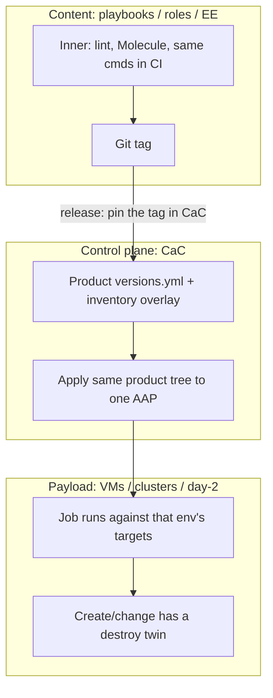

---
review:
  status: unreviewed
  notes: "AI-generated 2026-09-09. Draft for peer feedback. AAP/Ansible SDLC with product-folder CaC, pinned content, experiment orgs. Unslop pass 2026-09-09."
---

# Ansible and AAP as an SDLC — discussion draft

> **Audience:** Platform and automation engineers already running AAP CaC (product folders, CoP-style dispatch) who want a shared picture before changing a live repo.
> **Purpose:** Get feedback on a model that treats playbooks, controller objects, and payload (VMs, clusters, day-2) as one promotion problem, not three separate tools.

This is a shape, not a migration plan.
The [example tree](example/) is illustrative.
The preview playbook does not talk to a controller.

---

## The gap

Red Hat and CoP material covers **CaC of the controller** well: git as source of truth, apply via `infra.aap_configuration`, promote through environments.

A second pile covers **content**: lint, Molecule, execution environments, Hub.

What we actually run is a third thing: jobs that create and change infrastructure (VMs, OpenShift clusters, worker nodes).
Apply-only CaC does not delete what you remove from git.
Copying product YAML into an "experiment" folder forks the control plane.
Env **branches** duplicate the product tree for the wrong reason.

This draft assumes CaC is already split by **product**, not by `config/dev|qa|prod`.
Keep that.
Environment is which AAP you apply to, plus which pin and credentials that inventory injects.

---

## Three artifacts, one promotion



| Artifact | Develop AAP | Integration AAP | Production AAP |
|---|---|---|---|
| **Content** | Branch or SHA allowed | Tagged revision only | Same tag that passed integration |
| **CaC** | Durable product tree + optional experiment org | Durable tree only | Durable tree only |
| **Payload** | Lab / disposable cluster | Lab that stands in for prod | Real targets, change window |

Fixes go back to the playbook repo (or a small CaC delta), not a UI hotfix on production AAP.

CaC merge is the **deploy decision**.
A playbook tag is a **content release**.
Those are different git repos, or at least different cadences.
When the two are joined, cutting a tag opens a CaC MR that bumps that product's pin.
This PoC does not implement that bot.

---

## Product folders, not env folders

```
config/
  platform/          # orgs of record, EE definitions, credential types
  ocp-day2/          # one product, one tree
    versions.yml     # default content pin (git tag)
    durable/         # JTs, projects, workflows. organization is a variable
    experiments/     # manifests only
  vm-automation/
```

Apply:

```bash
ansible-playbook playbooks/aap_config.yml -i inventories/develop.yml
ansible-playbook playbooks/aap_config.yml -i inventories/integration.yml
ansible-playbook playbooks/aap_config.yml -i inventories/production.yml
```

Same YAML.
Inventories supply `aap_hostname`, credential instances, `product_org`, and `content_revision` (prod may lag).

Do not maintain `config/dev` vs `config/prod` copies of the same job templates.
Do not use Git branches named `dev` / `prod` for CaC.

---

## Experiments: retarget, do not clone

A **content** experiment (same JTs, different git ref) is a manifest:

```yaml
product: ocp-day2
org: exp-EXP-123-add-workers
scm_revision: feat/add-workers
inventory: lab-ocp
expires: "2026-09-23"
```

Apply to **develop AAP only**: set `product_org` / `content_revision` from the manifest, then include the **same** `durable/` files.
The experiment org is created because `durable/organizations.yml` uses `{{ product_org }}`.

A **control-plane** experiment (new survey, extra workflow node) adds a **delta** file next to the manifest, not a copy of the product folder.
If it graduates, that delta is the CaC MR into `durable/`.

Copy-paste of the whole product tree is the failure mode: promotion becomes a manual diff, and apply-only CaC leaves the old objects behind.

The isolation unit in this draft is **one experiment = one AAP organization**.
Deleting the org is the garbage collector apply-only dispatch does not give you.
A prefix inside a shared Sandbox org is cheaper (shared inventory) and easier to get wrong with `object_diff`.

---

## Delete is a separate play

`infra.aap_configuration` will absent objects you still list.
It will not absent objects you merely removed from git.
Rename is the same bug.

| Layer | Use |
|---|---|
| Experiment org `state: absent` | Default experiment GC |
| Reverse apply / teardown play | When you cannot delete the org |
| `object_diff` (CoP extended) | Drift on **durable** product orgs only. Never unscoped on develop AAP if experiments live there. |

Payload is not the org.
Teardown order: run the destroy/scale-in twin, then absent the experiment org.

---

## Example

Walk the tree and run the preview (localhost, no AAP): [example/README.md](example/README.md).

Quality gates, Ansible tools, agent instructions, and GitHub/GitLab stubs: [quality-assurance.md](quality-assurance.md).

---

## What we want feedback on

1. **Org per experiment** vs name prefix in one Sandbox org. Which matches how you already slice AAP orgs?
2. **Templating** `organization: "{{ product_org }}"` and `scm_revision: "{{ content_revision }}"` in durable YAML. Acceptable, or too magical for reviewers?
3. **Pins per AAP inventory** (prod lags) vs one `versions.yml` applied everywhere on CaC merge?
4. **Payload destroy twin.** Same workflow graph as create, or a separate JT that experiments must remember to run?
5. **`object_diff` scoped to a product org.** Do multiple products already share one org? If yes, exclusive reconcile cannot key off the folder alone.
6. **ansible-lint profile** (`moderate` vs `production`) and whether an agent may launch jobs on develop AAP. See [quality-assurance.md](quality-assurance.md).

---

## Related reading

- [Development Sandboxes](https://agiledata.org/essays/sandboxes.html) (Ambler). Blast radius. Fixes go back to development.
- [aap_configuration_template](https://github.com/redhat-cop/aap_configuration_template). We keep product folders. We do not adopt env folders or env branches.
- [Manage automation controller CaC with Ansible](https://www.redhat.com/en/blog/ansible-automation-controller-cac-gitops). Promote after test. Scheduled reconcile. Their env **branches** are the part we are not taking.
- [Creating an Ansible controller CaC pipeline](https://www.redhat.com/en/blog/creating-ansible-controller-config-code-pipeline). System org, org-admin service users, webhook per stage (not fan-out to every AAP).
- [How to start CaC for an Ansible instance](https://developers.redhat.com/articles/2025/05/27/how-start-configuration-code-ansible-instance). Drift / delete-from-git as a requirement (`delete_objects` lives in community `configify`. CoP path is `object_diff`).
- [Ansible development workspaces](https://developers.redhat.com/articles/2026/08/21/red-hat-ansible-development-workspaces). Content inner/outer loop. "Controller syncs the project" is floating HEAD, not a pin.
- [object_diff](https://github.com/redhat-cop/aap_configuration_extended/tree/devel/roles/object_diff). API vs git exclusive-ish reconcile.
- [Automate OCP with RHACM and AAP](../../../library/automate-ocp-cluster-deployment-rhacm-aap.md). Payload pipeline this CaC story has to host.
- [AAP operator on OpenShift](../aap-operator-on-openshift.md). GitOps of the operator CR is a different layer from CaC of job templates.
- [Bare-metal dev sandbox](../../bare-metal-dev-sandbox/README.md). Ambler sandboxes on **targets**, not extra AAP instances.

---

*This content was created with AI assistance. See [AI-DISCLOSURE.md](../../../AI-DISCLOSURE.md) for how to interpret AI-generated content in this workspace.*
