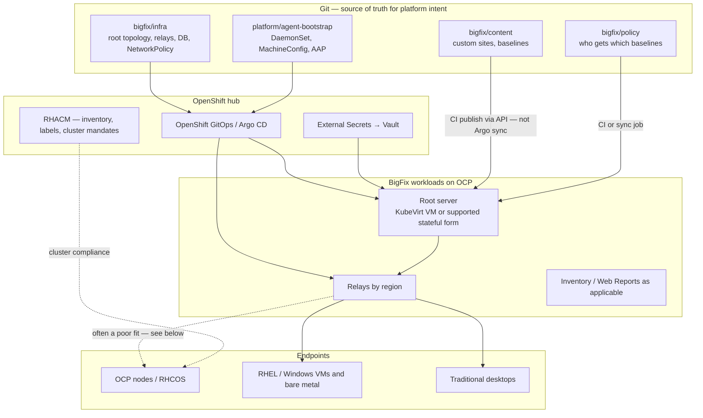

# BigFix on OpenShift with GitOps — Food for Thought

> **Audience:** Platform engineers and architects who know OpenShift GitOps (Argo CD ± RHACM) and want a clear mental model for where HCL BigFix fits — or does not
> **Purpose:** Learning resource and discussion starter — not a deployment runbook.
> Use it to plot ownership before anyone proposes "we'll just GitOps BigFix onto the hub."

**Product name:** **HCL BigFix** (HCLSoftware).
IBM divested BigFix to HCL in 2019; many shops still say "IBM BigFix" out of habit.
For current install, support, and feature docs, use [HCL BigFix documentation](https://help.hcl-software.com/bigfix/landing/index.html) — not legacy IBM Knowledge Center pages (those are mostly divestiture notices).

**Status:** Speculative architecture.
No claim that this pattern has been production-validated in this workspace.
Product packaging and supported topologies change — verify against current HCL docs before design commits.

---

## Why this note exists

BigFix and OpenShift GitOps solve adjacent problems with different contracts.

| BigFix | OpenShift GitOps (typical) |
|--------|----------------------------|
| Agent evaluates Fixlets locally | Controller reconciles Kubernetes objects from Git |
| Content sites, baselines, computer groups | Applications, ApplicationSets, Helm values |
| Patch / inventory / compliance on endpoints | Desired state for cluster and platform config |
| Deviation is "relevant / not relevant" on a computer | Deviation is OutOfSync or non-compliant on a cluster |

Teams that already run a [GitOps-heavy hub-and-spoke](fleet-control-spectrum.md#reference-posture-gitops-heavy-hub-and-spoke) posture sometimes ask:

> Can we put BigFix end-to-end on OpenShift and manage it the same way we manage cert-manager?

Short answer: **parts yes, the evaluation engine no — unless you replace BigFix's job with something else.**

This note unpacks that.

---

## On this page

- [Three planes](#three-planes-do-not-collapse-them)
- [Reference picture](#reference-picture)
- [What GitOps can own](#what-gitops-can-own)
- [What stays BigFix-native](#what-stays-bigfix-native)
- [Ownership matrix](#ownership-matrix-one-owner-per-concern)
- [RHCOS and OCP nodes](#rhcos-and-ocp-nodes)
- [Spectrum mapping](#mapping-to-the-fleet-control-spectrum)
- [MVP vs fuller vision](#mvp-vs-fuller-vision)
- [Discussion prompts](#discussion-prompts-for-the-team)
- [Related reading](#related-reading)

---

## Three planes (do not collapse them)

Treat BigFix as three planes with different GitOps fitness.

| Plane | Traditional BigFix | GitOps-shaped role |
|-------|--------------------|--------------------|
| **Control plane** | Root server, DSA, consoles, reports | Deploy topology and config *around* the server from Git |
| **Distribution plane** | Relays | Relays as Deployments/Services; placement by region/site labels |
| **Endpoint plane** | Agents + Fixlets / baselines | Bootstrap agents where appropriate; **evaluation still BigFix** |

Git can be the contract for *infrastructure and intent*.
BigFix remains the contract for *endpoint relevance and remediation* unless you deliberately move that work to Compliance Operator, MachineConfig, ACM Policy, or Ansible.

Collapsing those planes is how designs claim "100% GitOps BigFix" and then discover Fixlets do not `kubectl apply`.

---

## Reference picture

Two reconciliation loops, not one:

1. **Argo loop** — Kubernetes objects for BigFix infra and (optionally) agent bootstrap.
2. **Content loop** — Git → CI → BigFix REST/API (or console-as-code) → sites and baselines on the root.

If you only build loop 1, you GitOps the *appliance*, not the *product*.

---

## What GitOps can own

### Deploy the appliance

Candidates for Argo Applications / ApplicationSets:

- Namespace, NetworkPolicy, Routes or Ingress, certificates
- Persistent volumes / external DB connection config
- Relay Deployments and Services, one ApplicationSet entry per region or site
- External Secrets bindings for masthead password, DB credentials, license material

**Root server reality check:**
The root is stateful, licensed, and historically not a disposable 12-factor Deployment.
A realistic OCP placement is often a **KubeVirt VM** (or a vendor-supported container topology if one exists for your version) with Git describing the VM and surrounding platform objects — same pattern as other enterprise control planes that are not cloud-native.

### Bootstrap agents where the OS allows it

| Target | Typical delivery |
|--------|------------------|
| RHEL / Windows VMs | cloud-init, Ignition, or AAP from ACM PolicyAutomation |
| Bare metal outside OCP | Existing relay enrollment; Git tracks assignment policy |
| OCP workers (RHCOS) | See [RHCOS section](#rhcos-and-ocp-nodes) — default skepticism |

### Drive *membership* from fleet labels

Reuse the same targeting idea as ApplicationSets:

- ACM (or Git `cluster.yaml`) owns labels such as `patch-ring: canary`
- A sync job or BigFix computer-group definition maps those labels to BigFix groups
- Baselines attach to groups, not to ad-hoc console clicks

That keeps fleet identity in one place — consistent with the [targeting axis](fleet-control-spectrum.md#axis-4-targeting-and-identity) in the spectrum note.

---

## What stays BigFix-native

These do not become Argo-managed Kubernetes resources:

| Artifact | Why |
|----------|-----|
| Fixlets, Tasks, Analyses | BES content language; evaluated by agents |
| Baselines and site subscriptions | Product semantics, not CRDs |
| Relevance expressions | Client-side; Git can version them, Argo cannot apply them |
| Action history / remediation state | Lives in BigFix, not in `kubectl get` |

**Content-as-code pattern (the second loop):**

1. Custom sites and overlays live in Git.
2. CI lints and optionally tests against a lab root.
3. Merge publishes to the target root via supported APIs.
4. Promotion mirrors your trunk or environment branch discipline for the Argo catalog.

Upstream HCL content sites remain subscribed at the product layer.
Git owns *your* overlays and the evidence of who approved them.

HCL's stronger OpenShift-facing story today is often **inventory / software discovery against the Kubernetes API**, not "BigFix deploys OpenShift."
Treat Inventory plugin config as Git-managed config; treat cluster desired state as still owned by GitOps/ACM.

---

## Ownership matrix (one owner per concern)

Same rule as Argo vs ACM: **one controller of record per concern.**
Dual enforce on the same host setting is an outage waiting for a sync window.

| Concern | Prefer | Avoid |
|---------|--------|-------|
| BigFix root / relay topology on OCP | Argo | Manual `oc apply` snowflakes |
| Secrets for BigFix | ESO / Vault via Argo | Secrets committed to Git |
| Custom Fixlets and baselines | Git + CI publish | Console-only forever |
| Computer group membership at scale | Labels in Git/ACM → sync | Purely manual groups with no export |
| OCP cluster operators, SCC, NetworkPolicy | Argo ± ACM Policy | BigFix Fixlets aimed at kube-apiserver behavior |
| RHCOS node config | MachineConfig / MCO | BigFix as primary node mutator |
| RHEL guest OS patching (VM / bare metal) | BigFix baselines | Hoping Argo will patch inside the guest |
| "Is this *cluster* compliant?" for auditors | ACM Policy reports | Screenshots of BigFix only |
| "Is this *endpoint* patched?" | BigFix reports / Inventory | Claiming Argo sync status answers CVE posture |
| Container image / runtime inventory | BigFix Inventory plugins (where licensed) | Replacing ImageStream / Quay governance |

Print this table in design reviews.
Fill the empty cells for *your* estate before buying topology.

---

## RHCOS and OCP nodes

RHCOS is image-based and MachineConfig-reconciled.
That fights classic agent-plus-Fixlet culture:

- Agents need privilege and persistence models that sit awkwardly on immutable nodes.
- Fixlets that mutate the host compete with MCO.
- Many "patch the node" outcomes are better expressed as **MachineConfig / ClusterVersion / operator updates** under GitOps.

Pragmatic defaults for discussion:

1. **Do not** make OCP workers the flagship BigFix use case.
2. **Do** use BigFix for the non-OCP estate (RHEL VMs, Windows, appliances) that still needs patch baselines.
3. **Do** consider Inventory integration for container software visibility if SAM is the driver.
4. If an agent on every worker is a hard requirement, treat it as an exception with an explicit owner and a written non-conflict rule vs MCO — not as the happy path.

---

## Mapping to the fleet control spectrum

Read this beside [fleet-control-spectrum.md](fleet-control-spectrum.md).

| Axis | BigFix-on-OCP implication |
|------|---------------------------|
| **Reconciliation authority** | Argo for BigFix *infra*; BigFix for *endpoint* remediation; ACM for *cluster* mandates — three authorities, deliberately split |
| **Compliance posture** | BigFix "relevant" ≠ ACM "non-compliant." Executives need both answers named |
| **Lifecycle scope** | Day 0 for BigFix appliances can be GitOps; Day 0 for OCP clusters stays CIM/ZTP/ACM or install tooling |
| **Targeting** | Prefer shared labels over two independent taxonomies (Argo generators vs BigFix groups) |
| **Ownership** | Platform owns appliance Git; security/endpoint team owns content Git; clarify PR paths |
| **Drift semantics** | Argo OutOfSync on relays; BigFix open actions on endpoints; do not merge those UIs without design |
| **Secrets** | Same ESO posture as the rest of the fleet catalog |

**Reconsideration trigger (new):** Day-2 work that is *guest OS patching* is outside Argo's job.
That is the spectrum's "external automation" trigger — BigFix (or AAP) is the bridge, not an ApplicationSet.

---

## MVP vs fuller vision

| Tier | What you build | What you learn |
|------|----------------|----------------|
| **MVP** | Relays (and optionally WebUI) on OCP via Argo; root elsewhere or as one KubeVirt VM; agents on non-OCP estate; custom content in Git with CI publish | Whether the *second loop* (content-as-code) is culturally adoptable |
| **Fuller** | Root + relays + Inventory on OCP; label-driven group sync from ACM; explicit ownership matrix signed by platform and endpoint teams; SAM reports into CMDB | Whether dual compliance reporting is acceptable to auditors |

Do not skip MVP.
Most failed "GitOps BigFix" pitches fail the content loop or the RHCOS assumption — not the YAML for a relay Service.

---

## Discussion prompts for the team

Use in a working session (30–45 minutes).
Capture answers in the ownership matrix above.

1. **Which endpoints are in scope?** OCP nodes, RHEL VMs, Windows, all three?
2. **What question must BigFix answer that Argo/ACM cannot?** (Usually: guest patch/CVE posture, or SAM.)
3. **Who owns custom content PRs?** Platform, security, or a shared CODEOWNERS split?
4. **Where does the root run?** Existing VM estate, KubeVirt on the hub, or vendor container support you have verified?
5. **How do we prevent dual controllers?** Name three settings that must *never* be both a Fixlet and a MachineConfig/Policy.
6. **What does "compliant" mean in the exec slide?** One word for clusters, one word for endpoints — or admit they differ.
7. **Is Inventory-on-OCP the actual goal?** If yes, the design shrinks; if no, do not let SAM demos drive control-plane topology.

---

## Related reading

| Topic | Location |
|-------|----------|
| Fleet control axes and GitOps-heavy posture | [fleet-control-spectrum.md](fleet-control-spectrum.md) |
| Hub-and-spoke Argo framework | [argo/examples/framework/](argo/examples/framework/) |
| RHACM config in Git | [rhacm/git-driven-configuration.md](rhacm/git-driven-configuration.md) |
| ACM + Ansible for work outside the cluster | [library: RHACM + AAP](../library/automate-ocp-cluster-deployment-rhacm-aap.md) |
| Follow-up idea log | [fleet-management-ideas.md](fleet-management-ideas.md) |

External (HCL — verify version for your license):

- [HCL BigFix documentation landing](https://help.hcl-software.com/bigfix/landing/index.html) — canonical product docs
- [Software discovery in containers](https://help.hcl-software.com/bigfix/11.0/Inventory/softinv/r_software_discovery_container.html) — Inventory ↔ Kubernetes / OpenShift API (pin version path to what you run)
- [HCL BigFix product home](https://www.hcl-software.com/bigfix/home) — positioning and modules
- IBM pages titled "IBM BigFix … Divestiture notification" — ownership/history only; not day-to-day ops docs

---

*This document was created with AI assistance (Cursor) and has not been fully reviewed by the author.
See [AI-DISCLOSURE.md](../AI-DISCLOSURE.md) for how to interpret AI-generated content in this workspace.*
