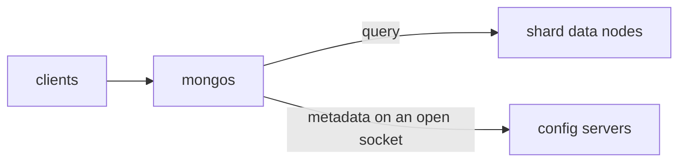
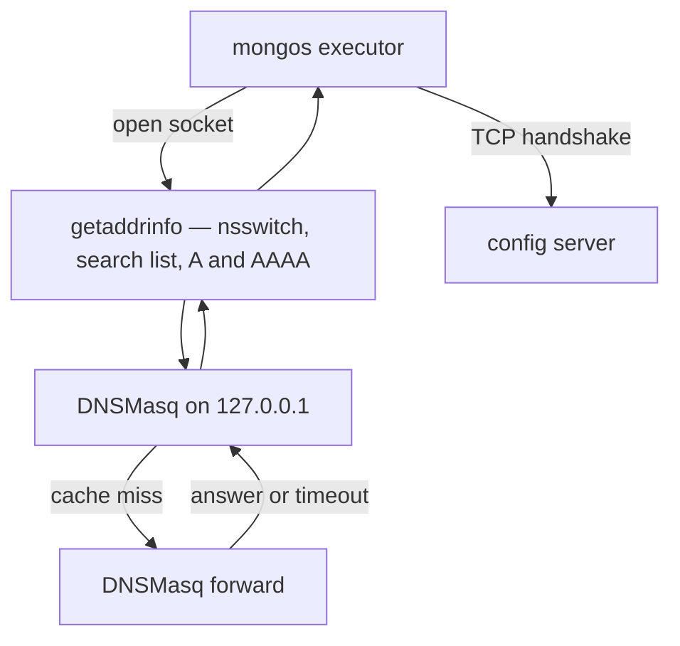
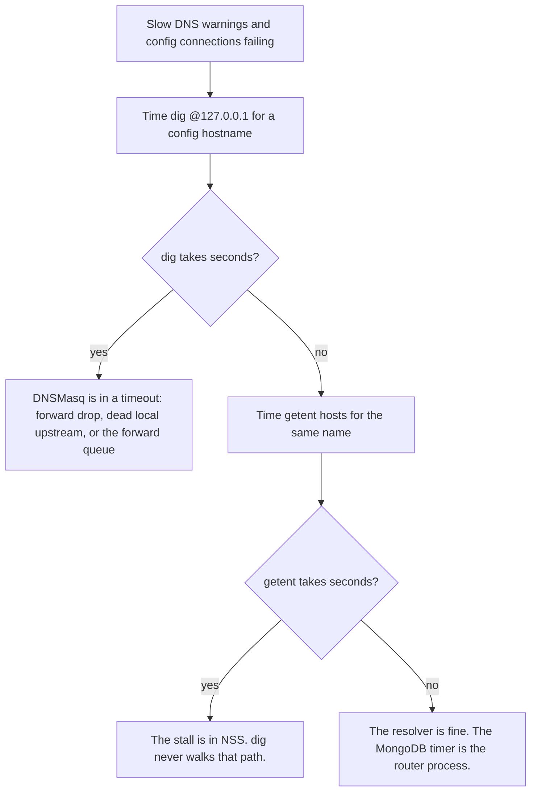
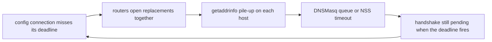

---
review:
  status: unreviewed
  notes: "2026-10-08 incident model. DNS timings, nsswitch, and dnsmasq config were not measured on the routers. MongoDB ticket text is from the public Jira summaries."
---

# Router-to-config DNS — cause, symptom, or the loop

> **Audience:** Whoever is deciding whether the next capture on the mongos hosts is DNSMasq, NSS, or the mongos process itself.
>
> **Purpose:** Show why slow local DNS and dropped config-server connections can each produce the other, and which measurement splits them.

Reported shape of the incident: a high volume of connections dropping between the mongos routers and the config servers, with MongoDB logging DNS lookups that take multiple seconds, at over 1000 lookups per minute.
Those lookups stay on the router host and hit a local DNSMasq.
They do not show up as DNS leaving the box.

---

## What is steady state

Clients talk to mongos.
mongos talks to the shards that hold the data, and to the config server replica set that stores the map of which chunks live where.
The config-server sockets are supposed to stay open.
DNS is on the path that opens a socket, not on the path that uses one.

A resolver timeout does not reset a TCP session that is already up.
It delays the next handshake.
MongoDB then records the peer as failed once the connect deadline passes.
The public ticket [SERVER-53662](https://jira.mongodb.org/browse/SERVER-53662) shows that pair of lines together: `DNS resolution while connecting to <host> took Nms`, then `Marking host <host> as failed` with `NetworkInterfaceExceededTimeLimit: Couldn't get a connection within the time limit`.
Live-socket resets and idle timeouts are a different event.
They still cause a reconnect, and the reconnect is where DNS shows up.

---

## Where the seconds go

mongos resolves the config host with `getaddrinfo` on a networking thread, and the warning is that call's wall time.
Wall time includes a slow answer, and it also includes the thread sitting runnable while the process is starved.
Three clocks can print the same line.

| Clock | What it measures | Fast result means |
|-------|------------------|-------------------|
| `dig @127.0.0.1` | DNSMasq, one query, no NSS | The cache or the forward answered |
| `getent hosts` | The call mongos makes | NSS, search suffixes, AAAA, mdns, or sssd are quiet |
| MongoDB's warning | Wall time on the executor thread | The thread actually got through `getaddrinfo` quickly |

A cache hit from DNSMasq is sub-millisecond.
Multi-second answers to `127.0.0.1` mean something is waiting out a timeout.
Common shapes, given traffic that never leaves the host: DNSMasq forwards and the forward is dropped on the box, the forward target is another local resolver that does not answer, or AAAA queries die while A queries do not.
`dig` of an A record will look healthy in that last case.
`getaddrinfo` asks for both.

DNSMasq's upstream default is 150 concurrent forwards (`--dns-forward-max`).
Past that it refuses new ones, and glibc waits out `resolv.conf` (default timeout 5 seconds, two attempts) even though the packet never left.
Over 1000 lookups a minute at multi-second each cannot be one thread doing them back to back.
The overlap is across routers on the host, or across the extra queries one `getaddrinfo` emits (search suffixes, A and AAAA).

---

## The same log line, three ways

MongoDB has already hit the third branch in the field.
[SERVER-53662](https://jira.mongodb.org/browse/SERVER-53662) tracked the warnings to one sick mongos, with sessions backing up, while the rest of the cluster stayed quiet.
Putting the names in `/etc/hosts` did not stop the warnings.
[SERVER-89509](https://jira.mongodb.org/browse/SERVER-89509) is the same report on 5.0.22 and was closed as works as designed.
The closing rationale is not in the public summary, so the hosts-file observation is the part this note relies on: the warning can fire when a normal DNS round trip is not the slow part.

On 6.2 and later, `taskExecutorPoolSize` is fixed at 1 ([SERVER-102410](https://jira.mongodb.org/browse/SERVER-102410)).
One reactor thread does the egress work, and it resolves serially.
A synchronous resolve that takes seconds stops heartbeats and new handshakes on that router for the same interval.

---

## How the two feed each other

A short config-server blip is enough to start it.
Every router reconnects at once, the lookups overlap, the replacements miss their deadline, and the next wave starts.
The first dropped socket can be ordinary.
The volume after that can be the loop.

---

## What is still unchecked

These were not measured on the routers:

- `dig @127.0.0.1` versus `getent hosts` for a config hostname, taken during the event, including a second `dig` immediately after the first.
- Whether DNSMasq's forward packets stay on the box or only the mongos-to-`127.0.0.1` packets do.
- A versus AAAA, and the `search` / `ndots` lines in `resolv.conf`.
- The `hosts:` line in `nsswitch.conf`.
- Whether the MongoDB lines are `NetworkInterfaceExceededTimeLimit` on connect, or closes of sockets that were already established.
- `dns-forward-max` and the running DNSMasq config. 150 is the upstream default, not a measured setting.
- MongoDB version, so the single-executor note applies only if this fleet is on 6.2 or later.

---

*This content was created with AI assistance. See [AI-DISCLOSURE.md](../../../AI-DISCLOSURE.md) for how to interpret AI-generated content in this workspace.*
