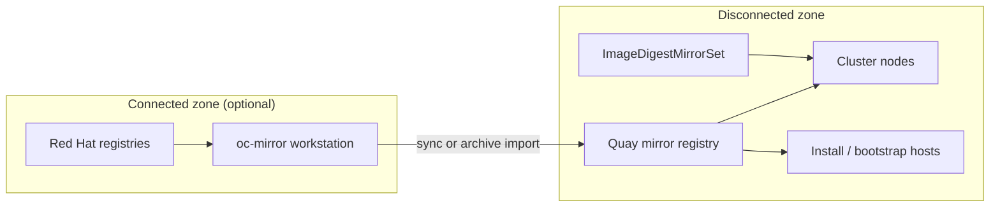

# Disconnected OCP with Quay

> **Status:** In Progress  
> **Started:** 2026-06-27  
> **Index:** [README.md](README.md)

## Audience and Purpose

**Reader:** Platform engineers and architects standing up or extending OpenShift in an environment without reliable outbound internet — and anyone implementing the mirror registry, mirroring pipeline, and cluster pull redirection.

**Enables:** Scope boundary for the disconnected stack (Quay + `oc-mirror` + cluster mirror policy), sequencing of work, and decisions that must be made before install — without re-litigating the full disconnected-install guide on every session.

## Problem Statement

Clusters cannot pull release images, operator catalogs, or workload images from public registries at install time or steady state. Red Hat's supported pattern is a **local mirror registry** (Quay — typically `mirror-registry` for a single-node footprint, or an existing enterprise Quay) populated with **`oc-mirror`**, plus cluster-level **image digest mirroring** (`ImageDigestMirrorSet`) so nodes redirect pulls to the mirror. Without this foundation, OCP install, upgrades, OperatorHub, and day-2 workloads fail or stall on egress.

This work is needed now because disconnected operation is a hard prerequisite for the target environment — not an optimization.

## Scope

**In scope**

- Mirror registry platform on **Quay** (sizing, TLS, auth, storage, backup posture)
- **`oc-mirror` v2** pipeline: `ImageSetConfiguration`, initial full sync, incremental updates for upgrades
- **Trust chain**: registry CA distribution to install hosts, bootstrap, and cluster (`trustedCA`, `registries.conf` / machine config as required)
- **Disconnected install inputs**: pull secret, mirrored release image, `install-config` mirror settings
- **Post-install mirror policy**: apply `oc-mirror` output (`ImageDigestMirrorSet`; know `ImageContentSourcePolicy` for older clusters)
- **Disconnected OperatorHub**: disable default catalog sources; `CatalogSource` for mirrored operator index; mirror only required operators initially
- **RHCOS / payload hosting** where install or provisioning cannot reach `mirror.openshift.com` (HTTP mirror or registry paths per install method)
- **Operational runbook stubs**: how to add an operator, bump OCP z-stream/minor, verify pull path without internet

**Out of scope**

- Full production DR / multi-site Quay HA design (unless explicitly pulled in)
- Mirroring every Red Hat operator catalog package by default
- Application-team container build pipelines (CI/CD to Quay) — only platform images needed for OCP/ACM/GitOps unless stated otherwise
- Non-OCP registry consumers (generic artifact mirrors, RPM mirrors) except where required for OCP/RHCOS
- Fleet GitOps onboarding (RHACM/ArgoCD) — separate epic; this guide covers the **mirror prerequisite** those flows depend on

## Success Criteria

- [ ] Quay mirror registry reachable from install subnet and all cluster nodes; TLS trusted end-to-end
- [ ] Target OCP release channel/version mirrored via `oc-mirror`; install completes with no public registry pulls
- [ ] `ImageDigestMirrorSet` (or equivalent) applied; `oc adm release info` / sample workload pull resolves to Quay
- [ ] OperatorHub serves mirrored catalog; at least one operator installs successfully while egress is blocked (or verified via registry logs)
- [ ] Documented procedure for incremental mirror update aligned to an OCP upgrade path
- [ ] Gaps and org-specific choices captured in `Key Decisions` (below) — no silent assumptions

## Target release (example)

| Field | Example |
|-------|---------|
| **OCP z-stream** | `4.18.14` |
| **Update channel** | `stable-4.18` |
| **Operator catalog tag** | `v4.18` |
| **Mirror policy API** | `ImageDigestMirrorSet` (4.13+ greenfield) |
| **`oc-mirror` client** | Match target OCP z-stream |

Pin mirroring to exact z-streams under change control unless z-stream upgrades are explicitly in scope.

## Constraints

- Follow [OCP disconnected environments](https://docs.redhat.com/en/documentation/openshift_container_platform/4.18/html/disconnected_environments/) for the target version
- **mirror-registry 2.x:** SQLite (`--sqliteStorage`); day-2 ops use `systemctl` on installed `quay-*` units — not `quay-postgres`/`quay-redis` (1.x legacy)
- **mirror-registry:** image blobs on `--quayStorage` (dedicated filesystem, in `fstab`) — not root `/` or default Podman volumes
- Mirror content must match exact versions — ad-hoc `latest` tags are unsafe for platform images
- `oc-mirror` v2: use `--v2`; split platform and operator mirror runs; avoid `targetCatalog`/`targetTag` overrides on operator entries

## Key Decisions

| Decision | Choice | Rationale |
|----------|--------|-----------|
| Mirror registry product | **mirror-registry** (single-node Quay) or enterprise Quay | Red Hat default for bootstrap; enterprise if org already operates it |
| OCP target version / channel | **per environment** | Drives ImageSetConfiguration channels and catalog tags |
| Quay image storage | **`--quayStorage` on dedicated LV** | Default Podman volumes land on `/` — common failure mode |
| Connected vs fully air-gapped mirror host | **TBD** | Air-gapped → `oc-mirror` archive + physical/one-way transfer; connected → direct sync to Quay |
| Install method | **TBD** — IPI/UPI, assisted/CIM, or static | Determines RHCOS ISO/rootfs hosting and when IDMS must exist |
| Operators to mirror (initial set) | **TBD** | Mirror minimum for platform (e.g. ACM, GitOps, Virt) — not full catalog |
| Hub in disconnected story | **TBD** | If ACM hub is in scope, MCH/assisted images and `AgentServiceConfig` mirror/`osImages` apply |
| Registry auth model | **TBD** | Pull secret merge, robot accounts, global pull secret on cluster |

## Architecture (reference)

## Phased delivery (suggested)

| Phase | Outcome |
|-------|---------|
| **0 — Discover** | Install method, network zones, operator shortlist, storage plan |
| **1 — Quay** | mirror-registry on dedicated `--quayStorage`; TLS + robot account |
| **2 — Mirror** | oc-mirror platform then operators; cluster-resources saved |
| **2b — Validate** | Release info + catalog tags in Quay; artifacts archived |
| **3 — Install** | Greenfield cluster from mirrored release + IDMS + trust |
| **4 — OperatorHub** | Default sources off; mirrored catalogs; operators installed |
| **5 — Operate** | Incremental mirror, z-stream upgrades, Quay GC |

## Related

- **[Working guide](working-guide.md)** — phased execution path, storage, troubleshooting
- **[ImageSet examples](imageset-examples.md)** — platform / operators / combined YAML
- [Disconnected environments appendix](../../learning-path/vmware-admins/README.md#appendix-disconnected-and-air-gapped-environments) — `oc-mirror`, IDMS, OperatorHub pattern
- [CIM hub mirror configuration](../../rhacm/notes/cim-hub-setup.md) — assisted install `mirrorRegistryRef`, `osImages`
- [Registry credentials via RHACM](../../rhacm/examples/secret-management/4_registry_credentials/README.md) — pull secret distribution to managed clusters
- [Image registry auth troubleshooting](../troubleshooting/image-registry-auth/README.md) — TLS/RBAC patterns (internal registry; analogous trust issues)
- Red Hat: [Disconnected environments (4.18)](https://docs.redhat.com/en/documentation/openshift_container_platform/4.18/html/disconnected_environments/)
- Red Hat: [oc-mirror plugin (4.18)](https://docs.redhat.com/en/documentation/openshift_container_platform/4.18/html/disconnected_environments/mirroring-images-for-a-disconnected-installation)
- Red Hat: [mirror-registry](https://docs.redhat.com/en/documentation/red_hat_quay/latest/html/red_hat_quay_installation_and_configuration_on_openshift_with_mirror_registry/)

## ImageSetConfiguration

See [imageset-examples.md](imageset-examples.md) for platform-only, operators-only, and combined templates.

After mirror run: apply generated `ImageDigestMirrorSet` from `oc-mirror` output; verify with `oc adm release info` against the mirrored release digest.

## Open questions (resolve in Phase 0)

1. Target z-stream pin vs range for in-place z-stream updates?
2. Connected mirror host vs fully air-gapped (`file://` archive transfer)?
3. `mirror-registry` greenfield vs existing enterprise Quay?
4. Lab first vs production disconnected install?
5. ACM/CIM hub in the same disconnected boundary?
6. Day-1 operator list and catalog map ([imageset-examples.md](imageset-examples.md))?
