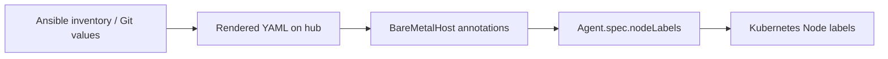
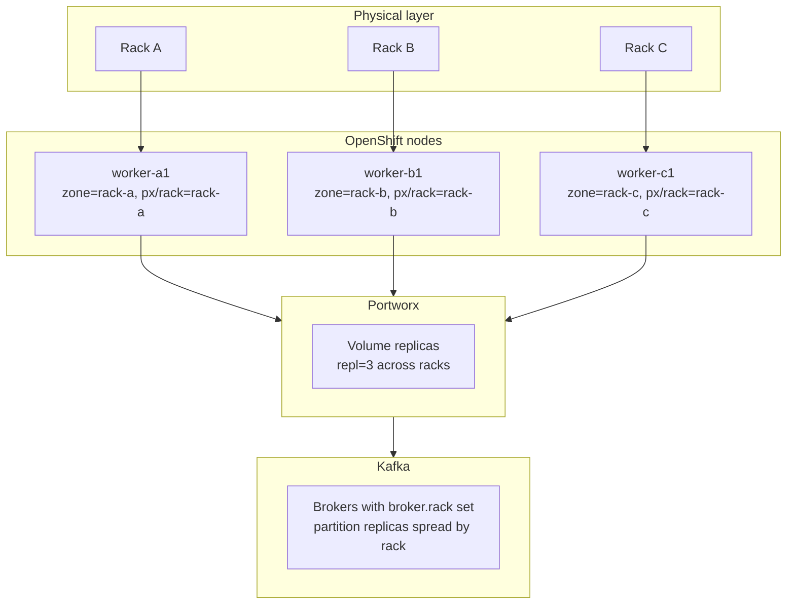
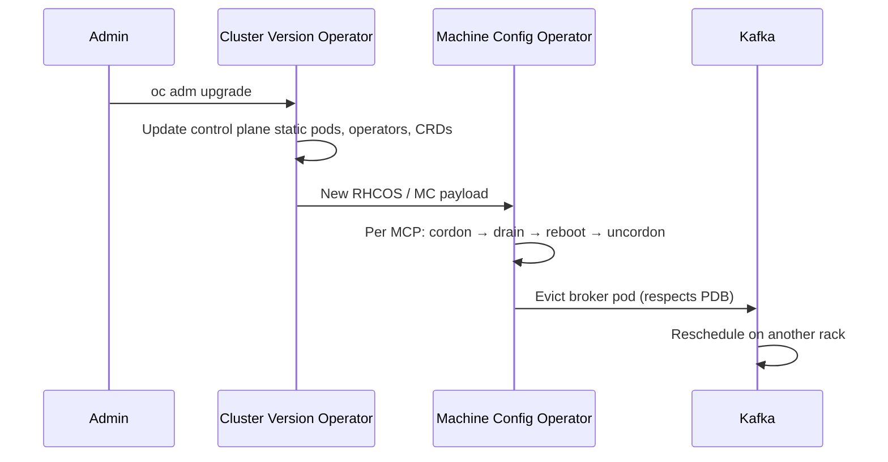

# Kafka on Bare-Metal OpenShift with Portworx — Rack-Aware Example

**Audience:** Platform engineers deploying or hardening Kafka on bare-metal OpenShift with Portworx-backed storage — **Confluent Platform Operator (CFK)** is the primary example path; Strimzi/AMQ Streams examples are kept for side-by-side comparison.

**Purpose:** Provide copy-paste example manifests so Kafka brokers, Portworx volume replicas, and OpenShift node upgrades all respect the same rack (failure-domain) labels — regardless of whether you use Confluent or Strimzi.

**Scope:** Example configurations for **OpenShift Container Platform 4.20+**. Statically reviewed against Strimzi, Portworx, and OCP 4.20 docs (see [VALIDATION.md](VALIDATION.md)). Not end-to-end tested without a live cluster. Placeholders (`rack-a`, `example.com`, sizing) must be adjusted to your environment.

**Target platform:** OCP 4.20+ · Ignition 3.5.0 · [Streams for Apache Kafka 3.1](https://docs.redhat.com/en/documentation/red_hat_streams_for_apache_kafka/3.1/) (OCP 4.16–4.20) or Strimzi 0.48.x

**Related:**

- [VALIDATION.md](VALIDATION.md) — static review status, prerequisites matrix, cluster-side checks
- [LABELING-COMPARISON.md](LABELING-COMPARISON.md) — **zone/region vs custom-rack labels** (side-by-side)

- [Portworx CSI crashloop troubleshooting](../../troubleshooting/portworx-csi-crashloop/README.md)
- [NVMe host NQN duplicates](../../troubleshooting/nvme-host-nqn-duplicate/README.md) — prerequisite if using NVMe-oF to FlashArray
- [NFS Portworx proxy PVC delays](../../troubleshooting/nfs-portworx-proxy-pvc-slow-ready/README.md)
- [OCP examples index](../README.md)

---

## On this page

- [Architecture](#architecture)
- [Rack labeling variants](#rack-labeling-variants)
- [Prerequisites](#prerequisites)
- [ACM provisioning and inventory](#acm-provisioning-and-inventory)
- [Identify your Kafka operator](#identify-your-kafka-operator)
- [Common foundation (all operators)](#common-foundation-all-operators)
- [Operator-specific examples](#operator-specific-examples)
- [Rack outage behavior](#rack-outage-behavior)
- [OpenShift upgrades and node churn](#openshift-upgrades-and-node-churn)
- [OpenShift internals and tenancy](#openshift-internals-and-tenancy)
- [Verification checklist](#verification-checklist)
- [Manifest index](#manifest-index)

---

## Prerequisites

Assumes **OpenShift Container Platform 4.20+** (Ignition 3.5.0 MachineConfigs).

| Component | Version for OCP 4.20+ | How to verify |
|-----------|----------------------|---------------|
| **Streams for Apache Kafka** (Red Hat) | **3.1** (Strimzi 0.48.x, Kafka 4.1) | `oc get csv -A \| grep -i amq-streams` |
| **Strimzi** (upstream) | **0.48+** | `oc get csv -A \| grep strimzi` |
| **Kafka** | **4.1.0** with `metadataVersion: 4.1-IV1` | Operator version matrix / CSV |
| **Portworx CSI** | `pxd.portworx.com` provisioner | `oc get csidriver pxd.portworx.com` |
| **Worker nodes** | ≥ 3 workers with 3 distinct rack label values per [labeling variant](#rack-labeling-variants) | See node label examples |

Red Hat reference: [Streams for Apache Kafka 3.1 — tested on OCP 4.16–4.20](https://docs.redhat.com/en/documentation/red_hat_streams_for_apache_kafka/3.1/html/release_notes_for_streams_for_apache_kafka_3.1_on_openshift/ref-supported-configurations-str).

OCP reference: [Machine configuration — Ignition 3.5.0 (OCP 4.20)](https://docs.redhat.com/en/documentation/openshift_container_platform/4.20/html/machine_configuration/machine-configs-configure).

Full validation checklist: [VALIDATION.md](VALIDATION.md).

---

## Rack labeling variants

Two parallel manifest sets — **pick one per cluster**, do not mix label keys.

| Variant | When to use | Manifests |
|---------|-------------|-----------|
| **[zone-region](manifests/zone-region/)** | Well-known `topology.kubernetes.io/zone` / `region`; MCO drains by zone | Default for bare-metal rack-as-zone |
| **[custom-rack](manifests/custom-rack/)** | Domain labels (`platform.example.com/rack`) when zone is reserved or CMDB uses rack/site | Explicit semantics, no cloud AZ confusion |

Full side-by-side comparison: **[LABELING-COMPARISON.md](LABELING-COMPARISON.md)**

Shared infra (both variants): [`manifests/common/`](manifests/common/) — Portworx StorageClass, optional kernel tuning.

---

## ACM provisioning and inventory

If the cluster is created via **ACM agent-based install** on bare metal (Ansible inventory → Git → hub `ClusterDeployment` / `InfraEnv` / `AgentClusterInstall`), rack and kafka labels **should be owned in source inventory** and rendered into hub manifests before install — not applied manually after the fact.

### How labels flow (ACM + BMAC)



The **Baremetal Agent Controller (BMAC)** on the hub copies BMH annotations prefixed with `bmac.agent-install.openshift.io.node-label.` into `Agent.spec.nodeLabels`. Assisted Installer applies those labels to the Node when the host joins the cluster (Day 0).

You can assign a **MachineConfigPool** at install time if you use custom pools elsewhere in the cluster. This example does **not** use a dedicated kafka worker pool — brokers schedule on any worker.

Examples (zone-region variant — see [custom-rack](manifests/custom-rack/) for alternate keys):

- [`manifests/zone-region/acm-bmh-worker-host.example.yaml`](manifests/zone-region/acm-bmh-worker-host.example.yaml)
- [`manifests/zone-region/inventory-workers.example.yaml`](manifests/zone-region/inventory-workers.example.yaml)

### Inventory fields to model per host

**Zone/region variant:**

| Inventory field | Becomes node label | Notes |
|-----------------|-------------------|--------|
| `rack` | `topology.kubernetes.io/zone` | Strimzi `rack.topologyKey` · CFK `rackAssignment.nodeLabels` |
| `rack` | `px/rack` | Portworx StorageClass `racks:` — **same value** |
| `region` | `topology.kubernetes.io/region` | Optional |
| — | `node-role.kubernetes.io/worker: ""` | Default worker pool (no dedicated kafka role) |

**Custom-rack variant** — same inventory shape; map `rack` → `platform.example.com/rack`, `site` → `platform.example.com/site`. See [LABELING-COMPARISON.md](LABELING-COMPARISON.md).

### Two BMH label mechanisms (do not mix blindly)

| Path | Where | When |
|------|-------|------|
| **BMAC annotations** (ACM agent install on hub) | `bmac.agent-install.openshift.io.node-label.*` | Day 0 via Assisted Installer |
| **`spec.nodeLabels`** (Metal3 on cluster) | `BareMetalHost.spec.nodeLabels` | IPI / spoke Metal3 provisioning |

This workspace's [`baremetal-hosts`](../../argo/examples/framework/apps/baremetal-hosts/) Helm chart uses `spec.nodeLabels` from `values.yaml` — suitable when BMH lives on the **spoke** cluster. For **ACM hub-side** agent install, prefer **BMAC annotations** in rendered hub manifests.

See also: [vgpu-node-labeling.md](../../gpu/vgpu-node-labeling.md) for the same inventory → Git → label pattern (different labels, same GitOps model).

### Day-2 label changes

Labels set at install via BMAC are **not automatically updated** if inventory changes later. To move a host to a different rack or role:

- Re-provision (disruptive), or
- RHACM `ConfigurationPolicy` / Ansible to reconcile live nodes, then update Git to match

For kafka rack placement, treat inventory corrections as **infra changes** — changing `topology.kubernetes.io/zone` on a live broker node forces rescheduling and ISR churn.

---

## Architecture

Three layers must agree on the same failure-domain label:



**Golden rule:** pick one rack identifier (for example `rack-a`) and use it consistently in:

| Layer | Label / config |
|-------|----------------|
| OpenShift node | `topology.kubernetes.io/zone: rack-a` |
| Portworx | `px/rack: rack-a` |
| Kafka | `broker.rack` derived from the same `topologyKey` |

On bare metal, `topology.kubernetes.io/zone` is **not** set automatically — you must label nodes yourself.

---

## Identify your Kafka operator

Run these before choosing which operator section to follow:

```bash
# Installed operators (OLM)
oc get csv -A | grep -iE 'kafka|strimzi|amq|confluent'

# Common CRDs
oc get crd | grep -iE 'kafka\.|strimzi|confluent'

# Running Kafka workloads
oc get pods -A | grep -iE 'kafka|strimzi|confluent'
oc get kafka -A 2>/dev/null          # Strimzi / AMQ Streams
oc get kafkanodepool -A 2>/dev/null  # Strimzi node pools (0.34+)
oc get kafkas -A 2>/dev/null         # Confluent Platform Operator (name varies by version)
```

| If you see… | Operator | Example manifests in this directory |
|-------------|----------|-----------------------------------|
| `Kafka`, `KafkaNodePool` CRDs; Strimzi CSV | **Strimzi** (upstream) | [`manifests/zone-region/strimzi/`](manifests/zone-region/strimzi/) or [`custom-rack/strimzi/`](manifests/custom-rack/strimzi/) |
| Same CRDs; `amq-streams` or Red Hat build CSV | **AMQ Streams** (Red Hat Strimzi) | Same as Strimzi — pick one [labeling variant](LABELING-COMPARISON.md) |
| `platform.confluent.io` CRDs; Confluent CSV | **Confluent Platform Operator (CFK)** | [`manifests/zone-region/confluent/`](manifests/zone-region/confluent/) or [`custom-rack/confluent/`](manifests/custom-rack/confluent/) + [`common/confluent-kafka-rbac.yaml`](manifests/common/confluent-kafka-rbac.yaml) |
| Helm release, no operator CRD | **Helm / manual** | Set `broker.rack` in broker config; use [`manifests/common/`](manifests/common/) scheduling labels |
| `eventstreams` CRD (older) | **IBM Event Streams** | Not covered here — same rack-awareness concepts apply to broker config |

If none of the above match, start with [common foundation](#common-foundation-all-operators) and wire rack awareness into whatever chart or operator your team uses.

---

## Common foundation (all operators)

These apply regardless of Kafka distribution.

### Minimum production layout

| Constraint | Recommendation |
|------------|----------------|
| Racks | ≥ 3 for true rack-fault tolerance |
| Kafka replication factor | 3 |
| `min.insync.replicas` | 2 |
| Portworx `repl` | 3, with `racks` spanning all racks |
| Workers per rack | Enough capacity for brokers **and** other workloads (brokers share workers) |
| Upgrade parallelism | `maxUnavailable: 1` on the default `worker` MachineConfigPool |

### Node labels

**ACM agent install:** define labels in source inventory; render to hub `BareMetalHost` BMAC annotations — see [ACM provisioning and inventory](#acm-provisioning-and-inventory). Use [`zone-region/`](manifests/zone-region/) or [`custom-rack/`](manifests/custom-rack/) node label examples.

**Post-install / manual** (fallback only): see `node-labels.example.yaml` in your chosen variant directory.

```bash
oc label node worker-a1.example.com \
  topology.kubernetes.io/zone=rack-a \
  topology.kubernetes.io/region=dc1 \
  px/rack=rack-a
```

### Shared workers (this example)

Kafka brokers **schedule on any worker** — no `node-role.kubernetes.io/kafka` label, no `dedicated=kafka` taint, and no custom `kafka-worker` MachineConfigPool. Rack awareness comes from `topology.kubernetes.io/zone` (or custom rack labels) and operator scheduling rules only.

Implications:

- Brokers may colocate with application pods — use `Guaranteed` QoS (requests = limits) and PDBs to protect broker availability during drains.
- Node drains during worker MCP upgrades evict **all** pods on the node, not just Kafka.
- Foreign pods in a rack can reduce scheduling headroom for broker spread — plan worker capacity per rack accordingly.

### Portworx StorageClass

Cross-rack volume replicas. Primary file uses the **CSI provisioner** (`pxd.portworx.com`) — recommended for current OpenShift + Portworx installs per [Portworx CSI docs](https://docs.portworx.com/portworx-csi/reference/storage-class).

| File | Provisioner | When to use |
|------|-------------|-------------|
| [`portworx-storageclass-kafka.yaml`](manifests/common/portworx-storageclass-kafka.yaml) | `pxd.portworx.com` | Default — CSI clusters |
| [`portworx-storageclass-kafka-legacy-in-tree.yaml`](manifests/common/portworx-storageclass-kafka-legacy-in-tree.yaml) | `kubernetes.io/portworx-volume` | Legacy in-tree only |

Confirm on cluster: `oc get sc -o custom-columns=NAME:.metadata.name,PROVISIONER:.provisioner | grep -i portworx`

Key parameters:

- `repl: "3"`
- `racks: "rack-a,rack-b,rack-c"`
- `io_profile: "db"`
- `volumeBindingMode: WaitForFirstConsumer`

### Kernel tuning (optional)

Bare-metal brokers can benefit from disabling transparent huge pages and lowering swappiness. See [`manifests/common/machineconfig-kafka-tuning.yaml`](manifests/common/machineconfig-kafka-tuning.yaml).

**Not in default apply order** — the MachineConfig targets the default `worker` role, so it reboots every worker when applied. Use only if those sysctl changes are acceptable for all workloads sharing worker nodes.

Uses **Ignition 3.5.0** per [OCP 4.20 MachineConfig guidance](https://docs.redhat.com/en/documentation/openshift_container_platform/4.20/html/machine_configuration/machine-configs-configure).

### Scheduling primitives (all operators)

Every Kafka deployment should enforce:

1. **One broker per node** — `podAntiAffinity` on `kubernetes.io/hostname`
2. **Even spread across racks** — `topologySpreadConstraints` on `topology.kubernetes.io/zone` with `whenUnsatisfiable: DoNotSchedule`
3. **Rack-aware partition placement** — `broker.rack` on each broker (operator-specific)
4. **Voluntary disruption limit** — PodDisruptionBudget `maxUnavailable: 1` on broker pods

---

## Operator-specific examples

### Confluent Platform Operator (CFK) — primary path

Confluent uses `platform.confluent.io` CRDs (`Kafka`, `KRaftController`). Rack awareness is **two layers**:

1. **Kafka partition placement** — `spec.rackAssignment.nodeLabels` reads the node label and sets `broker.rack` (requires `oneReplicaPerNode: true` and a ServiceAccount with `get`/`list` on `nodes` + `pods`).
2. **Pod scheduling** — `podTemplate.affinity.podAntiAffinity` on the same label key spreads brokers across racks at schedule time.

Files (zone-region): [`manifests/zone-region/confluent/`](manifests/zone-region/confluent/) · Custom-rack: [`manifests/custom-rack/confluent/`](manifests/custom-rack/confluent/) · RBAC: [`manifests/common/confluent-kafka-rbac.yaml`](manifests/common/confluent-kafka-rbac.yaml)

| CFK field | Effect (zone-region) | Custom-rack equivalent |
|-----------|----------------------|-------------------------|
| `spec.rackAssignment.nodeLabels` | `[topology.kubernetes.io/zone]` | `[platform.example.com/rack]` |
| `spec.oneReplicaPerNode` | `true` — one broker per node | same |
| `podTemplate.serviceAccountName` | `kafka-rack` (RBAC manifest) | same |
| `podTemplate.affinity.podAntiAffinity` | `topologyKey: topology.kubernetes.io/zone` | `topologyKey: platform.example.com/rack` |
| `spec.storageClass.name` | `portworx-kafka-repl3` | same |
| `configOverrides.server` | `min.insync.replicas=2`, RF=3 | same |

CFK also sets `default.replication.factor` and `min.insync.replicas` from replica count; the example overrides explicitly to match the Strimzi side-by-side values.

**Strimzi vs CFK mapping** — see [LABELING-COMPARISON.md](LABELING-COMPARISON.md#side-by-side-confluent-vs-strimzi).

Pin `image.application` / `image.init` to your licensed Confluent Platform version. Examples use **CP 8.1.0** (KRaft) — confirm against your CFK operator bundle.

**Apply order:**

```bash
# 0. Dry-run against your cluster (recommended)
oc apply --dry-run=server -f manifests/common/
oc apply --dry-run=server -f manifests/zone-region/confluent/
# or: -f manifests/custom-rack/confluent/

# 1. Common foundation (StorageClass)
oc apply -f manifests/common/portworx-storageclass-kafka.yaml
# Optional — reboots all workers:
# oc apply -f manifests/common/machineconfig-kafka-tuning.yaml

# 2. CFK operator must already be installed; create target namespace
oc create namespace kafka --dry-run=client -o yaml | oc apply -f -

# 3. Rack-assignment RBAC (before Kafka CR)
oc apply -f manifests/common/confluent-kafka-rbac.yaml

# 4. KRaft controllers, then brokers (order matters)
oc apply -f manifests/zone-region/confluent/kraftcontroller.yaml
oc apply -f manifests/zone-region/confluent/kafka-rack-aware.yaml
# or: -f manifests/custom-rack/confluent/
```

**Verify `broker.rack`:**

```bash
oc exec -n kafka prod-kafka-0 -- \
  grep broker.rack /opt/confluentinc/etc/kafka/kafka.properties
```

For strict `topologySpreadConstraints` with `whenUnsatisfiable: DoNotSchedule` (as in the Strimzi examples), CFK requires the [pod overlay](https://docs.confluent.io/operator/current/co-configure-misc.html#pod-overlay) feature — the examples here use CFK-native `podAntiAffinity` on the rack label key instead.

### Strimzi / AMQ Streams — comparison

AMQ Streams is Red Hat's build of the Strimzi operator — the `Kafka` and `KafkaNodePool` CRs are the same model. Kept for side-by-side comparison with CFK.

Files (zone-region): [`manifests/zone-region/strimzi/`](manifests/zone-region/strimzi/) · Custom-rack: [`manifests/custom-rack/strimzi/`](manifests/custom-rack/strimzi/)

| Strimzi field | Effect (zone-region) | Custom-rack equivalent |
|---------------|----------------------|-------------------------|
| `spec.kafka.rack.topologyKey` | `topology.kubernetes.io/zone` | `platform.example.com/rack` |
| `template.pod.topologySpreadConstraints` | `topologyKey: topology.kubernetes.io/zone` | `topologyKey: platform.example.com/rack` |
| `template.pod.affinity.podAntiAffinity` | Prevents two brokers on one node |
| `spec.kafka.config.min.insync.replicas: 2` | Survives one broker loss with RF=3 |

Strimzi creates a PodDisruptionBudget automatically — verify it after deploy.

The example `kafka-cluster.yaml` uses a **plaintext internal listener** (port 9092) for simplicity. Add TLS listeners before production.

**Apply order:**

```bash
# 0. Dry-run against your cluster (recommended)
oc apply --dry-run=server -f manifests/common/
oc apply --dry-run=server -f manifests/zone-region/strimzi/
# or: -f manifests/custom-rack/strimzi/

# 1. Common foundation (labels from variant dir, StorageClass)
oc apply -f manifests/common/portworx-storageclass-kafka.yaml
# Optional — reboots all workers:
# oc apply -f manifests/common/machineconfig-kafka-tuning.yaml

# 2. Strimzi operator must already be installed in the target namespace
oc apply -f manifests/zone-region/strimzi/
# or: -f manifests/custom-rack/strimzi/
```

See [VALIDATION.md](VALIDATION.md) for cluster-side checks after apply.

### Helm / manual deployment

If Kafka runs as a StatefulSet without an operator:

1. Apply all [`manifests/common/`](manifests/common/) resources.
2. Set per-broker `broker.rack` in `server.properties` (or via environment) to match the node's `topology.kubernetes.io/zone`.
3. Add `topologySpreadConstraints` and `podAntiAffinity` to the StatefulSet pod template.
4. Create a PDB with `maxUnavailable: 1`.

---

## Rack outage behavior

With 3 racks, RF=3, minISR=2, and aligned labels:

| Component | 1 rack lost | Notes |
|-----------|-------------|-------|
| Portworx volumes | Online (degraded) | 2 of 3 replicas remain |
| Kafka brokers | 1 broker down | Cluster continues producing/consuming |
| Partition availability | Maintained | Rack awareness keeps replicas on surviving racks |
| Performance | Degraded | Re-replication and ISR rebuild add IO and network load |

**2-rack sites cannot get true rack fault tolerance.** With only two racks, two partition replicas may share a rack — a single rack loss can breach `min.insync.replicas`.

---

## OpenShift upgrades and node churn

The Machine Config Operator (MCO) upgrades nodes: cordon → drain → OS update → reboot → uncordon. Drains respect PodDisruptionBudgets.

### Upgrade-friendly settings

- Keep `maxUnavailable: 1` on the default `worker` MachineConfigPool (default).
- Never raise `maxUnavailable` on control-plane pools.
- When `topology.kubernetes.io/zone` is set, MCO drains alphabetically by zone, oldest node first within each zone.

### Suggested upgrade sequence

1. `oc adm upgrade` — confirm no blockers.
2. Confirm Kafka healthy (no under-replicated partitions, all brokers in ISR).
3. Upgrade control plane (sequential, etcd-safe).
4. Upgrade `worker` pool one node at a time — brokers and apps drain together.
5. MCO drain evicts pods on the node → broker reschedules on another rack → Portworx volume reattaches.

If drain appears stuck, check PDB events:

```bash
oc describe pdb -n <kafka-namespace>
oc get events -n <kafka-namespace> --field-selector reason=Evicted
```

### Pause worker pool during maintenance (optional)

```bash
oc patch mcp worker --type=merge -p '{"spec":{"paused":true}}'
# ... maintenance ...
oc patch mcp worker --type=merge -p '{"spec":{"paused":false}}'
```

### Adding nodes

1. Install host with rack labels **before** scheduling workloads.
2. Confirm Portworx sees the node: `pxctl status`
3. Scale brokers via your operator.
4. Rebalance partitions (Cruise Control / `KafkaRebalance` for Strimzi).

### Removing nodes

1. Cordon and drain: `oc adm drain <node> --ignore-daemonsets --delete-emptydir-data`
2. Wait for broker pod to reschedule and rejoin ISR.
3. Decommission Portworx node per Portworx docs before powering off hardware.

---

## OpenShift internals and tenancy

This example assumes **Kafka brokers share worker nodes with other workloads** — no dedicated kafka hardware or custom MCP. Rack-aware scheduling and Portworx replication still apply; operational tradeoffs differ from a dedicated-node design.

### Discover the tenancy model

```bash
# Kafka namespaces and footprint
oc get ns | grep -iE 'kafka|strimzi|confluent|amq'
oc adm top nodes
oc get pods -n <kafka-namespace> -o wide

# Rack labels on workers (zone-region variant)
oc get nodes -l node-role.kubernetes.io/worker \
  -o custom-columns=NAME:.metadata.name,ZONE:.metadata.labels.topology\\.kubernetes\\.io/zone,PX:.metadata.labels.px/rack

# Competing workloads on broker nodes
oc get pods -A --field-selector spec.nodeName=<worker-with-broker> \
  -o custom-columns=NS:.metadata.namespace,NAME:.metadata.name
```

| Signal | Likely model |
|--------|----------------|
| Brokers on workers that also run app pods; no kafka label/taints | **Shared multi-tenant** *(this example)* |
| Subset of workers labeled `kafka`, tainted `dedicated=kafka` | **Dedicated nodes on shared cluster** |
| Every worker runs only Kafka/Portworx/infra | **Kafka-dedicated cluster** |

---

### MachineConfigPool (MCP) — what to know

See **[MachineConfig and MachineConfigPool](../../../notes/machine-config-pools.md)** for targeting rules, custom pool patterns, rollout behavior, and diagnostics. Summary for **this example**:

- Brokers use the default **`worker`** MCP — no custom `kafka-worker` pool.
- Optional [`machineconfig-kafka-tuning.yaml`](manifests/common/machineconfig-kafka-tuning.yaml) uses `role: worker` and affects **all** workers if applied.
- `maxUnavailable: 1` on the worker pool drains one node at a time; PDBs on kafka **and** app pods can block drain.

#### MCP pitfalls with shared workers

1. **Drain coupling** — Draining a worker evicts Kafka **and** every other pod on that node. A misconfigured app PDB can block the drain and stall the entire MCP update.
2. **maxUnavailable on worker pool** — Raising `worker` pool `maxUnavailable` to speed upgrades drains multiple nodes in parallel — risky for Kafka ISR even with broker PDBs.
3. **Kernel tuning scope** — Do not apply kafka-specific MachineConfigs to `worker` unless acceptable for all colocated workloads.

---

### CVO vs MCO — two upgrade paths

Cluster upgrades involve two operators that are easy to conflate:



| Layer | What changes | Kafka impact |
|-------|--------------|--------------|
| **CVO** | API server, etcd, operators, platform images | Brief API blips; operators reconcile; generally no broker restart unless CRD/operand changes |
| **MCO** | Node OS, kubelet, kernel | **Broker pod evicted per node** during worker MCP rollout |

On a **shared cluster**, CVO may update the Kafka operator CSV while MCO is still draining unrelated workers — coordinate timing and watch operator logs.

---

### Tenancy models compared

#### A. Shared workers *(this example)*

Kafka runs on the default worker pool alongside applications.

| Do | Why |
|----|-----|
| Strong `podAntiAffinity` + rack spread in operator CRs | Best-effort broker distribution across racks amid foreign pods |
| `Guaranteed` QoS on brokers (requests = limits) | CPU/memory not stolen by bursty neighbors |
| Namespace `ResourceQuota` + `LimitRange` on app namespaces | Cap app burst on shared nodes |
| Verify PDBs on **all** pods sharing a node before drain | App PDBs can block worker MCP rollout |

| Watch | Risk |
|-------|------|
| Foreign pods in a rack | May occupy slots needed for broker spread or drain rescheduling |
| Portworx on all storage nodes | PX replication traffic shares physical network with apps |
| Cluster-wide monitoring/logging | Collectors on workers consume disk IO |
| DaemonSets | `ovn-kube-node`, `portworx`, `node-exporter` always on workers — plan capacity |

#### B. Dedicated nodes on a shared cluster

Kafka runs on a labeled, tainted subset of workers; apps run elsewhere. Not used in this example — see [machine-config-pools.md](../../../notes/machine-config-pools.md) for custom MCP patterns if you adopt it later.

#### C. Kafka-dedicated cluster

Entire `worker` pool is kafka-capable. Simplest operationally when no app colocation is required.

---

### Other OpenShift internals to account for

| Component | Consideration |
|-----------|---------------|
| **PodDisruptionBudget** | Strimzi creates one for Kafka; verify `maxUnavailable: 1`. App PDBs on the **same node** do not block kafka drain directly, but they block **node** drain if those app pods are on the kafka node you are draining. |
| **Eviction API / descheduler** | Cluster descheduler (if installed) can move pods across nodes — may disturb kafka rack placement. Exclude kafka namespace or use anti-affinity hard rules. |
| **Scheduler** | `topologySpreadConstraints` with `DoNotSchedule` fails scheduling if a rack is full of **any** pods using that constraint key — foreign pods do not count unless they share the label selector. |
| **Storage** | Portworx runs as DaemonSet; volume replication uses node network. Dedicated cluster network or VLAN for storage replication reduces app interference. |
| **SCC** | Kafka brokers typically need `anyuid` or restricted SCC depending on image. Operator usually sets this; verify on install. |
| **NetworkPolicy / EgressFirewall** | Multi-tenant clusters often isolate namespaces — ensure kafka can reach clients, ZooKeeper/KRaft peers, and metrics scrapers across namespace boundaries. |
| **Ingress / Routes** | External clients hit the router layer — router pods on workers compete for resources unless on infra nodes. |
| **Machine API / scaling** | Bare metal: new nodes via MachineSet or BMH. Add nodes with rack labels **before** scaling kafka replicas. Removing a Machine without drain risks broker loss. |
| **Monitoring** | Platform + user workload metrics; kafka JMX exporter adds scrape load. Cardinality from many topics can stress Prometheus on small clusters. |
| **etcd** | Large numbers of Kafka-related CRs (topics, users, rebalance) increase etcd size — watch `etcd_cluster_database_size`. |

---

### Upgrade choreography (shared workers)

| Step | Action |
|------|--------|
| 1 | Verify kafka health, ISR, no under-replicated partitions |
| 2 | `oc adm upgrade` — resolve Upgradeable=false conditions |
| 3 | CVO completes control plane + operator updates |
| 4 | Upgrade `worker` MCP one node at a time |
| 5 | Rebalance if brokers landed suboptimally after rolls (operator-dependent) |

---

### Quick decision guide

```
Need dedicated kafka hardware or taints?
├── No  → shared workers (this example)
└── Yes → custom MCP + node labels — see machine-config-pools.md
```

---

## Verification checklist

```bash
# 1. Rack labels on workers (zone-region variant)
oc get nodes -l node-role.kubernetes.io/worker \
  -o custom-columns=\
NAME:.metadata.name,\
ZONE:.metadata.labels.topology\\.kubernetes\\.io/zone,\
RACK:.metadata.labels.px/rack

# 2. Brokers spread across zones
oc get pods -n <kafka-namespace> -o wide | grep -i kafka

# 3. broker.rack set (CFK)
oc exec -n <kafka-namespace> <broker-pod-0> -- \
  grep broker.rack /opt/confluentinc/etc/kafka/kafka.properties
# Strimzi / AMQ Streams:
# oc exec -n <kafka-namespace> <broker-pod-0> -- \
#   grep broker.rack /opt/kafka/custom-config/server.properties

# 4. Portworx volume replica placement
pxctl volume inspect <volume-id>

# 5. PDB present
oc get pdb -n <kafka-namespace>

# 6. Under-replicated partitions (if kafka-topics.sh available)
oc exec -n <kafka-namespace> <broker-pod-0> -- \
  kafka-topics.sh --bootstrap-server localhost:9092 \
  --describe --under-replicated-partitions
```

---

## Manifest index

```
manifests/
├── README.md                 # variant index
├── common/                   # shared: Portworx SC, optional kernel tuning, CFK RBAC
├── zone-region/              # topology.kubernetes.io/zone + region
│   ├── node-labels.example.yaml
│   ├── acm-bmh-worker-host.example.yaml
│   ├── inventory-workers.example.yaml
│   ├── confluent/            # CFK — primary path
│   └── strimzi/              # AMQ Streams / upstream — comparison
└── custom-rack/              # platform.example.com/rack + site
    ├── node-labels.example.yaml
    ├── acm-bmh-worker-host.example.yaml
    ├── inventory-workers.example.yaml
    ├── confluent/
    └── strimzi/
```

[LABELING-COMPARISON.md](LABELING-COMPARISON.md) — side-by-side zone/region vs custom-rack.
[VALIDATION.md](VALIDATION.md) — static review status and cluster-side checklist.

---

## Design decisions to settle

These change sizing and manifest values:

1. **Rack and broker count** — e.g. 3 racks × 3 brokers vs 3 × 6
2. **Operator choice** — Confluent (primary examples) vs Strimzi/AMQ vs Helm
3. **Dedicated kafka pool** — not used; brokers share the default worker pool
4. **OCP upgrade channel** — EUS vs stable affects upgrade choreography

*Example configurations — not production-ready without review. See [AI-DISCLOSURE.md](../../../../AI-DISCLOSURE.md).*
