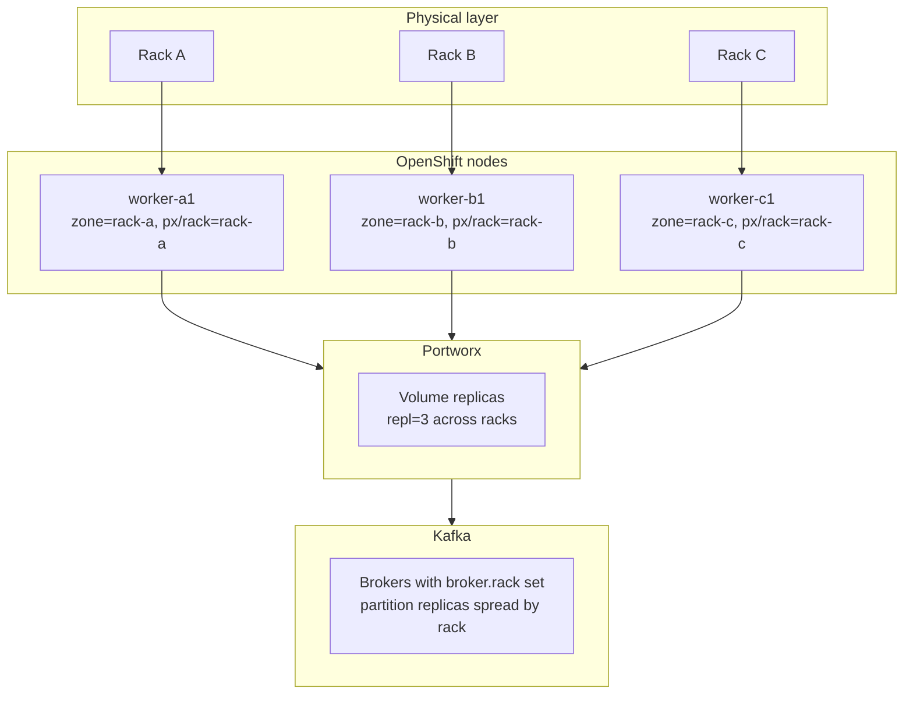
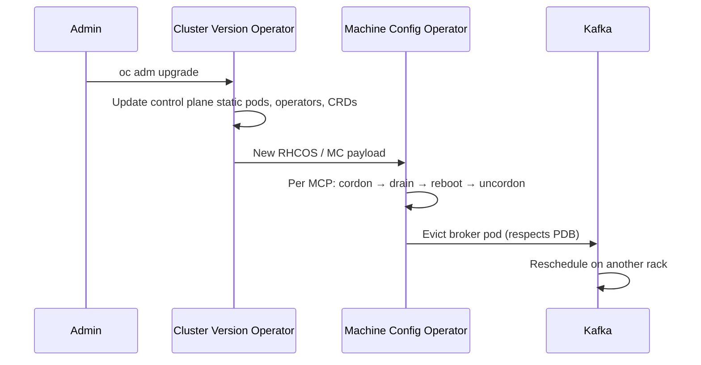

# Kafka on Bare-Metal OpenShift with Portworx — Rack-Aware Example

**Audience:** Platform engineers deploying or hardening Kafka on bare-metal OpenShift with Portworx-backed storage, without a fixed operator choice yet.

**Purpose:** Provide copy-paste example manifests and an operator-agnostic layout so Kafka brokers, Portworx volume replicas, and OpenShift node upgrades all respect the same rack (failure-domain) labels.

**Scope:** Example configurations for **OpenShift Container Platform 4.20+**. Statically reviewed against Strimzi, Portworx, and OCP 4.20 docs (see [VALIDATION.md](VALIDATION.md)). Not end-to-end tested without a live cluster. Placeholders (`rack-a`, `example.com`, sizing) must be adjusted to your environment.

**Target platform:** OCP 4.20+ · Ignition 3.5.0 · [Streams for Apache Kafka 3.1](https://docs.redhat.com/en/documentation/red_hat_streams_for_apache_kafka/3.1/) (OCP 4.16–4.20) or Strimzi 0.48.x

**Related:**

- [VALIDATION.md](VALIDATION.md) — static review status, prerequisites matrix, cluster-side checks

- [Portworx CSI crashloop troubleshooting](../../troubleshooting/portworx-csi-crashloop/README.md)
- [NFS Portworx proxy PVC delays](../../troubleshooting/nfs-portworx-proxy-pvc-slow-ready/README.md)
- [OCP examples index](../README.md)

---

## On this page

- [Architecture](#architecture)
- [Prerequisites](#prerequisites)
- [Identify your Kafka operator](#identify-your-kafka-operator)
- [Common foundation (all operators)](#common-foundation-all-operators)
- [Operator-specific examples](#operator-specific-examples)
- [Rack outage behavior](#rack-outage-behavior)
- [OpenShift upgrades and node churn](#openshift-upgrades-and-node-churn)
- [OpenShift internals and tenancy](#openshift-internals-and-tenancy)
- [Verification checklist](#verification-checklist)
- [Manifest index](#manifest-index)

---

## Prerequisites

Assumes **OpenShift Container Platform 4.20+** (Ignition 3.5.0 MachineConfigs).

| Component | Version for OCP 4.20+ | How to verify |
|-----------|----------------------|---------------|
| **Streams for Apache Kafka** (Red Hat) | **3.1** (Strimzi 0.48.x, Kafka 4.1) | `oc get csv -A \| grep -i amq-streams` |
| **Strimzi** (upstream) | **0.48+** | `oc get csv -A \| grep strimzi` |
| **Kafka** | **4.1.0** with `metadataVersion: 4.1-IV1` | Operator version matrix / CSV |
| **Portworx CSI** | `pxd.portworx.com` provisioner | `oc get csidriver pxd.portworx.com` |
| **Kafka worker nodes** | ≥ 3 nodes, 3 distinct `topology.kubernetes.io/zone` values | See [node labels](#node-labels) |

Red Hat reference: [Streams for Apache Kafka 3.1 — tested on OCP 4.16–4.20](https://docs.redhat.com/en/documentation/red_hat_streams_for_apache_kafka/3.1/html/release_notes_for_streams_for_apache_kafka_3.1_on_openshift/ref-supported-configurations-str).

OCP reference: [Machine configuration — Ignition 3.5.0 (OCP 4.20)](https://docs.redhat.com/en/documentation/openshift_container_platform/4.20/html/machine_configuration/machine-configs-configure).

Full validation checklist: [VALIDATION.md](VALIDATION.md).

---

## Architecture

Three layers must agree on the same failure-domain label:



**Golden rule:** pick one rack identifier (for example `rack-a`) and use it consistently in:

| Layer | Label / config |
|-------|----------------|
| OpenShift node | `topology.kubernetes.io/zone: rack-a` |
| Portworx | `px/rack: rack-a` |
| Kafka | `broker.rack` derived from the same `topologyKey` |

On bare metal, `topology.kubernetes.io/zone` is **not** set automatically — you must label nodes yourself.

---

## Identify your Kafka operator

Run these before choosing which operator section to follow:

```bash
# Installed operators (OLM)
oc get csv -A | grep -iE 'kafka|strimzi|amq|confluent'

# Common CRDs
oc get crd | grep -iE 'kafka\.|strimzi|confluent'

# Running Kafka workloads
oc get pods -A | grep -iE 'kafka|strimzi|confluent'
oc get kafka -A 2>/dev/null          # Strimzi / AMQ Streams
oc get kafkanodepool -A 2>/dev/null  # Strimzi node pools (0.34+)
oc get kafkas -A 2>/dev/null         # Confluent Platform Operator (name varies by version)
```

| If you see… | Operator | Example manifests in this directory |
|-------------|----------|-----------------------------------|
| `Kafka`, `KafkaNodePool` CRDs; Strimzi CSV | **Strimzi** (upstream) | [`manifests/strimzi/`](manifests/strimzi/) |
| Same CRDs; `amq-streams` or Red Hat build CSV | **AMQ Streams** (Red Hat Strimzi) | Same as Strimzi — CRs are compatible; use Red Hat-supported versions |
| `platform.confluent.io` CRDs; Confluent CSV | **Confluent Platform Operator** | [`manifests/confluent/`](manifests/confluent/) — equivalent concepts, different CR shape |
| Helm release, no operator CRD | **Helm / manual** | Set `broker.rack` in broker config; use [`manifests/common/`](manifests/common/) scheduling labels |
| `eventstreams` CRD (older) | **IBM Event Streams** | Not covered here — same rack-awareness concepts apply to broker config |

If none of the above match, start with [common foundation](#common-foundation-all-operators) and wire rack awareness into whatever chart or operator your team uses.

---

## Common foundation (all operators)

These apply regardless of Kafka distribution.

### Minimum production layout

| Constraint | Recommendation |
|------------|----------------|
| Racks | ≥ 3 for true rack-fault tolerance |
| Kafka replication factor | 3 |
| `min.insync.replicas` | 2 |
| Portworx `repl` | 3, with `racks` spanning all racks |
| Workers per rack | ≥ 2 if the pool runs more than Kafka (gives drain targets during upgrades) |
| Upgrade parallelism | `maxUnavailable: 1` on the Kafka worker MachineConfigPool |

### Node labels

Label every Kafka-capable worker at join time. See [`manifests/common/node-labels.example.yaml`](manifests/common/node-labels.example.yaml).

```bash
oc label node worker-a1.example.com \
  topology.kubernetes.io/zone=rack-a \
  topology.kubernetes.io/region=dc1 \
  px/rack=rack-a \
  node-role.kubernetes.io/kafka=
```

### Dedicated Kafka worker pool

Isolate Kafka from generic workload churn. See [`manifests/common/machineconfigpool-kafka-worker.yaml`](manifests/common/machineconfigpool-kafka-worker.yaml).

- Label: `node-role.kubernetes.io/kafka=""`
- Taint: `dedicated=kafka:NoSchedule`
- `maxUnavailable: 1` — one node at a time during OS upgrades
- `paused: true` — optional hold during sensitive maintenance

### Portworx StorageClass

Cross-rack volume replicas. Primary file uses the **CSI provisioner** (`pxd.portworx.com`) — recommended for current OpenShift + Portworx installs per [Portworx CSI docs](https://docs.portworx.com/portworx-csi/reference/storage-class).

| File | Provisioner | When to use |
|------|-------------|-------------|
| [`portworx-storageclass-kafka.yaml`](manifests/common/portworx-storageclass-kafka.yaml) | `pxd.portworx.com` | Default — CSI clusters |
| [`portworx-storageclass-kafka-legacy-in-tree.yaml`](manifests/common/portworx-storageclass-kafka-legacy-in-tree.yaml) | `kubernetes.io/portworx-volume` | Legacy in-tree only |

Confirm on cluster: `oc get sc -o custom-columns=NAME:.metadata.name,PROVISIONER:.provisioner | grep -i portworx`

Key parameters:

- `repl: "3"`
- `racks: "rack-a,rack-b,rack-c"`
- `io_profile: "db"`
- `volumeBindingMode: WaitForFirstConsumer`

### Kernel tuning (optional)

Bare-metal brokers benefit from disabling transparent huge pages and lowering swappiness. See [`manifests/common/machineconfig-kafka-tuning.yaml`](manifests/common/machineconfig-kafka-tuning.yaml).

Uses **Ignition 3.5.0** per [OCP 4.20 MachineConfig guidance](https://docs.redhat.com/en/documentation/openshift_container_platform/4.20/html/machine_configuration/machine-configs-configure).

### Scheduling primitives (all operators)

Every Kafka deployment should enforce:

1. **One broker per node** — `podAntiAffinity` on `kubernetes.io/hostname`
2. **Even spread across racks** — `topologySpreadConstraints` on `topology.kubernetes.io/zone` with `whenUnsatisfiable: DoNotSchedule`
3. **Rack-aware partition placement** — `broker.rack` on each broker (operator-specific)
4. **Voluntary disruption limit** — PodDisruptionBudget `maxUnavailable: 1` on broker pods

---

## Operator-specific examples

### Strimzi / AMQ Streams

AMQ Streams is Red Hat's build of the Strimzi operator — the `Kafka` and `KafkaNodePool` CRs are the same model.

Files: [`manifests/strimzi/`](manifests/strimzi/)

| Strimzi field | Effect |
|---------------|--------|
| `spec.kafka.rack.topologyKey: topology.kubernetes.io/zone` | Sets `broker.rack` per broker from the node label |
| `template.pod.topologySpreadConstraints` | Spreads broker **pods** across zones |
| `template.pod.affinity.podAntiAffinity` | Prevents two brokers on one node |
| `spec.kafka.config.min.insync.replicas: 2` | Survives one broker loss with RF=3 |

Strimzi creates a PodDisruptionBudget automatically — verify it after deploy.

The example `kafka-cluster.yaml` uses a **plaintext internal listener** (port 9092) for simplicity. Add TLS listeners before production.

**Apply order:**

```bash
# 0. Dry-run against your cluster (recommended)
oc apply --dry-run=server -f manifests/common/
oc apply --dry-run=server -f manifests/strimzi/

# 1. Common foundation (labels, MCP, StorageClass) — per node / cluster admin
oc apply -f manifests/common/portworx-storageclass-kafka.yaml
oc apply -f manifests/common/machineconfigpool-kafka-worker.yaml
oc apply -f manifests/common/machineconfig-kafka-tuning.yaml

# 2. Strimzi operator must already be installed in the target namespace
oc apply -f manifests/strimzi/
```

See [VALIDATION.md](VALIDATION.md) for cluster-side checks after apply.

### Confluent Platform Operator

Confluent uses different CRDs (`Kafka` under `platform.confluent.io` or version-specific API groups). Rack awareness is configured on the broker component, not via Strimzi's `rack.topologyKey`.

Files: [`manifests/confluent/`](manifests/confluent/)

Equivalent mapping:

| Concept | Strimzi | Confluent |
|---------|---------|-----------|
| Rack label source | `spec.kafka.rack.topologyKey` | `spec.podTemplate` + broker env / `confluent.platform.rack` |
| Spread across racks | `topologySpreadConstraints` in pod template | Same — in `spec.podTemplate.pod` |
| Storage class | `storage.class` on node pool | `dataVolumeClaimTemplate` on Kafka CR |
| PDB | Auto-created | Configure `spec.podDisruptionBudget` if supported by your operator version |

Confluent broker rack ID is typically set via:

```properties
broker.rack=<value from node label>
```

Use an init container or the operator's configuration surface to map `topology.kubernetes.io/zone` → `broker.rack`. The example CR is **illustrative** — confirm API group and fields with `oc api-resources` before apply.

### Helm / manual deployment

If Kafka runs as a StatefulSet without an operator:

1. Apply all [`manifests/common/`](manifests/common/) resources.
2. Set per-broker `broker.rack` in `server.properties` (or via environment) to match the node's `topology.kubernetes.io/zone`.
3. Add `topologySpreadConstraints` and `podAntiAffinity` to the StatefulSet pod template.
4. Create a PDB with `maxUnavailable: 1`.

---

## Rack outage behavior

With 3 racks, RF=3, minISR=2, and aligned labels:

| Component | 1 rack lost | Notes |
|-----------|-------------|-------|
| Portworx volumes | Online (degraded) | 2 of 3 replicas remain |
| Kafka brokers | 1 broker down | Cluster continues producing/consuming |
| Partition availability | Maintained | Rack awareness keeps replicas on surviving racks |
| Performance | Degraded | Re-replication and ISR rebuild add IO and network load |

**2-rack sites cannot get true rack fault tolerance.** With only two racks, two partition replicas may share a rack — a single rack loss can breach `min.insync.replicas`.

---

## OpenShift upgrades and node churn

The Machine Config Operator (MCO) upgrades nodes: cordon → drain → OS update → reboot → uncordon. Drains respect PodDisruptionBudgets.

### Upgrade-friendly settings

- Keep `maxUnavailable: 1` on the `kafka-worker` MachineConfigPool (default).
- Never raise `maxUnavailable` on control-plane pools.
- When `topology.kubernetes.io/zone` is set, MCO drains alphabetically by zone, oldest node first within each zone.

### Suggested upgrade sequence

1. `oc adm upgrade` — confirm no blockers.
2. Confirm Kafka healthy (no under-replicated partitions, all brokers in ISR).
3. Upgrade control plane (sequential, etcd-safe).
4. Upgrade non-Kafka workers first (if sharing a pool).
5. Upgrade `kafka-worker` pool one node at a time.
6. MCO drain evicts one broker → pod reschedules on another rack → Portworx volume reattaches.

If drain appears stuck, check PDB events:

```bash
oc describe pdb -n <kafka-namespace>
oc get events -n <kafka-namespace> --field-selector reason=Evicted
```

### Pause Kafka pool during maintenance (optional)

```bash
oc patch mcp kafka-worker --type=merge -p '{"spec":{"paused":true}}'
# ... maintenance ...
oc patch mcp kafka-worker --type=merge -p '{"spec":{"paused":false}}'
```

### Adding nodes

1. Install host with rack labels **before** scheduling workloads.
2. Confirm Portworx sees the node: `pxctl status`
3. Scale brokers via your operator.
4. Rebalance partitions (Cruise Control / `KafkaRebalance` for Strimzi).

### Removing nodes

1. Cordon and drain: `oc adm drain <node> --ignore-daemonsets --delete-emptydir-data`
2. Wait for broker pod to reschedule and rejoin ISR.
3. Decommission Portworx node per Portworx docs before powering off hardware.

---

## OpenShift internals and tenancy

Whether Kafka shares a cluster with application workloads changes almost every operational decision.
The rack-aware manifests still apply in both models; **how you use MachineConfigPools and node isolation** differs.

### Discover the tenancy model

```bash
# Kafka namespaces and footprint
oc get ns | grep -iE 'kafka|strimzi|confluent|amq'
oc adm top nodes
oc get pods -A -o wide --field-selector spec.nodeName=<worker> | head

# Dedicated kafka nodes?
oc get nodes -l node-role.kubernetes.io/kafka
oc get nodes -o custom-columns=NAME:.metadata.name,TAINTS:.spec.taints

# MCP membership — is kafka on a custom pool or default worker?
oc get mcp
oc get mcp -o yaml | grep -A5 nodeSelector

# Competing workloads on kafka nodes (should be empty if dedicated)
oc get pods -A --field-selector spec.nodeName=<kafka-node> \
  -o custom-columns=NS:.metadata.namespace,NAME:.metadata.name
```

| Signal | Likely model |
|--------|----------------|
| All workers run mixed app + infra pods; no kafka label/taints | **Shared multi-tenant** |
| Subset of workers labeled `kafka`, tainted `dedicated=kafka` | **Dedicated nodes on shared cluster** (most common) |
| Every worker runs only Kafka/Portworx/infra; no app namespaces | **Kafka-dedicated cluster** |

---

### MachineConfigPool (MCP) — what to know

MCPs are how OpenShift rolls **OS-level change** (RHCOS, kernel args, kubelet, CRI-O, systemd) to nodes.
They are **not** how you schedule Kafka pods — that is labels, taints, affinity.
But MCP choices directly affect upgrade drain behavior and what kernel tuning lands where.

#### Default pools

| Pool | Nodes | Upgrade notes |
|------|-------|----------------|
| `master` | Control plane | Always sequential (`maxUnavailable: 1`). Never raise. |
| `worker` | All workers without a more specific pool | Default for most compute nodes. |

#### Custom pools (e.g. `kafka-worker`)

A node belongs to **exactly one** MCP — the most specific `nodeSelector` match wins.
Creating `kafka-worker` pulls kafka-labeled nodes **out of** the default `worker` pool.

```
worker MCP          →  nodes WITHOUT node-role.kubernetes.io/kafka
kafka-worker MCP    →  nodes WITH    node-role.kubernetes.io/kafka
```

Implications:

| Topic | Detail |
|-------|--------|
| **machineConfigSelector** | Kafka pool must include `worker` + `kafka-worker` roles so base worker MachineConfigs still apply, plus kafka-specific ones (e.g. THP disable). |
| **Kernel tuning scope** | `99-kafka-kernel-tuning` with `role: kafka-worker` reboots **only kafka nodes** — safe on a shared cluster. Putting it on `role: worker` would reboot every worker. |
| **maxUnavailable** | Default `1`. Drains one node at a time; respects PDBs. Raising it speeds upgrades but stacks more pods on fewer nodes during drain — bad for Kafka ISR. |
| **paused** | Stops MCP rollout for that pool only. Use to hold kafka nodes while app-worker pool finishes upgrading. |
| **Degraded** | Pool stuck — often pending MachineConfig, drain blocked by PDB, or node NotReady. Check `oc get mcp kafka-worker -o yaml` and `oc describe node`. |
| **Update order** | MCO drains by `topology.kubernetes.io/zone` (alphabetical), oldest node first within zone. Bare metal without zone labels: oldest first cluster-wide. |
| **Reboot cost** | Most MachineConfig changes trigger reboot. Plan maintenance windows; kafka brokers will roll one at a time if PDB is correct. |

#### MCP pitfalls on shared clusters

1. **Accidentally sharing a pool** — If kafka nodes stay in default `worker`, you cannot tune kernel params for kafka without affecting apps (and vice versa).
2. **Drain coupling** — Draining a shared node evicts Kafka **and** every other pod on that node. A misconfigured app PDB elsewhere can block the drain and stall the entire MCP update.
3. **maxUnavailable on worker pool** — If someone raises `worker` pool `maxUnavailable` to speed app upgrades, kafka nodes in that pool drain in parallel — risky even with kafka PDB.
4. **MachineConfig overlap** — Two MCPs must not apply conflicting configs to the same node. One node, one pool — design labels so pools partition cleanly.

---

### CVO vs MCO — two upgrade paths

Cluster upgrades involve two operators that are easy to conflate:



| Layer | What changes | Kafka impact |
|-------|--------------|--------------|
| **CVO** | API server, etcd, operators, platform images | Brief API blips; operators reconcile; generally no broker restart unless CRD/operand changes |
| **MCO** | Node OS, kubelet, kernel | **Broker pod evicted per node** during worker MCP rollout |

On a **shared cluster**, CVO may update the Kafka operator CSV while MCO is still draining unrelated workers — coordinate timing and watch operator logs.

---

### Tenancy models compared

#### A. Dedicated nodes on a shared cluster (recommended if not fully dedicated)

Kafka runs on a labeled, tainted subset of workers; apps run elsewhere.

| Do | Why |
|----|-----|
| Label + taint kafka nodes | `dedicated=kafka:NoSchedule` blocks accidental colocation |
| Separate `kafka-worker` MCP | Kernel tuning and upgrade cadence isolated from app workers |
| Upgrade app `worker` pool first | Absorb platform churn before touching broker nodes |
| `Guaranteed` QoS on brokers (requests = limits) | CPU/memory not stolen by bursty neighbors |
| `PriorityClass` for kafka pods (optional) | Lower chance of eviction under node pressure — does **not** override PDB or manual drain |

| Watch | Risk |
|-------|------|
| Portworx on all storage nodes | PX replication traffic shares physical network with apps |
| Cluster-wide monitoring/logging | Thanos/Loki collectors on kafka nodes consume disk IO |
| DaemonSets | `ovn-kube-node`, `portworx`, `node-exporter` always on kafka nodes — normal, plan capacity for them |
| Insufficient kafka nodes per rack | Need ≥1 broker slot per rack **plus** headroom for drain rescheduling |

#### B. Fully shared workers (kafka colocated with apps)

Avoid if Kafka is production-critical. If unavoidable:

| Do | Why |
|----|-----|
| Strong `podAntiAffinity` + `topologySpreadConstraints` | Best-effort rack spread amid foreign pods |
| Namespace `ResourceQuota` + `LimitRange` on app namespaces | Cap app burst on shared nodes |
| Do **not** put kafka kernel tuning on `worker` role | Would reboot app nodes too |
| Accept weaker rack guarantees | Foreign pods may occupy the only slot in a zone |

Drain during upgrade evicts **all** pods on the node — app + kafka together.
Any app with `PodDisruptionBudget minAvailable` matching replica count can block the node drain.

#### C. Kafka-dedicated cluster

Simplest operationally: entire `worker` pool is kafka-capable.

| Do | Why |
|----|-----|
| Kafka tuning on `worker` role is acceptable | All workers are kafka nodes |
| Single MCP often sufficient | Optional `kafka-worker` pool only if you also run infra nodes (ingress, monitoring) on separate hardware |
| Still label racks | Rack awareness is physical, not tenancy-dependent |
| Plan control-plane sizing | etcd and API load from Kafka operators + many brokers |

---

### Other OpenShift internals to account for

| Component | Consideration |
|-----------|---------------|
| **PodDisruptionBudget** | Strimzi creates one for Kafka; verify `maxUnavailable: 1`. App PDBs on the **same node** do not block kafka drain directly, but they block **node** drain if those app pods are on the kafka node you are draining. |
| **Eviction API / descheduler** | Cluster descheduler (if installed) can move pods across nodes — may disturb kafka rack placement. Exclude kafka namespace or use anti-affinity hard rules. |
| **Scheduler** | `topologySpreadConstraints` with `DoNotSchedule` fails scheduling if a rack is full of **any** pods using that constraint key — foreign pods do not count unless they share the label selector. |
| **Storage** | Portworx runs as DaemonSet; volume replication uses node network. Dedicated cluster network or VLAN for storage replication reduces app interference. |
| **SCC** | Kafka brokers typically need `anyuid` or restricted SCC depending on image. Operator usually sets this; verify on install. |
| **NetworkPolicy / EgressFirewall** | Multi-tenant clusters often isolate namespaces — ensure kafka can reach clients, ZooKeeper/KRaft peers, and metrics scrapers across namespace boundaries. |
| **Ingress / Routes** | External clients hit the router layer — router pods on workers compete for resources unless on infra nodes. |
| **Machine API / scaling** | Bare metal: new nodes via MachineSet or BMH. Add nodes with rack labels **before** scaling kafka replicas. Removing a Machine without drain risks broker loss. |
| **Monitoring** | Platform + user workload metrics; kafka JMX exporter adds scrape load. Cardinality from many topics can stress Prometheus on small clusters. |
| **etcd** | Large numbers of Kafka-related CRs (topics, users, rebalance) increase etcd size — watch `etcd_cluster_database_size`. |

---

### Upgrade choreography by tenancy model

| Step | Shared cluster (dedicated kafka nodes) | Kafka-dedicated cluster |
|------|----------------------------------------|-------------------------|
| 1 | Verify kafka health, ISR, no under-replicated partitions | Same |
| 2 | `oc adm upgrade` — resolve Upgradeable=false conditions | Same |
| 3 | CVO completes control plane + operator updates | Same |
| 4 | Upgrade default `worker` pool (app nodes) | N/A or infra-only pool |
| 5 | Pause `kafka-worker` MCP optional during app pool churn | Optional pause on `worker` |
| 6 | Upgrade `kafka-worker` MCP one node at a time | Upgrade `worker` MCP |
| 7 | Rebalance if brokers landed suboptimally after rolls | Same |

---

### Quick decision guide

```
Is Kafka production-critical with strict latency SLA?
├── Yes → dedicated kafka nodes minimum (model A)
│         └── SLA very strict? → dedicated cluster (model C)
└── No  → shared workers possible (model B) with quotas and soft affinity only
```

If you are unsure which model you have today, run the [discovery commands](#discover-the-tenancy-model) and check whether any non-kafka pods land on broker nodes.

---

## Verification checklist

```bash
# 1. Matching zone + px/rack on kafka workers
oc get nodes -l node-role.kubernetes.io/kafka \
  -o custom-columns=\
NAME:.metadata.name,\
ZONE:.metadata.labels.topology\\.kubernetes\\.io/zone,\
RACK:.metadata.labels.px/rack

# 2. Brokers spread across zones
oc get pods -n <kafka-namespace> -o wide | grep -i kafka

# 3. broker.rack set (Strimzi example — pod name will vary)
oc exec -n <kafka-namespace> <broker-pod-0> -- \
  grep broker.rack /opt/kafka/custom-config/server.properties 2>/dev/null || \
  oc exec -n <kafka-namespace> <broker-pod-0> -- printenv | grep -i rack

# 4. Portworx volume replica placement
pxctl volume inspect <volume-id>

# 5. PDB present
oc get pdb -n <kafka-namespace>

# 6. Under-replicated partitions (if kafka-topics.sh available)
oc exec -n <kafka-namespace> <broker-pod-0> -- \
  kafka-topics.sh --bootstrap-server localhost:9092 \
  --describe --under-replicated-partitions
```

---

## Manifest index

```
manifests/
├── common/
│   ├── node-labels.example.yaml
│   ├── portworx-storageclass-kafka.yaml              # CSI (pxd.portworx.com)
│   ├── portworx-storageclass-kafka-legacy-in-tree.yaml
│   ├── machineconfigpool-kafka-worker.yaml
│   └── machineconfig-kafka-tuning.yaml
├── strimzi/
│   ├── kafkanodepool-controllers.yaml
│   ├── kafkanodepool-brokers.yaml
│   └── kafka-cluster.yaml
└── confluent/
    └── kafka-rack-aware.example.yaml     # illustrative — verify API before apply
```

[VALIDATION.md](VALIDATION.md) — static review status and cluster-side checklist.

---

## Design decisions to settle

These change sizing and manifest values:

1. **Rack and broker count** — e.g. 3 racks × 3 brokers vs 3 × 6
2. **Operator choice** — Strimzi/AMQ vs Confluent vs Helm
3. **Dedicated kafka pool** — recommended; shared workers require stronger resource quotas
4. **OCP upgrade channel** — EUS vs stable affects upgrade choreography

*Example configurations — not production-ready without review. See [AI-DISCLOSURE.md](../../../../AI-DISCLOSURE.md).*
