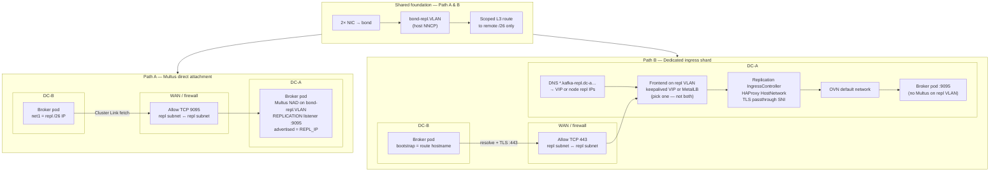

---
review:
  status: unreviewed
  notes: "Combined design doc for peer sharing — decision guide + path-specific depth. Multus is primary; ingress shard documented as alternative. Not yet implemented or reviewed by network/platform teams."
---

# Cross-DC Kafka Replication Architecture — Complete Picture

**Audience:** Platform engineers and peers reviewing a proposed cross-DC network + Kafka replication design before implementation — not yet a build guide.

**Purpose:** **Canonical hub** for cross-DC Cluster Linking on bare-metal OpenShift — compare replication paths, understand shared network foundations, then follow the deep-dive doc for the mechanism you are evaluating. This file is the entry point; linked docs are maintained references, not peers that override it.

**How to read this doc:**

| You need to… | Start here |
|---|---|
| **Compare paths** (Multus vs ingress) | [Choose your replication path](#choose-your-replication-path) |
| **Understand networking terms** (SNAT, Multus, scoped routes) | [Networking basics](#networking-basics-terms-used-in-this-doc) |
| **Implement host bond/VLAN** (required for all paths) | [Shared foundation — host network](#shared-foundation--host-network) |
| **Implement Multus path** (primary) | [Path A — Multus pod attachment](#path-a--multus-pod-attachment) → [Part 2 — Cluster Linking](#part-2--confluent-cluster-linking-on-top-of-it) |
| **Implement ingress path** (alternative) | [Path B — dedicated ingress shard](#path-b--dedicated-ingress-shard) → [cross-dc-ingress-alternative.md](cross-dc-ingress-alternative.md) |
| **Run pre-cutover verification** | [Pre-flight](#pre-flight-before-network-verification) (Path A: Multus network test) or [ingress test framework](../../networking/cross-dc-ingress-test/README.md) (Path B) |

**Corpus map (deep dives):**

| Doc / tooling | Role |
|---|---|
| [cross-dc-replication.md](../../networking/cross-dc-replication.md) | Generic host + Multus layers (workload-agnostic depth) |
| [cross-dc-cluster-linking.md](cross-dc-cluster-linking.md) | Kafka / CFK / Cluster Linking depth |
| [cross-dc-ingress-alternative.md](cross-dc-ingress-alternative.md) | Dedicated ingress shard + external DNS/VIP handoff |
| [cross-dc-rollout/](../../networking/cross-dc-rollout/README.md) | Inventory → rendered NNCP / test env / Kafka net values |
| [cross-dc-nncp-helm/](cross-dc-nncp-helm/README.md) | Host bond/VLAN NNCP (shared by Multus and ingress paths) |
| [cross-dc-kafka-net-helm/](cross-dc-kafka-net-helm/README.md) | Multus NAD + `MultiNetworkPolicy` (Multus path only) |
| [cross-dc-network-test/](../../networking/cross-dc-network-test/README.md) | Pre-Kafka Multus network verification (Path A) |
| [cross-dc-ingress-test/](../../networking/cross-dc-ingress-test/README.md) | Pre-Kafka layered ingress verification (Path B) |
| [ingress-replication examples](examples/ingress-replication/README.md) | Generic `IngressController` + policy examples (ingress path) |

If this hub and a deep-dive disagree, **update the deep-dive and then sync this hub** — not the other way around.

**Official references** (sent by a peer for cross-check — findings folded in below):

- [OpenShift: Secondary networks — attaching a pod](https://docs.redhat.com/en/documentation/openshift_container_platform/4.20/html/multiple_networks/secondary-networks#nw-multus-advanced-annotations_attaching-pod) — `default-route` override, static IP/MAC annotations
- [OpenShift: Secondary networks — configuring multi-network policy](https://docs.redhat.com/en/documentation/openshift_container_platform/4.20/html/multiple_networks/secondary-networks#configuring-multi-network-policy)
- [OpenShift: MultiNetworkPolicy API reference](https://docs.redhat.com/en/documentation/openshift_container_platform/4.20/html/network_apis/multinetworkpolicy-k8s-cni-cncf-io-v1beta1)

**Deployment context:** Confluent for Kubernetes (**CFK**), installed via Helm (not OLM/OperatorHub). Helm vs. OLM only affects how the operator itself is deployed, not the `platform.confluent.io` CRDs it watches.

---

## On this page

- [Problem shape](#problem-shape)
- [Choose your replication path](#choose-your-replication-path)
  - [Replication traffic flow — component view](#replication-traffic-flow--component-view)
- [Layer map](#layer-map)
- [Networking basics (terms used in this doc)](#networking-basics-terms-used-in-this-doc)
- [Shared foundation — host network](#shared-foundation--host-network)
  - [Layer 1–2: bond and VLAN](#layer-12-bond-and-vlan)
  - [Layer 3: routing](#layer-3-routing)
- [Path A — Multus pod attachment](#path-a--multus-pod-attachment)
  - [Broker replication IP assignment](#broker-replication-ip-assignment)
  - [Securing the secondary network: MultiNetworkPolicy](#securing-the-secondary-network-multinetworkpolicy)
- [Part 2 — Confluent Cluster Linking on top of it](#part-2--confluent-cluster-linking-on-top-of-it)
  - [What Cluster Linking simplifies](#what-cluster-linking-simplifies)
  - [Connection direction](#connection-direction)
  - [Path B — dedicated ingress shard](#path-b--dedicated-ingress-shard)
  - [CFK listener configuration](#cfk-listener-configuration)
  - [Managing the cluster link (GitOps)](#managing-the-cluster-link-gitops)
  - [Bidirectional, pre-staged links for failover](#bidirectional-pre-staged-links-for-failover)
  - [Security requirements](#security-requirements)
  - [MultiNetworkPolicy for Kafka](#multinetworkpolicy-for-kafka)
- [Anti-patterns](#anti-patterns)
- [Pre-flight before network verification](#pre-flight-before-network-verification)
- [Verification checklist](#verification-checklist)
- [Open questions to confirm before implementing](#open-questions-to-confirm-before-implementing)

---

## Problem shape

Two bare-metal OpenShift clusters, one per datacenter, need a **dedicated, isolated** network path for bulk replication traffic — separate from management/API/OVN pod traffic. Each node has two NICs on **two different physical cards** (slot A, slot B), intended for HA via bonding. This is a **third network**, distinct from both the cluster's machine network and any storage network:

| Network | Typical pattern |
|---|---|
| Management / API / OVN | Existing machine network |
| Storage (NVMe/TCP, etc.) | Two independent NICs, **no bond** |
| **Cross-DC replication** | Bonded NIC pair + VLAN + routed subnet — this doc |

The concrete workload driving this design is **Apache Kafka (Confluent Platform, via CFK)**, using **Cluster Linking** for broker-to-broker replication between the two clusters.

**Before building this:** confirm whether the two NICs per node are genuinely new/unconfigured, or whether they're existing NICs already bonded for something else and this is really "add a VLAN to an existing bond." The two scenarios have very different bandwidth-isolation and fault-isolation properties — check `nmcli connection show` / `ip -d link show` / `oc get nns` on a target node rather than assuming.

---

## Choose your replication path

**Read this section first** if you are deciding how brokers reach each other across datacenters.
The sections below assume you have picked a path.

Three realistic shapes for cross-DC Cluster Linking on bare-metal OpenShift:

| Path | How brokers are reached | Advertised endpoints | Firewall (WAN) | Ops complexity |
|---|---|---|---|---|
| **A — Multus** (primary) | Broker pod on replication VLAN | `REPLICATION://10.200.1.21:9095` per broker | Per-broker pod IP, TCP **9095** | `$(REPL_IP)` / IPAM wiring |
| **B — Dedicated ingress** | HAProxy on repl VLAN → OVN → broker | CFK Route hostnames, TCP **443** (passthrough) | Router VIP or node repl IPs, TCP **443** | 2nd IngressController + DNS/VIP |
| **C — Default ingress PoC** | Default HAProxy on machine network | CFK Route hostnames on `apps.*` | Machine-network ingress VIP | Lowest — **not** repl VLAN |

```text
Path A (Multus) — primary design in this doc:
  Remote broker ──TCP 9095──► 10.200.1.21 (broker pod on repl VLAN)

Path B (dedicated ingress) — see cross-dc-ingress-alternative.md:
  Remote broker ──TCP 443──► repl VIP or DNS-LB pool on repl VLAN
           ──HAProxy (SNI)──► OVN ──► broker pod :9095

Path C (PoC only):
  Remote broker ──TCP 443──► machine-network ingress VIP
           ──default HAProxy──► OVN ──► broker pod :9095
```

### Replication traffic flow — component view

**Canonical topology** for sharing with network and platform peers. Example direction: **DC-B broker initiates** a Cluster Link fetch toward an endpoint **advertised by DC-A** (default Cluster Linking direction — source-initiated mode flips who dials).

**Cluster Link** sits above this diagram: `bootstrap.servers` / `bootstrapEndpoint` must match the **advertised replication listener** on the chosen path (Multus IP:9095 or route hostname:443).



| Path | What crosses the WAN | What stays inside the destination DC |
|---|---|---|
| **A** | TCP **9095** to broker **pod repl IP** | Multus attachment, `MultiNetworkPolicy` on NAD |
| **B** | TCP **443** to **frontend** on repl VLAN | IngressController → Route → OVN → broker |
| **C** *(PoC)* | TCP **443** to **machine-network** ingress VIP | Default HAProxy → OVN → broker — **not** repl VLAN |

Path B frontend detail: [cross-dc-ingress-alternative.md — Frontend options](cross-dc-ingress-alternative.md#frontend-options-without-an-external-hardware-lb). Path A IPAM detail: [BROKER-IPAM.md](cross-dc-kafka-net-helm/BROKER-IPAM.md).

**Shared by all paths that use the replication VLAN (A and B):**

- Bond + VLAN + scoped L3 route on `bond-repl.200` ([shared foundation](#shared-foundation--host-network))
- Routed `/26` per DC — not L2 stretch across WAN
- Bidirectional firewall between replication subnets

**Path-specific only:**

| Concern | Path A (Multus) | Path B (ingress) | Path C (PoC) |
|---|---|---|---|
| Multus NAD on brokers | Yes | No | No |
| `MultiNetworkPolicy` on NAD | Yes | No (OVN `NetworkPolicy` router→broker) | No |
| 2nd `IngressController` | No | Yes | No (uses default) |
| DNS zone on repl VLAN | Optional (IPs in link config) | Required (`*.kafka-repl.dc-a…`) | Uses `apps.*` |
| CFK `$(REPL_IP)` wiring | Yes | No — CFK Routes auto-manage listeners | No |

**When to choose:**

- **Path A** — per-broker repl IPs, no router hop, `MultiNetworkPolicy` on the NAD; accept listener/IPAM wiring.
- **Path B** — CFK Route ergonomics; accept HAProxy hop + DNS/VIP (or DNS LB) on repl VLAN. Full design: [cross-dc-ingress-alternative.md](cross-dc-ingress-alternative.md).
- **Path C** — functional validation only; replication stays on management network.

---

## Layer map

```text
L7  Application         Kafka broker protocol, Cluster Linking (fetch-based replication)
L4  Transport            TCP session, dedicated REPLICATION listener/port
L3  Network              Routed subnets per DC, static route (not default gateway)
L2  Data link            Bond (two cards) + VLAN tag
L1  Physical             Two NICs, two cards, dedicated fiber/circuit
```

Pod attachment (Multus on **Path A**) sits at L2/L3 and is the layer most often skipped by mistake.
**Path B** skips pod attachment; replication enters via HAProxy on the repl VLAN instead.

---

## Networking basics (terms used in this doc)

This section is for readers who are strong on OpenShift/Kafka but still building networking vocabulary — the rest of the doc assumes these ideas.

### Layer numbers (quick reference)

See the [layer map](#layer-map) above. In conversation you'll mostly touch **L1–2** (NICs, bond, VLAN), **L3** (subnets, gateways, routes — *not* default routes on the replication link), and **L4** (TCP port 9095 for replication). **L7** is Kafka + Cluster Linking on top.

### Three address "worlds" on a node

| World | Typical addresses | Who uses it |
|---|---|---|
| **Machine / management network** | Whatever the cluster already uses for API, nodes, SSH | Host OS, `oc debug node`, most infrastructure |
| **OVN pod network (default)** | Cluster overlay (e.g. `10.128.x.x`) | Almost every pod's `eth0` — Services, internal Kafka clients |
| **Replication VLAN subnet** | Per-DC `/26` (e.g. `10.200.1.0/26` ↔ `10.200.2.0/26`) | Cross-DC replication — broker pods (Path A) or ingress frontend (Path B) |

These are **different subnets on purpose**. Replication traffic should be identifiable by source/dest IP in the replication pools, not mixed with management traffic.

### NAT, SNAT, and DNAT

**NAT (Network Address Translation)** rewrites IP addresses (and often ports) in packet headers so traffic can cross between address realms.

| Term | Rewrites | Typical direction | Example in OpenShift |
|---|---|---|---|
| **SNAT** (Source NAT) | Source IP/port | Outbound | Pod sends as `10.128.x.x`; remote may see the **node's machine-network IP** after OVN SNAT |
| **DNAT** (Destination NAT) | Destination IP/port | Inbound | Client hits a Route/LoadBalancer VIP; packet is steered to a **pod IP** |

**Why SNAT matters here:** If a broker only uses the default OVN network toward the other DC, egress can be **SNAT'd to the machine-network IP**. Firewalls and routing on the replication path expect sources in **`10.200.1.x`**, not the management subnet — return paths break or ACLs don't match. Multus gives replication traffic a path where the **source is already a replication-subnet IP** (see below).

### Default pod network vs Multus secondary network

**Without Multus:** Each pod gets one interface (`eth0`) on the cluster overlay (OVN-Kubernetes). That is the right default for API calls, DNS, image pulls, and internal Kafka clients.

**Multus** is a CNI meta-plugin (enabled on OpenShift) that can attach **additional** interfaces defined by a **`NetworkAttachmentDefinition` (NAD)**. A pod annotation (`k8s.v1.cni.cncf.io/networks: …`) requests the extra attachment at startup.

After attachment, a broker is **dual-homed** — not "moved" off the cluster network:

```text
┌─ Kafka pod ─────────────────────────────────────────────────────┐
│  eth0 (OVN)          default route → normal cluster egress       │
│                      INTERNAL listener, clients, API, DNS      │
│                      (often SNAT to machine-network IP)          │
├──────────────────────────────────────────────────────────────────┤
│  net1 (Multus/NAD)   route to remote DC /26 ONLY                 │
│                      REPLICATION listener advertised here        │
│                      source IP = replication pool (10.200.1.x)   │
│                      NO default-route on this attachment         │
└──────────────────────────────────────────────────────────────────┘
```

**NAD** = the Kubernetes object describing *how* to attach (macvlan on `bond-repl.200`, IP pool, routes). **Multus** = the mechanism that applies it. **`network-status` annotation** on the pod = what actually landed (IPs, routes — use this to verify no accidental `default-route`).

More detail on NAD patterns: [NetworkAttachmentDefinition guide](../../networking/network-attachment-definitions/README.md).

### Scoped route vs default route (host and pod)

A **default route** (`0.0.0.0/0`) means "send *everything* out this interface." On the replication VLAN — host **or** pod — that bleeds API traffic, DNS, and pulls onto a link sized for replication only. It usually breaks the cluster outright.

A **scoped route** means "send only **this prefix** out this interface" — here, the **other datacenter's replication `/26`**. Everything else follows the normal default (OVN / machine network).

| Level | Correct shape | Wrong shape |
|---|---|---|
| **Host** (NNCP) | Route: remote `/26` → gateway on `bond-repl.200` | Default route on `bond-repl.200` |
| **Pod** (NAD + annotation) | Route: remote `/26` on Multus iface; default stays on `eth0` | `default-route` set on Multus attachment |

That split is the design rule peers often state as: **only traffic to the other DC's replication subnet uses the replication IP; all other destinations use the original cluster/machine path.**

### Other terms that appear later

| Term | Meaning |
|---|---|
| **CNI** | Container Network Interface — plugins that wire pod networking (OVN, Multus, macvlan, whereabouts) |
| **macvlan** | Gives each pod its own MAC on a VLAN segment (default here); use **ipvlan** if the switch limits MAC counts |
| **whereabouts** | IPAM plugin — assigns pod IPs from a pool on a NAD |
| **NNCP / NNCE** | NodeNetworkConfigurationPolicy / Enactment — nmstate objects for host networking |
| **`MultiNetworkPolicy`** | Like `NetworkPolicy`, but enforced on a **secondary** interface (standard policy only sees `eth0`) |

---

## Shared foundation — host network

**Required for Path A and Path B** (any design that uses the dedicated replication VLAN).
Kafka-agnostic — identical for storage mirroring or other cross-DC replication workloads.

### Layer 1–2: bond and VLAN

Prefer **NMState / `NodeNetworkConfigurationPolicy`** over raw MachineConfig/Butane if the `kubernetes-nmstate` operator is available — it's day-2 mutable (no MCO drain/reboot for most changes) and gives you `NodeNetworkState` to verify what actually landed. Fall back to Butane/Ignition MachineConfig only if nmstate isn't installed.

```yaml
apiVersion: nmstate.io/v1
kind: NodeNetworkConfigurationPolicy
metadata:
  name: repl-network
spec:
  nodeSelector:
    node-role.kubernetes.io/repl-gateway: ""   # only nodes actually cabled for this
  desiredState:
    interfaces:
      - name: bond-repl
        type: bond
        state: up
        link-aggregation:
          mode: active-backup      # LACP (802.3ad) only if the local ToR pair supports it end-to-end
          port:
            - ens4f0                # slot A, port 1
            - ens5f0                # slot B, port 1
      - name: bond-repl.200
        type: vlan
        state: up
        vlan:
          base-iface: bond-repl
          id: 200
        ipv4:
          enabled: true
          address:
            - ip: 10.200.1.11
              prefix-length: 26
          dhcp: false
```

**Decisions to nail down here, in order of how often they're gotten wrong:**

1. **Node targeting.** If only a subset of nodes have this NIC layout (e.g., dedicated gateway/broker nodes), target them with a label + `nodeSelector`, not the default `worker` pool. Applying this cluster-wide to nodes without the matching hardware will fail or misconfigure.
   **If every node needs a unique static IP** on this interface (e.g., Kafka brokers run fleet-wide, not on a small gateway subset), a single role-based NNCP won't do it — NMState applies identical `desiredState`, including the IP, to every node it matches. The only NNCP-native fix is one policy per node via `kubernetes.io/hostname`. See [Cross-DC replication NNCP (Helm)](cross-dc-nncp-helm/README.md) for a template that renders this from a node list. Worth confirming first, though, whether a static host IP is even needed — see the next callout.
2. **Interface naming stability.** Kernel interface names (`ens4f0`, etc.) depend on PCI enumeration order and can differ across otherwise-identical hardware. At fleet scale, match by MAC/PCI path via `systemd.link` rather than assuming names are consistent.
3. **Bonding mode.** `active-backup` works with any switch. `802.3ad`/LACP requires every hop in the bond to participate — fine if the bond terminates at your own local ToR pair, **not** viable if anyone assumes the bond itself spans the WAN (it doesn't; the WAN segment is routed, not bonded).

### Layer 3: routing

**The most common mistake in this whole design:** setting the node's **default route** on the replication interface instead of a route scoped to the remote subnet. A default route on this interface sends *all* egress traffic (image pulls, DNS, API calls) out over a link sized, firewalled, and provisioned for one purpose only — and it usually breaks connectivity outright.

```yaml
routes:
  config:
    - destination: 10.200.2.0/26      # remote DC's replication subnet — NOT 0.0.0.0/0
      next-hop-address: 10.200.1.1
      next-hop-interface: bond-repl.200
# deliberately no default-route entry on this interface
```

**L3 routed, not L2 stretched.** Each DC gets its own subnet on this VLAN; a router/gateway pair exchanges the routes. Don't stretch one VLAN/subnet across both DCs "for simplicity" — L2 stretch at distance introduces STP, MAC-learning, and failure-domain problems that routed L3 avoids entirely.

**MTU:** two constraints apply — **parent-first** (VLAN MTU bounded by `bond-repl` on the node) and **path** (effective MTU is the minimum hop on the replication VLAN circuit, independent of management/OVN MTU). Full treatment: [cross-dc-replication.md — MTU constraints](../../networking/cross-dc-replication.md#mtu--parent-first-and-path-constraints). Inventory `expectedMtu` and network test 5 encode the chosen end-to-end value.

**Path B note:** repl-gateway nodes hosting the dedicated ingress shard also need NNCP on `bond-repl.200` — for router frontend IPs on the repl subnet, not for broker Multus attachment.

---

## Path A — Multus pod attachment

**Skip this section if you chose Path B or C.** Path B still needs the [shared foundation](#shared-foundation--host-network) above.

### Pod attachment via Multus

See [Networking basics](#networking-basics-terms-used-in-this-doc) for NAT/SNAT, Multus, and dual-homed pods — this section applies those ideas to the replication VLAN.

A MachineConfig/NNCP configures the **host**. It does nothing for pods on the default OVN network — pods don't automatically see that interface, and OVN-Kubernetes **SNATs pod egress to the node's primary (machine-network) IP** on the default path. So even though the host has a correct route to the remote /26 via `bond-repl.200`, a pod on the default network reaching that destination can still present the **wrong source IP** — breaking return routing symmetry and complicating firewall rules that expect traffic sourced from the replication subnet specifically.

**The fix:** attach the workload pod to the VLAN via Multus — a **second** interface with a replication-subnet IP and a **scoped route to the remote DC's `/26` only**. The primary OVN interface (`eth0`) keeps the default route for everything else (API, DNS, internal listeners). The pod is dual-homed, not relocated to the replication subnet.

```yaml
apiVersion: k8s.cni.cncf.io/v1
kind: NetworkAttachmentDefinition
metadata:
  name: repl-net
  namespace: <workload-namespace>
spec:
  config: |
    {
      "cniVersion": "0.3.1",
      "type": "macvlan",
      "master": "bond-repl.200",
      "mode": "bridge",
      "ipam": {
        "type": "whereabouts",
        "range": "10.200.1.0/26",
        "range_start": "10.200.1.20",
        "range_end": "10.200.1.60"
      }
    }
```

**macvlan vs ipvlan:** `macvlan` (each pod gets its own MAC) is the common default. If many pods per node share this VLAN and the ToR does MAC-count/port-security limiting, switch to `ipvlan` mode `l2` instead — shares the host's MAC, avoids MAC-table growth.

**hostNetwork as an alternative:** if the workload is a host-level daemon (not a typical pod) or already runs with `hostNetwork: true`, it shares the host's network namespace directly and the host route alone is sufficient — no Multus needed for that specific workload.

**The pod-level version of the "no default route" rule:** the same mistake from [Layer 3 routing](#layer-3-routing) has a pod-scoped equivalent. The extended JSON form of the `k8s.v1.cni.cncf.io/networks` annotation accepts a `default-route` key per attachment — leave it unset for `repl-net`/`kafka-repl-net`. Left unset, the pod's default route stays on the primary (OVN) interface; the Multus attachment carries only the **scoped route to the remote `/26`** (plus local replication-subnet addressing), not a default. Confirm via the pod's `k8s.v1.cni.cncf.io/network-status` annotation — the secondary entry should have no `"default-route"` key.

**Static IP/MAC as an alternative to whereabouts:** macvlan supports per-pod address pinning via CNI chaining (`ipam.type: static`) and the extended `k8s.v1.cni.cncf.io/networks` annotation (`ips` / `routes` keys). **Neither mode is mandatory for Cluster Linking** — both need a correct advertised Multus IP; they differ in predictability, firewall shape, and CFK wiring complexity. See [Broker replication IP assignment](#broker-replication-ip-assignment) and [BROKER-IPAM.md](cross-dc-kafka-net-helm/BROKER-IPAM.md).

### Broker replication IP assignment

Two supported modes for Kafka on the replication NAD (selected in [rollout inventory](../../networking/cross-dc-rollout/inventory-dc-a.example.yaml) as `workload.brokerIpam.mode`, rendered by [cross-dc-kafka-net-helm](cross-dc-kafka-net-helm/README.md)):

| Mode | Summary | Choose when |
|---|---|---|
| **whereabouts** (default) | Pool assigns IP at schedule; init container sets `REPL_IP` from `network-status` | Subnet-wide firewall rules; simpler ops; first implementation |
| **static** | You pin `replIp` per broker ordinal; routes on pod annotation | Per-broker `/32` ACLs; fixed Cluster Link bootstrap lists; avoid init container |

Full trade-offs, CFK snippets, and switching guidance: **[BROKER-IPAM.md](cross-dc-kafka-net-helm/BROKER-IPAM.md)**. For the runtime chain (inventory → Multus → `network-status` → `REPL_IP` → Cluster Link bootstrap), subnet layout on the `/26`, persistence on pod recreate, and common failure modes, see [End-to-end pipeline](cross-dc-kafka-net-helm/BROKER-IPAM.md#end-to-end-pipeline) in that doc.

**Not the same as host NNCP IPs:** per-node static addresses on `bond-repl.200` are optional for macvlan and independent of broker IP mode — see [NNCP Helm README](cross-dc-nncp-helm/README.md).

### Securing the secondary network: MultiNetworkPolicy

Standard Kubernetes `NetworkPolicy` **only governs the default pod network** — it has no effect on the Multus-attached secondary interface. Without `MultiNetworkPolicy`, anything attached to this NAD can reach anything else attached to it, with zero in-cluster enforcement; you'd be relying entirely on physical VLAN isolation and upstream switch/router ACLs.

**Enable the capability:**

```yaml
apiVersion: operator.openshift.io/v1
kind: Network
metadata:
  name: cluster
spec:
  useMultiNetworkPolicy: true
```

**Opt the NAD in:**

```yaml
apiVersion: k8s.cni.cncf.io/v1
kind: NetworkAttachmentDefinition
metadata:
  name: repl-net
  namespace: <workload-namespace>
  annotations:
    k8s.v1.cni.cncf.io/policy-for: <workload-namespace>/repl-net
spec:
  # ...same config as above
```

**Restrict traffic on it** (generic version — see [Part 2](#multinetworkpolicy-for-kafka) for the Kafka-scoped version actually used):

```yaml
apiVersion: k8s.cni.cncf.io/v1beta1
kind: MultiNetworkPolicy
metadata:
  name: repl-net-restrict
  namespace: <workload-namespace>
  annotations:
    k8s.v1.cni.cncf.io/policy-for: <workload-namespace>/repl-net
spec:
  podSelector:
    matchLabels:
      <label-selecting-the-workload>
  policyTypes: [Ingress, Egress]
  ingress:
    - from: [{ipBlock: {cidr: 10.200.2.0/26}}]
      ports: [{protocol: TCP, port: <replication-port>}]
  egress:
    - to: [{ipBlock: {cidr: 10.200.2.0/26}}]
      ports: [{protocol: TCP, port: <replication-port>}]
```

Verify enforcement explicitly — spin up a debug pod on the same NAD without the matching label and confirm it *can't* reach the workload's replication port. `MultiNetworkPolicy` misconfiguration (missing `policy-for` annotation on either the NAD or the policy) tends to fail open silently.

**Mis-attachment defense:** a single broker-scoped allow policy leaves **unselected** pods on the same NAD at default-allow on `net1`. The [Kafka net Helm chart](cross-dc-kafka-net-helm/MULTINETWORKPOLICY.md) renders a catch-all **default-deny** policy plus a broker allow-list by default — see [MULTINETWORKPOLICY.md](cross-dc-kafka-net-helm/MULTINETWORKPOLICY.md).

**If a peer sends you the "subnets field" caveat, it doesn't apply here.** Red Hat's docs note that `podSelector`/`namespaceSelector` peer matching in a multi-network policy is only valid if the secondary network's CNI config defines a `subnets` field — otherwise only `ipBlock` works. That restriction is scoped to **OVN-Kubernetes secondary networks** (CNI type `ovn-k8s-cni-overlay`, `topology: layer2`/`localnet`), a different mechanism from the **macvlan** NAD this design uses. For macvlan/IPVLAN/SR-IOV NADs — including the `kafka-repl-net` policy in Part 2 — `podSelector` is valid regardless; there's no `subnets` field in a macvlan CNI config to begin with.

**CLI verification:** the resource name is `multi-networkpolicy` (singular, hyphenated) — `oc get multi-networkpolicy -n <namespace>`.

---

## Part 2 — Confluent Cluster Linking on top of it

Everything in this part is Kafka/CFK-specific — how the broker pods use the network built in Part 1.

### What Cluster Linking simplifies

Unlike MirrorMaker2 or Confluent Replicator, Cluster Linking is broker-to-broker — *"does not require running Connect to move messages between clusters"* ([Confluent docs](https://docs.confluent.io/platform/current/multi-dc-deployments/cluster-linking/index.html)). No separate `Connect` CR or Connect worker pods to also attach to the replication network.

**Path A:** broker pods need Multus attachment (see [Path A](#path-a--multus-pod-attachment)).
**Path B/C:** brokers stay on OVN; reachability is via CFK Routes (see [Path B](#path-b--dedicated-ingress-shard) and [CFK listener configuration](#cfk-listener-configuration)).

```text
Path A:  Brokers (Multus, REPLICATION listener) ──→ Cluster Link config ──→ remote brokers
Path B:  Brokers (Route hostnames :443) ──→ Cluster Link config ──→ remote brokers
```

### Connection direction

By default, the **destination cluster's brokers initiate the connection and fetch from the source** — it behaves like a consumer pulling data, not the source pushing. This determines which side needs an egress rule and which needs an ingress rule in `MultiNetworkPolicy` and any upstream firewall.

- **One-directional link** (e.g., pure DR, no failback link pre-staged): only the destination DC's brokers dial out; the source DC only needs inbound from the destination's /26.
- **Bidirectional** (this design — see [below](#bidirectional-pre-staged-links-for-failover)): each DC is simultaneously a source (accepting inbound) and a destination (dialing out) for its respective link, so rules end up symmetric on both sides regardless.

A newer **source-initiated link** option (CP 7.8+) flips this — confirm which mode is actually configured before assuming direction.

### Path B — dedicated ingress shard

**Skip if you chose Path A.** Summary only — full design, DNS/VIP handoff, security, and verification: **[cross-dc-ingress-alternative.md](cross-dc-ingress-alternative.md)**.

CFK supports [`externalAccess.type: route`](https://docs.confluent.io/operator/current/co-routes.html) — TLS passthrough/SNI through HAProxy, per-broker route hostnames, CFK-managed `advertised.listeners`.

| Ingress target | Production? | Replication VLAN? |
|---|---|---|
| **Default** `apps.*` ingress (Path C) | PoC only | No — machine network |
| **Dedicated** ingress shard on repl VLAN (Path B) | Yes, if DNS/VIP correct | Yes — WAN hits repl subnet frontend |
| **Multus** direct (Path A) | Yes | Yes — no ingress hop |

Path B trades `$(REPL_IP)` complexity for: 2nd `IngressController`, repl-VLAN DNS zone, VIP (keepalived/MetalLB) or DNS LB to router node repl IPs, and HAProxy as a shared hop for all replication bytes.

### CFK listener configuration

Configuration depends on the path chosen in [Choose your replication path](#choose-your-replication-path).

#### Path A — Multus listener

A listener with **no `externalAccess` block**, bound to the pod's Multus secondary interface, advertising that interface's IP.

```yaml
apiVersion: platform.confluent.io/v1beta1
kind: Kafka
metadata:
  name: kafka
  namespace: confluent
spec:
  podTemplate:
    annotations:
      k8s.v1.cni.cncf.io/networks: kafka-repl-net
  listeners:
    internal:
      tls:
        enabled: true
    # no "external" block, no externalAccess.type: route for the replication path
  configOverrides:
    server:
      - "listeners=INTERNAL://0.0.0.0:9071,REPLICATION://0.0.0.0:9095"
      - "listener.security.protocol.map=INTERNAL:PLAINTEXT,REPLICATION:SSL"
      - "advertised.listeners=INTERNAL://$(POD_NAME).kafka.confluent.svc.cluster.local:9071,REPLICATION://$(REPL_IP):9095"
```

**Verify against the installed CFK version's CRD reference:**

1. Whether the structured `listeners` block supports a fully custom named listener without an `externalAccess` type attached, or whether the `configOverrides.server` raw passthrough above is the correct escape hatch.
2. How `$(REPL_IP)` gets populated — depends on [broker IP mode](cross-dc-kafka-net-helm/BROKER-IPAM.md): **whereabouts** → typically an init container reading `network-status`; **static** → literal per-ordinal IP in pod env / `advertised.listeners`. See [CFK snippets](cross-dc-kafka-net-helm/examples/).

#### Path B or C — CFK Route listener

Use `listeners.custom` with `externalAccess.type: route` — CFK creates per-broker Routes and sets `advertised.listeners` to route hostnames.
Cluster Link `bootstrap.servers` uses those hostnames (port **443**, TLS passthrough to broker **9095**).

Path **B:** dedicated `IngressController` with separate `spec.domain` (e.g. `kafka-repl.dc-a.example.com`) and `routeSelector` — not default `apps.*`.
Path **C:** default ingress — valid PoC only.

Example and full listener shape: [cross-dc-ingress-alternative.md — CFK listener](cross-dc-ingress-alternative.md#cfk-listener-configuration-route-mode).

### Managing the cluster link (GitOps)

The link object must be **version-controlled** — not only created in Control Center during cutover. Two valid approaches: **`ClusterLink` CRD** + Argo CD when the CR exposes every setting you need, or **declarative spec in Git** + **reconcile script** (often an Argo Job) when the CRD has gaps or the team prefers API/CLI.

Peers sometimes report the CRD **does not expose all link settings** — verify on **your** CFK version (`oc explain clusterlink.spec`). Full pattern comparison (CRD, Job reconcile, PostSync hooks, CronJob drift, external CI, hybrid, long-running reconciler): **[CLUSTER-LINK-GITOPS.md](CLUSTER-LINK-GITOPS.md)**.

Regardless of pattern, separate **management** traffic (API/CLI/CR apply — management network) from **replication** traffic (broker fetch on the replication listener). The **`bootstrap.servers` / `bootstrapEndpoint` must be the replication listener's advertised address** — Multus IP:9095 (Path A) or route hostname:443 (Path B/C) — not internal Service DNS or the wrong ingress VIP.
Getting this value wrong means the link either fails or silently uses the wrong path.

**Do not mix** API-managed mirrors with a `ClusterLink` CR on the same link — CFK may delete externally created mirrors on reconcile.

### Bidirectional, pre-staged links for failover

The design: **active/standby**, but with links configured in **both directions** upfront, so replication can resume when a failed DC comes back online without building a link under pressure.

Confluent has a built-in alternative worth confirming was deliberately not chosen: `reverse-and-start` / `reverse-and-pause` reverses an existing link's direction rather than requiring two independently-managed link objects. It has a specific limitation — doesn't support prefixed cluster links — which is the most likely reason to use two separate links instead, if topic prefixing is in use to avoid naming collisions between clusters.

Either approach needs the same symmetric network reachability; it doesn't change the [shared foundation](#shared-foundation--host-network). It does change how failover/failback is *operated*, so worth confirming which was intended.

### Security requirements

Confluent's own guidance treats these as requirements, not optional hardening, specifically because Cluster Linking accesses the listener like a client:

- **TLS/SASL required** — *"Do not use unauthenticated listeners with Confluent Platform. Cluster Linking can access the listeners, increasing the security risk."*
- **Certificate/keystore files at the same path on every broker** — a real operational trap if using file-based TLS material rather than inline PEM config; inconsistency causes link failures.
- **ACL syncing** — Cluster Linking syncs ACLs between clusters by default. If the two clusters have independently-managed ACLs today, this needs a deliberate decision, not a default left alone.
- **Long-lived TCP connections** — *"Firewalls that allow the cluster link connection ... must allow the TCP connection to persist."* Check idle-connection timeouts on any firewall/router on the WAN path; aggressive timeouts silently break Cluster Linking.

### MultiNetworkPolicy for Kafka

**Path A only.** Same pattern as [Securing the secondary network](#securing-the-secondary-network-multinetworkpolicy), scoped to broker pods and port 9095.
The [cross-dc-kafka-net-helm](cross-dc-kafka-net-helm/README.md) chart renders **two** policies by default — full rationale in **[MULTINETWORKPOLICY.md](cross-dc-kafka-net-helm/MULTINETWORKPOLICY.md)**:

| Policy | `podSelector` | Effect on `net1` |
|---|---|---|
| `kafka-repl-net-default-deny` | `{}` | Deny all (mis-attachment defense) |
| `kafka-repl-net-restrict` | `app: kafka` | Allow remote `/26` TCP 9095 only |

Broker allow policy (simplified):

```yaml
apiVersion: k8s.cni.cncf.io/v1beta1
kind: MultiNetworkPolicy
metadata:
  name: kafka-repl-restrict
  namespace: confluent
  annotations:
    k8s.v1.cni.cncf.io/policy-for: confluent/kafka-repl-net
spec:
  podSelector:
    matchLabels:
      app: kafka
  policyTypes: [Ingress, Egress]
  ingress:
    - from: [{ipBlock: {cidr: 10.200.2.0/26}}]
      ports: [{protocol: TCP, port: 9095}]
  egress:
    - to: [{ipBlock: {cidr: 10.200.2.0/26}}]
      ports: [{protocol: TCP, port: 9095}]
```

Because Cluster Linking is broker-only (no Connect layer), this is the only workload-specific policy needed — no separate rule set for Connect workers.

---

## Anti-patterns

| Anti-pattern | Why it breaks things |
|---|---|
| Default gateway on the replication NIC | Bleeds all egress traffic onto a link sized for one purpose; usually breaks connectivity |
| Assuming pods on the default network use the new NIC automatically | OVN SNAT + default routing table means they don't, without Multus |
| L2-stretching a subnet across DCs "for simplicity" | STP, MAC-learning, and failure-domain problems at distance |
| LACP bond assumed to span the WAN | The WAN carrier doesn't participate in your LACP; bond terminates locally, WAN segment is routed |
| MachineConfig/NNCP applied to the default `worker` pool when only some nodes have the hardware | Fails to render, or misconfigures nodes without the matching NICs |
| No `MultiNetworkPolicy` on the secondary interface | Standard `NetworkPolicy` doesn't see it; no in-cluster enforcement at all |
| `default-route` set on the broker pod's `kafka-repl-net` Multus annotation | Same failure mode as the host-level default-route mistake, at pod scope — bleeds pod egress onto the replication link |
| Assuming the OVN-K8s "`subnets` field required for `podSelector`" caveat applies to this macvlan NAD | It's specific to OVN-Kubernetes secondary networks, not macvlan/IPVLAN/SR-IOV |
| Jumbo MTU on VLAN without raising parent bond MTU | [Parent-first constraint](../../networking/cross-dc-replication.md#mtu--parent-first-and-path-constraints) — VLAN cannot exceed `bond-repl` frame size |
| Local jumbo when inter-DC replication path is 1500 | [Path MTU constraint](../../networking/cross-dc-replication.md#mtu--parent-first-and-path-constraints) — effective MTU is minimum hop on VLAN 200 |
| `externalAccess.type: route` on the **default** ingress for the Kafka replication listener | Routes replication through machine-network ingress — defeats the dedicated VLAN silently |
| Using a **dedicated** ingress shard without repl-VLAN DNS/VIP | Routes exist but WAN traffic still hits wrong network if DNS points at `apps.*` VIP |
| Unauthenticated Kafka listener exposed to Cluster Linking | Confluent explicitly calls this a security risk, not a style choice |

---

## Pre-flight before network verification

**When:** After host NNCP/bond/VLAN is applied on both clusters, before running the [cross-DC network test framework](../../networking/cross-dc-network-test/README.md) or deploying Kafka on the replication VLAN.

**Operational detail:** [cross-dc-network-test/README.md — Pre-flight](../../networking/cross-dc-network-test/README.md#pre-flight) and `./preflight.sh` (automated read-only checks). This section is the condensed checklist for peer review and change tickets.

### Resolve first (from [open questions](#open-questions-to-confirm-before-implementing))

Real per-DC subnet/gateway, VLAN interface name on the bond, exact node hostnames in `NODE_NAMES`, end-to-end MTU, and which nodes actually carry the replication NIC — not the example `10.200.x.x` / `bond-repl.200` placeholders.

Carve out a **test-only whereabouts pool** disjoint from Kafka's planned pool and from host static IPs on the same `/26`.

### Build order

**Path A (Multus) — primary:**

```text
Open questions answered + path A chosen
  → inventory-dc-a.yaml + inventory-dc-b.yaml filled in (see cross-dc-rollout/)
  → render-config.py --both  (NNCP values, dc-*.env, Kafka net values)
  → useMultiNetworkPolicy patch on both clusters
  → NNCP on DC-A + DC-B — oc get nnce Available
  → ./preflight.sh dc-a.env dc-b.env
  → ./run-network-test.sh dc-a.env dc-b.env   (skip bond failover first time)
  → Kafka NAD/MultiNetworkPolicy Helm + CFK Multus listener + Cluster Linking
```

**Path B (dedicated ingress):**

```text
Open questions answered + path B chosen
  → inventory + NNCP on repl-gateway nodes (router frontend IPs)
  → IngressController replication shard + DNS zone on repl VLAN
  → CFK listeners.custom with externalAccess.type: route
  → Cluster Linking (bootstrap.servers = route hostnames)
  → See cross-dc-ingress-alternative.md for full checklist
```

**Path C (PoC):** CFK Route on default ingress only — no repl VLAN rollout required for functional validation.

### Platform gates (both clusters)

| Gate | Confirm |
|---|---|
| `kubernetes-nmstate` | NNCE CRD present; enactments `Available` for every node in the env file |
| Whereabouts | `ippools.whereabouts.cni.cncf.io` CRD present |
| MultiNetworkPolicy | `oc get network cluster -o jsonpath='{.spec.useMultiNetworkPolicy}'` → `true` |
| Probe image | `TEST_PROBE_IMAGE` pullable from worker nodes |
| Workstation | `oc` + `jq` + `envsubst`; separate kubeconfig per cluster; cluster-admin-ish for `oc debug node` |

### Network / firewall coordination

Confirm with the network team **before** the first test run (wording depends on path — see [Choose your replication path](#choose-your-replication-path)):

| Path | Firewall rule shape |
|---|---|
| **A (Multus)** | TCP **9095** between **broker pod IPs** on replication VLAN, both directions |
| **B (ingress)** | TCP **443** between replication subnets (to router VIP or node repl IPs), both directions |
| **C (PoC)** | TCP **443** to machine-network ingress VIP |

- ICMP allowed for the MTU ping sweep (test 5) — Path A/B on repl VLAN.
- Replication port (9095 or 443) not already in use on that VLAN for another service.

Host routes can look correct while macvlan pod traffic is still blocked upstream — test 4 is the definitive check, but firewall misconfiguration is easier to fix before you apply pods.

### Templating: what gets Helm vs envsubst

| Layer | Tool | Rationale |
|---|---|---|
| **Inventory (single source of truth)** | [cross-dc-rollout/inventory-dc-*.yaml](../../networking/cross-dc-rollout/README.md) | Subnets, nodes, pools — rendered into all downstream configs |
| Per-node host network (NNCP) | [cross-dc-nncp-helm](cross-dc-nncp-helm/README.md) | *N* nodes, unique static IPs, optional batched rollout |
| Kafka NAD + `MultiNetworkPolicy` | [cross-dc-kafka-net-helm](cross-dc-kafka-net-helm/README.md) | Per-DC workload attachment after network test |
| Network verification (NAD, probe pods, test policy) | `envsubst` + shell in [cross-dc-network-test](../../networking/cross-dc-network-test/README.md) | Fixed two-sided runbook — env rendered from inventory |
| `useMultiNetworkPolicy: true` | One-time [Network CR patch](../../networking/cross-dc-rollout/examples/cluster-network-operator-patch.example.yaml) | Singleton cluster config — not Helm |
| Workstation paths | Rendered `dc-*.env` (gitignored) | Kubeconfig paths are local, not cluster objects |

Converting the test manifests to Helm would mostly relocate the same values from env files into chart values without changing what gets applied. Keep Helm where the templating problem is real (per-node NNCP, per-DC Kafka NAD); keep inventory as the one place humans edit overlapping fields.

### What a green run proves — and doesn't

**Proves (Path A network test):** host NNCP, Multus attachment, cross-DC L4 on the replication VLAN, path MTU, and `MultiNetworkPolicy` `ipBlock` enforcement.

**Does not prove:** CFK listener wiring, Cluster Link `bootstrap.servers`, or failover replication resume — those need the real broker deployment on the chosen path.

## Verification checklist

**Path A (automated network layer):** run [`preflight.sh`](../../networking/cross-dc-network-test/preflight.sh) first, then the [cross-DC network test framework](../../networking/cross-dc-network-test/README.md) — Multus reachability, MTU, `MultiNetworkPolicy`, isolated from Kafka.

**Path B:** run [`preflight-ingress.sh`](../../networking/cross-dc-ingress-test/preflight-ingress.sh) then the [cross-DC ingress test framework](../../networking/cross-dc-ingress-test/README.md) — layered checks (host → VIP/DNS-LB → IngressController → route → cross-DC HTTP), isolated from Kafka. Manual passthrough checks: [ingress verification checklist](cross-dc-ingress-alternative.md#verification-checklist-ingress-path).

**All paths (Kafka / Cluster Linking):** items 8–9 below after brokers are deployed.

1. Confirm current NIC/bond state on target nodes before assuming new vs. existing (`nmcli connection show`, `oc get nns`). *(Path A/B)*
2. `curl`/`nc` the remote replication IP:port from a debug pod on the NAD — confirms L2–L4 before the workload is involved. *(Path A)*
3. Check the workload pod's `k8s.v1.cni.cncf.io/network-status` annotation — confirms it actually got the second interface and correct IP. *(Path A)*
4. Fail one leg of the bond; confirm the replication path stays reachable. *(Path A/B)*
5. Confirm `MultiNetworkPolicy` actually blocks an unauthorized pod on the same NAD (`oc get multi-networkpolicy -n <namespace>`). *(Path A)*
6. `ping -M do -s <size>` across the full path to confirm real MTU. *(Path A/B)*
7. Check the broker pod's `k8s.v1.cni.cncf.io/network-status` for the `kafka-repl-net` entry — no accidental `"default-route"`. *(Path A)*
8. Confirm Cluster Link `bootstrap.servers` matches the chosen path — Multus `REPLICATION` address (A) or route hostname:443 (B/C), not internal Service DNS.
9. Fail over and back: confirm the pre-staged reverse link resumes replication without manual re-creation.

## Open questions to confirm before implementing

**Network:**

- Are the two NICs per node genuinely new/unconfigured, or is this a VLAN added to an already-existing bond used for other traffic?
- Do all nodes have this NIC layout, or only a subset (dedicated gateway/broker nodes)?
- Does the local ToR pair support LACP, or should the bond use `active-backup`?
- What MTU does the replication path on VLAN 200 support end-to-end? ([constraints](../../networking/cross-dc-replication.md#mtu--parent-first-and-path-constraints) — independent of management/OVN MTU)
- Is `kubernetes-nmstate` already installed, or does this need to go through raw MachineConfig/Butane instead?

**Kafka / CFK:**

- **Replication path:** Multus (A) vs dedicated ingress shard (B) vs default-ingress PoC (C)? See [Choose your replication path](#choose-your-replication-path) and [cross-dc-ingress-alternative.md](cross-dc-ingress-alternative.md).
- Two independently-managed links, or a deliberate choice over `reverse-and-start`/`reverse-and-pause`? (Likely reason: topic prefixing.)
- One Control Center instance per DC, or one shared instance? (Determines if Control Center needs any cross-DC network path beyond what brokers already have.)
- Will the link-creation API calls be scripted/version-controlled, or done manually through the Control Center UI?
- Does the installed CFK version's `listeners` schema support a custom listener without an `externalAccess` type, or is `configOverrides.server` passthrough required?
- How is `$(REPL_IP)` populated — init container (`whereabouts` mode) or static per-ordinal IP (`static` mode)? See [BROKER-IPAM.md](cross-dc-kafka-net-helm/BROKER-IPAM.md).

---

*This content was created with AI assistance. See [AI-DISCLOSURE.md](../../../../../AI-DISCLOSURE.md) for how to interpret AI-generated content in this workspace.*
