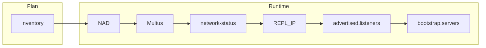

---
review:
  status: unreviewed
  notes: "Broker replication IP assignment — mode comparison, end-to-end lifecycle, failure modes, CFK integration."
---

# Broker replication IP assignment — whereabouts vs static

**Audience:** Whoever chooses how Kafka brokers get Multus IPs on the replication VLAN and how `REPL_IP` is wired into CFK.

**Purpose:** Compare the two supported `ipam.mode` values for [cross-dc-kafka-net-helm](README.md), walk the runtime chain from inventory to Cluster Link bootstrap, and explain what each mode implies for firewalls and pod lifecycle — so the choice is deliberate, not accidental.

**Related:** [Cross-DC architecture overview](../cross-dc-architecture-overview.md#broker-replication-ip-assignment) · [Cross-DC rollout inventory](../../../networking/cross-dc-rollout/README.md) · [Cluster Linking listener config](../cross-dc-cluster-linking.md#cfk-listener-configuration) · [Network test framework](../../../networking/cross-dc-network-test/README.md)

---

## On this page

- [What brokers actually need](#what-brokers-actually-need)
- [Mode comparison](#mode-comparison)
- [Subnet layout on the `/26`](#subnet-layout-on-the-26)
- [End-to-end pipeline](#end-to-end-pipeline)
- [End-to-end lifecycle (whereabouts)](#end-to-end-lifecycle-whereabouts)
- [End-to-end lifecycle (static)](#end-to-end-lifecycle-static)
- [Whereabouts persistence and Cluster Link drift](#whereabouts-persistence-and-cluster-link-drift)
- [Common failure modes](#common-failure-modes)
- [What the network test proves](#what-the-network-test-proves)
- [Whereabouts mode (default)](#whereabouts-mode-default)
- [Static mode](#static-mode)
- [Choosing in inventory](#choosing-in-inventory)
- [Switching modes later](#switching-modes-later)

---

## What brokers actually need

Cluster Linking does **not** require statically pinned IPs. It requires:

1. Each broker has a **real Multus IP** on the replication NAD (not the default OVN network).
2. `advertised.listeners` exposes `REPLICATION://<that-ip>:9095` (via `$(REPL_IP)` or equivalent).
3. The link's `bootstrap.servers` uses those **advertised** addresses — not internal/external listeners.
4. Addresses are **stable enough** for your operational model (pod restart, failback, firewall change process).

Both modes below satisfy (1)–(3). They differ on (4), manifest complexity, and firewall shape.

---

## Mode comparison

| | **whereabouts** (pool) | **static** (per-broker pin) |
|---|---|---|
| **NAD shape** | Single macvlan + whereabouts range + route in IPAM | Chained macvlan + `static` IPAM + tuning plugin |
| **IP chosen by** | Whereabouts at pod schedule time | You, per StatefulSet ordinal, in pod annotation |
| **`REPL_IP` source** | Init container reading `network-status` (typical) | Literal env or annotation-derived — known before pod starts |
| **Pod annotation** | `k8s.v1.cni.cncf.io/networks: kafka-repl-net` | Extended JSON with `ips` + `routes` per broker — see [static snippet](examples/cfk-kafka-static.snippet.yaml) |
| **After pod delete/recreate** | IP may change unless whereabouts reassigns consistently | Same ordinal → same IP (if annotation unchanged) |
| **Cluster Link bootstrap list** | Must be updated if IPs drift, or automate discovery | Fixed list from [broker-ip-map](templates/broker-ip-map.yaml) ConfigMap |
| **Firewall ACLs** | Allow whole pool range (e.g. `.20–.60`) | Can allow per-`/32` broker IPs |
| **Operational complexity** | Lower — one pool, one annotation shape | Higher — N broker rows in inventory, per-pod CFK patches |
| **Best first choice when** | Subnet-wide firewall rules, GitOps link scripts that query live brokers | Per-broker `/32` ACLs, hand-maintained link config, avoiding init container |

**Host NNCP static IPs are a separate question.** Per-node host addresses on the bond VLAN are **not** required for macvlan broker traffic — see [NNCP Helm README](../cross-dc-nncp-helm/README.md). Brokers care about **pod** IPs, not host IPs.

---

## Subnet layout on the `/26`

The [rollout inventory examples](../../../networking/cross-dc-rollout/inventory-dc-a.example.yaml) carve non-overlapping roles on each DC's replication subnet (DC-A `10.200.1.0/26`, DC-B `10.200.2.0/26`). `render-config.py` validates that pools and host IPs do not overlap.

| Addresses (DC-A example) | Role | Consumed by |
|---|---|---|
| `.1` | Local gateway | Scoped route target for remote `/26` (host NNCP + NAD IPAM) |
| `.6–.10` | **Test pool** | [Network test](../../../networking/cross-dc-network-test/README.md) NAD (`repl-net-test`) only |
| `.11–.13` | **Host IPs** | NNCP per-node static on `bond-repl.200` (optional for macvlan) |
| `.20–.60` | **Kafka whereabouts pool** | Broker Multus IPs when `mode: whereabouts` |
| `.21–.23` (typical static plan) | **Pinned broker IPs** | Explicit `replIp` per ordinal when `mode: static` |

The test and Kafka pools share the same VLAN and macvlan master but **must not overlap** — so you can run verification before Kafka exists and re-run tests without touching broker assignments.

Field-level inventory worksheet: [INVENTORY-WORKSHEET.md](../../../networking/cross-dc-rollout/INVENTORY-WORKSHEET.md).

---

## End-to-end pipeline

IPAM is one step in a longer chain. Cluster Link never talks to whereabouts directly — it only sees whatever Kafka **advertises**.

```text
inventory (ipPools.kafka / brokers[])
    → NAD (macvlan + ipam)
    → Multus attaches net1 at pod schedule
    → network-status annotation (what actually landed)
    → REPL_IP (init container or literal env)
    → advertised.listeners REPLICATION://IP:9095
    → Cluster Link bootstrap.servers
```



**IPAM's job:** when Multus creates the secondary interface (`net1`), assign a replication-subnet IP and attach the scoped route to the remote `/26`. Everything downstream depends on that landing correctly.

For Multus dual-homing, SNAT, and scoped routes (why only remote `/26` traffic uses the replication IP), see [Networking basics](../cross-dc-architecture-overview.md#networking-basics-terms-used-in-this-doc) in the architecture overview.

---

## End-to-end lifecycle (whereabouts)

Walkthrough for one broker (`kafka-0`) on DC-A with `ipam.mode: whereabouts`.

### Step 0 — Rendered NAD

Helm produces a NAD with a whereabouts pool and route in IPAM (from [templates/nad.yaml](templates/nad.yaml)):

```json
"ipam": {
  "type": "whereabouts",
  "range": "10.200.1.0/26",
  "range_start": "10.200.1.20",
  "range_end": "10.200.1.60",
  "routes": [{ "dst": "10.200.2.0/26", "gw": "10.200.1.1" }]
}
```

The route lives **in the NAD** — every pod that draws from this pool gets "send `10.200.2.0/26` via `.1`."

### Step 1 — Pod scheduled

CFK creates the pod with a simple Multus annotation:

```yaml
k8s.v1.cni.cncf.io/networks: kafka-repl-net
```

No IP in the annotation — Multus applies whatever the NAD defines.

### Step 2 — CNI runs (before containers start)

1. OVN wires `eth0` (default pod network).
2. Multus invokes the `kafka-repl-net` chain: macvlan on `bond-repl.200`, whereabouts picks a free IP from `.20–.60`, route to remote `/26` applied on `net1`.

Multus writes **`k8s.v1.cni.cncf.io/network-status`** on the pod — the source of truth for what landed. Example shape:

```json
[
  {
    "name": "ovn-kubernetes",
    "interface": "eth0",
    "ips": ["10.128.5.42"],
    "default": true
  },
  {
    "name": "kafka-repl-net",
    "interface": "net1",
    "ips": ["10.200.1.24"],
    "routes": [{ "dst": "10.200.2.0/26", "gw": "10.200.1.1" }]
  }
]
```

You did not choose `.24` in Git — whereabouts did at schedule time.

### Step 3 — Init container bridges to Kafka

Kafka's config references `$(REPL_IP)` in `advertised.listeners`, but that IP did not exist when the manifest was authored. An init container reads `network-status` and exports the value — see [cfk-kafka-whereabouts.snippet.yaml](examples/cfk-kafka-whereabouts.snippet.yaml).

OpenShift exposes `network-status` to the pod (path varies by version — verify against your CFK/OpenShift version). The pattern is always: **parse `network-status` → extract `kafka-repl-net` IP → expose to the broker process**.

### Step 4 — Broker starts

```properties
listeners=INTERNAL://0.0.0.0:9071,REPLICATION://0.0.0.0:9095
advertised.listeners=INTERNAL://kafka-0.kafka.confluent.svc:9071,REPLICATION://10.200.1.24:9095
```

- **Bind** on `0.0.0.0:9095` — listens on all interfaces including `net1`.
- **Advertise** on the Multus IP — tells remote brokers and Cluster Link clients where to connect.

Internal clients still use the OVN DNS name on `eth0`. Replication peers use `net1`.

### Step 5 — Cluster Link consumes advertised addresses

When you create the link (API / Control Center / CLI), `bootstrap.servers` must list **REPLICATION advertised** endpoints — e.g. `10.200.1.24:9095,10.200.1.25:9095,...` on DC-A and the matching `.2.x` addresses on DC-B. That configuration lives **outside** Kubernetes — see [Cluster Linking — the link itself](../cross-dc-cluster-linking.md#the-link-itself-api-driven-not-a-crd).

---

## End-to-end lifecycle (static)

Same broker identity, but **you** decide the IP in inventory before the pod runs.

### What differs from whereabouts

| Step | Whereabouts | Static |
|---|---|---|
| IP decided | At CNI time (pool) | In inventory (`replIp` per ordinal) |
| Route location | In NAD IPAM | In pod annotation (per broker) |
| Init container | Typical | Not needed — literal `REPL_IP` |
| Pod annotation | Name only | Extended JSON with `ips` + `routes` |

### Flow

1. Inventory lists `brokers[]` with `name` + `replIp` — see [inventory-dc-a.static.example.yaml](../../../networking/cross-dc-rollout/inventory-dc-a.static.example.yaml).
2. Helm renders a **static IPAM** NAD (no whereabouts pool on the NAD) plus ConfigMap `kafka-repl-net-broker-ip-map` with copy-paste annotation JSON per broker ([templates/broker-ip-map.yaml](templates/broker-ip-map.yaml)).
3. Each broker's CFK `podTemplate` uses the extended annotation, e.g.:

```json
[{"name":"kafka-repl-net","ips":["10.200.1.21/26"],"routes":[{"dst":"10.200.2.0/26","gw":"10.200.1.1"}]}]
```

4. `REPL_IP=10.200.1.21` (literal) feeds `advertised.listeners` — see [cfk-kafka-static.snippet.yaml](examples/cfk-kafka-static.snippet.yaml).
5. Cluster Link `bootstrap.servers` is a fixed list derived from the same inventory / ConfigMap.

Static mode shifts complexity **left** into IP planning and per-ordinal CFK patches in exchange for predictable wire behavior and simpler broker startup.

---

## Whereabouts persistence and Cluster Link drift

Whereabouts is a cluster IPAM controller (CRD: `ippools.whereabouts.cni.cncf.io`). It tracks which IPs are allocated to which pod/network attachments.

| Event | Typical behavior |
|---|---|
| Pod running | IP reserved for that pod/network |
| Pod deleted | Allocation released; IP returns to the pool |
| New pod with same name (`kafka-0`) | **May** get the same IP again, **may not** — depends on pool pressure and timing |
| Reschedule to another node | Fresh whereabouts assignment; macvlan still works on the new node |

**StatefulSet ordinal identity ≠ Multus IP identity** in whereabouts mode unless you pin IPs (static) or automate link updates after broker replacement.

**Operational mitigations without switching to static:**

- Allow firewalls by **pool range** (`.20–.60` ↔ `.20–.60`) so a reassigned `.27` still passes ACLs
- Script bootstrap discovery from live broker `network-status` or broker metadata after rollout
- Treat broker replace as a **Cluster Link update** step when bootstrap lists are hand-maintained

---

## Common failure modes

**1. Wrong source IP (no Multus / wrong path)**  
Broker reaches the remote DC via OVN default egress → SNAT to the machine-network IP → firewall or return routing rejects the flow. Fix: Multus attachment with scoped route to remote `/26`, not host NNCP alone.

**2. `REPL_IP` mismatch (whereabouts + init gap)**  
`network-status` shows one IP but `advertised.listeners` advertises another (init failed, wrong parse, stale env). Remote peers connect to an address nothing listens on. Fix: verify init container logs and running broker config on the pod.

**3. Bootstrap drift (whereabouts + static link config)**  
Brokers healthy, network path fine, but Cluster Link still lists old IPs after pod replace. Fix: update link `bootstrap.servers` or automate discovery; or use static mode if ops requires frozen bootstrap lists.

When the [network test](../../../networking/cross-dc-network-test/README.md) passes but Cluster Link fails, suspect modes **2** or **3** — not Layer 1–3 host routing.

---

## What the network test proves

The [network test framework](../../../networking/cross-dc-network-test/README.md) exercises the **same whereabouts + macvlan + scoped-route pattern** on a disjoint test pool (`.6–.10`) — without Kafka.

| Proves | Does not prove |
|---|---|
| Host NNCP + bond/VLAN + scoped host route | CFK listener wiring |
| Multus secondary attachment + whereabouts IP | Init container → `REPL_IP` chain |
| `network-status` shape (no accidental `default-route`) | Cluster Link `bootstrap.servers` correctness |
| `MultiNetworkPolicy` on secondary interface | Broker pod recreate / IP persistence |

Use a passing network test as a gate before deploying Kafka NAD and brokers; use this doc's lifecycle sections when wiring CFK and creating links.

---

## Whereabouts mode (default)

### Trade-offs

**Pros:** One NAD for all brokers; simplest pod annotation; pool scales if broker count changes; matches the network test pattern (whereabouts + routes in IPAM).

**Cons:** `REPL_IP` not known at manifest-authoring time; init container adds a moving part; broker recreate **may** get a new IP — Cluster Link config that hard-codes bootstrap addresses can drift unless you refresh links or automate discovery.

Runtime chain: [End-to-end lifecycle (whereabouts)](#end-to-end-lifecycle-whereabouts). CFK wiring: [examples/cfk-kafka-whereabouts.snippet.yaml](examples/cfk-kafka-whereabouts.snippet.yaml).

---

## Static mode

### Trade-offs

**Pros:** Predictable IPs for firewalls and link bootstrap; no init container; survives pod recreate with same ordinal; maps cleanly to StatefulSet identity.

**Cons:** More inventory and CFK YAML to maintain; adding/removing brokers requires IP plan + link updates; mis-typed annotation fails at schedule time; no dynamic pool — you own IPAM.

Runtime chain: [End-to-end lifecycle (static)](#end-to-end-lifecycle-static). CFK wiring: [examples/cfk-kafka-static.snippet.yaml](examples/cfk-kafka-static.snippet.yaml).

---

## Choosing in inventory

Set `workload.brokerIpam.mode` in [inventory YAML](../../../networking/cross-dc-rollout/inventory-dc-a.example.yaml):

```yaml
workload:
  brokerIpam:
    mode: whereabouts   # or static
  brokers: []           # required when mode=static
  # brokers:
  #   - name: kafka-0
  #     replIp: 10.200.1.21
```

Run `render-config.py` — it validates pools, renders Helm values, and (for static) passes through `brokers[]`.

Examples:

- [inventory-dc-a.example.yaml](../../../networking/cross-dc-rollout/inventory-dc-a.example.yaml) — whereabouts (default)
- [inventory-dc-a.static.example.yaml](../../../networking/cross-dc-rollout/inventory-dc-a.static.example.yaml) — static per-broker

Subnet carving reference: [Subnet layout on the `/26`](#subnet-layout-on-the-26).

---

## Switching modes later

Not a hot-swap — plan a maintenance window:

1. Update inventory `brokerIpam.mode` and broker list / pool as needed.
2. Re-render and apply NAD (mode change replaces CNI config).
3. Rolling restart brokers with updated pod annotations / init container / `REPL_IP` wiring.
4. Update Cluster Link `bootstrap.servers` on both sides.
5. Confirm firewalls match new shape (pool range vs `/32` list).

---

*This content was created with AI assistance. See [AI-DISCLOSURE.md](../../../../../../AI-DISCLOSURE.md) for how to interpret AI-generated content in this workspace.*
