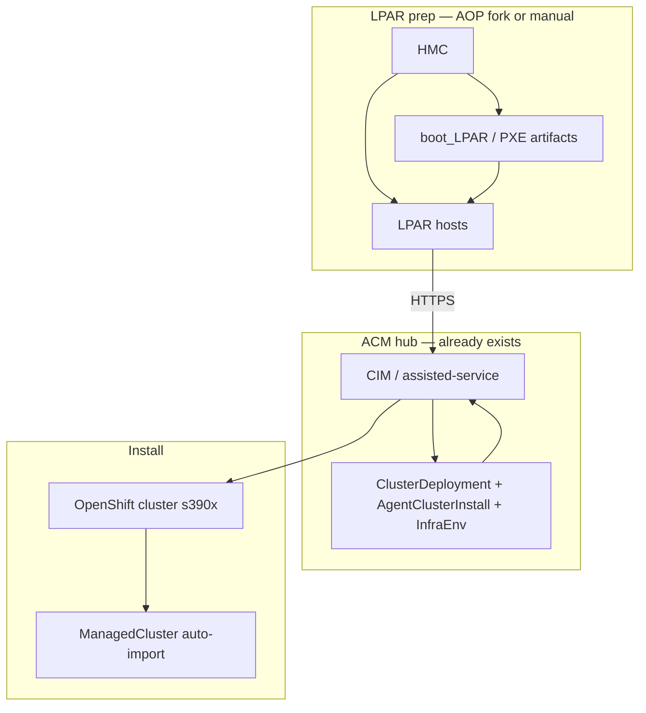
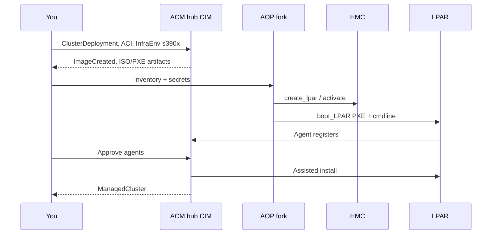

---
review:
  status: unreviewed
  notes: "CIM-driven ABI LPAR runbook; hub already exists; 2026-07-22."
---

# CIM-driven ABI install on LPAR

> **Audience:** Platform engineers with an **existing ACM hub** provisioning a new **s390x LPAR** cluster via Assisted Installer
> **Purpose:** End-to-end division of labor — hub CRs, AOP fork, HMC boot — and validation checkpoints
> **Chosen path:** ABI LPAR orchestrated by **CIM** (not standalone `openshift-install`, not HCP)
> **Hub network:** **Connected** — CIM pulls s390x media from `mirror.openshift.com`; no `osImages` override required unless you add a mirror later
> **Cluster topology:** **HA** (e.g. 3 control plane + workers) — adjust `provisionRequirements` / `acm.expected_agents` accordingly
> **LPAR networking:** **Generic** — OSA or HiperSockets per `host_vars`; see [lpar-networking-osa-vs-hipersockets.md](lpar-networking-osa-vs-hipersockets.md)

**Connected hub implication:** `AgentServiceConfig` with storage PVCs is enough. The assisted-image-service downloads RHCOS kernel/initrd/rootfs for `cpuArchitecture: s390x` when you create the `InfraEnv`. You only need `spec.osImages` if you move to disconnected or hit corporate-proxy egress issues (see [cim-hub-setup.md](../../rhacm/notes/cim-hub-setup.md#corporate-proxy)).

**Related:** [lpar-install-paths.md](lpar-install-paths.md) · [cim-hub-setup.md](../../rhacm/notes/cim-hub-setup.md) · [agent-install-preflight.md](../../rhacm/notes/agent-install-preflight.md) · [AOP fork](ansible-openshift-provisioning-fork.md)

---

## Architecture

Assisted Service runs on the **hub** (`multicluster-engine`). LPARs boot via **HMC/PXE**, register as **Agent** CRs, and the hub drives install to completion.



| Layer | Owner | Does not do |
|-------|-------|-------------|
| **Hub (CIM)** | ACM/MCE | Create LPARs, HMC ops, OSA wiring |
| **AOP fork** | Your automation | Run Assisted Service (that's on the hub) |
| **ACM day-2** | Hub after install | Day-0 LPAR boot |

---

## Prerequisites checklist

### Hub (audit first)

Your hub is **connected** — skip `osImages` unless egress fails or you add an internal mirror later.

Run the [cim-hub-setup quick audit](../../rhacm/notes/cim-hub-setup.md#quick-audit). Minimum:

- [ ] `oc get agentserviceconfig` — `agent` exists
- [ ] `assisted-service` + `assisted-image-service` **Available**
- [ ] Assisted PVCs **Bound**
- [ ] `provisioning-configuration` → `watchAllNamespaces: true` (on-prem hub)
- [ ] Hub can reach `mirror.openshift.com` (or corporate proxy injected into assisted pods — see [corporate proxy](../../rhacm/notes/cim-hub-setup.md#corporate-proxy))
- [ ] ~~`osImages` includes `s390x`~~ — **not required** on a connected hub

### s390x on `AgentServiceConfig` (connected)

No extra config for s390x. When `InfraEnv.spec.cpuArchitecture: s390x` is created, assisted-image-service fetches the matching RHCOS artifacts from Red Hat's mirror.

**Only add `osImages`** if you later go disconnected or mirror internally:

```yaml
spec:
  osImages:
    - cpuArchitecture: s390x
      openshiftVersion: "4.21"
      version: "<rhcos-version-string>"
      url: "https://<mirror>/.../rhcos-live.s390x.iso"
      rootFSUrl: "https://<mirror>/.../rhcos-live-rootfs.s390x.img"
```

### LPAR / network

- [ ] LPARs sized for control plane + workers (see [mental-model.md](mental-model.md) capacity section)
- [ ] Storage: DASD or FCP/multipath defined; matches `agent-config` / NMState
- [ ] OSA or HiperSockets L2 path correct **before** boot
- [ ] LPARs can reach **hub assisted routes** on 443 (and DNS resolves them)
- [ ] Pull secret + SSH key ready in hub namespace

### Reachability test (from LPAR network or jump host)

```bash
# Discover assisted routes on hub
oc get routes -A | grep assisted

# From install network — replace URL
curl -k -sS -o /dev/null -w '%{http_code}\n' https://<assisted-image-route>/health
```

Failure here blocks agent registration — fix before HMC boot.

---

## Phase 1 — Hub CRs (CIM-driven)

Create a namespace per cluster (pattern matches [BARE-METAL-OPERATOR-INTEGRATION](../../rhacm/examples/BARE-METAL-OPERATOR-INTEGRATION.md)).

### 1. Namespace + pull secret

```bash
export CLUSTER=lpar-z-01
export NS=${CLUSTER}

oc create namespace "${NS}"
oc create secret generic ${CLUSTER}-pull-secret \
  --from-file=.dockerconfigjson=/path/to/pull-secret.json \
  -n "${NS}"
```

### 2. ClusterDeployment

```yaml
apiVersion: hive.openshift.io/v1
kind: ClusterDeployment
metadata:
  name: lpar-z-01
  namespace: lpar-z-01
spec:
  baseDomain: example.com
  clusterName: lpar-z-01
  platform:
    agentBareMetal:
      agentSelector:
        matchLabels:
          cluster: lpar-z-01
  provisioning:
    installConfigSecretRef:
      name: lpar-z-01-install-config
    imageSetRef:
      name: img4-21-0          # ClusterImageSet on hub — match target OCP
  pullSecretRef:
    name: lpar-z-01-pull-secret
```

### 3. AgentClusterInstall

```yaml
apiVersion: extensions.hive.openshift.io/v1beta1
kind: AgentClusterInstall
metadata:
  name: lpar-z-01
  namespace: lpar-z-01
spec:
  clusterDeploymentRef:
    name: lpar-z-01
  imageSetRef:
    name: img4-21-0
  networking:
    clusterNetwork:
      - cidr: 10.128.0.0/14
        hostPrefix: 23
    serviceNetwork:
      - 172.30.0.0/16
    apiVIP: 10.20.30.40        # API VIP — must be free on LPAR network
    ingressVIP: 10.20.30.41    # Ingress VIP
  provisionRequirements:
    controlPlaneAgents: 3
    workerAgents: 2
```

Adjust counts for compact/SNO if your lab requires it — verify supported topologies for s390x in current OCP docs.

### 4. InfraEnv (s390x)

```yaml
apiVersion: agent-install.openshift.io/v1beta1
kind: InfraEnv
metadata:
  name: lpar-z-01
  namespace: lpar-z-01
  labels:
    cluster: lpar-z-01
spec:
  cpuArchitecture: s390x
  clusterRef:
    name: lpar-z-01
    namespace: lpar-z-01
  pullSecretRef:
    name: lpar-z-01-pull-secret
  sshAuthorizedKey: "<your-ssh-public-key>"
  agentLabelSelector:
    matchLabels:
      cluster: lpar-z-01
  # If install network uses corporate proxy to reach hub:
  # proxy:
  #   httpProxy: "http://proxy.example.com:8080"
  #   httpsProxy: "http://proxy.example.com:8080"
  #   noProxy: ".svc,.cluster.local,10.0.0.0/8"
```

### 5. Wait for InfraEnv

```bash
oc wait --for=condition=ImageCreated infraenv/lpar-z-01 -n lpar-z-01 --timeout=600s

oc get infraenv lpar-z-01 -n lpar-z-01 \
  -o jsonpath='iso={.status.isoDownloadURL}{"\n"}'
```

On **LPAR**, you may use **PXE kernel/initrd** from hub-assisted artifacts rather than mounting an ISO — AOP `boot_LPAR` / ABI playbooks generate parm files with the hub registration endpoint. ISO URL is still a useful smoke test that CIM cached s390x images.

---

## Phase 2 — LPAR boot (AOP fork)

After hub CRs are applied and `InfraEnv` is healthy:

```bash
# On bastion — hub kubeconfig at acm.kubeconfig
ansible-playbook playbooks/acm_abi_boot_lpar.yaml \
  -i inventories/<your-inventory> \
  --ask-vault-pass
```

Inventory (`group_vars/all.yaml`):

```yaml
installation_type: lpar
acm:
  enabled: true
  kubeconfig: /root/.kube/hub-config
  cluster_namespace: lpar-z-01
  infraenv_name: lpar-z-01
  expected_agents: 5
  lpar_nodes:
    - control-lpar-1   # must match host_vars/<name>.yaml
    - control-lpar-2
    - control-lpar-3
    - worker-lpar-1
    - worker-lpar-2
```

The playbook:

1. Waits for `InfraEnv` `ImageCreated`
2. Downloads kernel/initrd/rootfs from hub → bastion httpd
3. Generates agent `.parm` files per LPAR host_vars
4. Boots LPARs via HMC (`boot_LPAR_acm`)
5. Waits for `Agent` CRs on hub — **approve agents on hub** (or set `InfraEnv` auto-approve)

### Approve agents on hub

```bash
oc get agents -n lpar-z-01 --kubeconfig=/path/to/hub-kubeconfig
oc patch agent <name> -n lpar-z-01 --type merge \
  -p '{"spec":{"approved":true,"hostname":"<fqdn>"}}'
```

Install then proceeds via `AgentClusterInstall` on the hub — no `openshift-install` on bastion.

---

## Phase 3 — Install completes on hub

```bash
# AgentClusterInstall progress
oc get agentclusterinstall lpar-z-01 -n lpar-z-01 -o yaml

# ClusterDeployment
oc get clusterdeployment lpar-z-01 -n lpar-z-01

# Managed cluster appears when install succeeds
oc get managedcluster | grep lpar-z-01
```

Install gates: validations pass, enough approved agents, VIPs reachable.

Preflight orchestration: [agent-install-preflight.md](../../rhacm/notes/agent-install-preflight.md) (ClusterCurator prehooks, approval gates).

---

## Division of labor summary



---

## Troubleshooting map

| Symptom | Check |
|---------|--------|
| `ImageCreated` false | [cim-hub-setup](../../rhacm/notes/cim-hub-setup.md) — storage, **proxy on assisted pods**, hub egress to `mirror.openshift.com` |
| No agents after boot | LPAR → hub route; DNS; firewall; correct PXE/cmdline |
| Agent `pending` validation | CPU/RAM/disk; NMState; storage paths on Z |
| Rootfs SSL / connection reset | [agent-install-rootfs-ssl-failure](../../rhacm/troubleshooting/agent-install-rootfs-ssl-failure.md) |
| Wrong disk on LPAR | Cherry-pick AOP #475 when in fork; `rootDeviceHints` |
| ACI stuck waiting | Approved agent count vs `provisionRequirements` |

---

## AOP fork — next implementation work

| Priority | Work | Status |
|----------|------|--------|
| 1 | `playbooks/acm_abi_boot_lpar.yaml` | **Done** — see fork `refactor/phase-1-dry` |
| 2 | Cherry-pick [#475](https://github.com/IBM/Ansible-OpenShift-Provisioning/pull/475) | Planned — LPAR disk hints |
| 3 | Validate parm template against your host_vars | Lab task |
| 4 | De-prioritize `boot_LPAR_hcp` unless scope changes | — |

Track in [ansible-openshift-provisioning-fork.md](ansible-openshift-provisioning-fork.md) and fork `REFACTORING.md`.

---

## Related reading

| Resource | Link |
|----------|------|
| Path comparison | [lpar-install-paths.md](lpar-install-paths.md) |
| CIM hub setup | [cim-hub-setup.md](../../rhacm/notes/cim-hub-setup.md) |
| Agent CR workflow (x86-oriented, same CRs) | [BARE-METAL-OPERATOR-INTEGRATION.md](../../rhacm/examples/BARE-METAL-OPERATOR-INTEGRATION.md) |
| RHACM index | [rhacm/README.md](../../rhacm/README.md) |
| Red Hat — ABI on Z | [installing on IBM Z](https://docs.redhat.com/en/documentation/openshift_container_platform/latest/html/installing_on_ibm_z_and_ibm_linuxone/) |

---

*This content was created with AI assistance. See [AI-DISCLOSURE.md](../../../AI-DISCLOSURE.md) for how to interpret AI-generated content in this workspace.*
