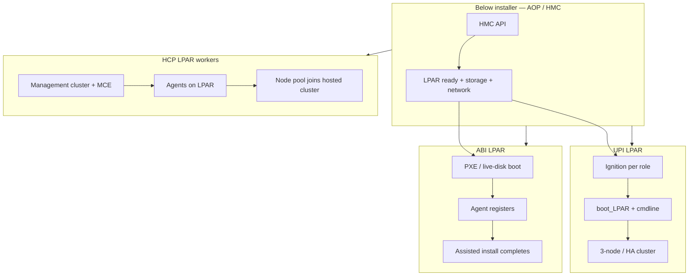
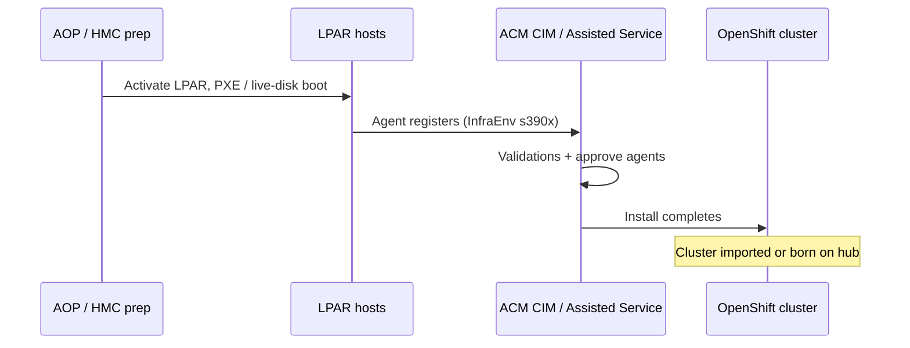

---
review:
  status: unreviewed
  notes: "LPAR install path comparison; ACM alignment; 2026-07-22."
---

# LPAR install paths — UPI vs ABI vs HCP

> **Audience:** Platform engineers choosing how to install OCP on IBM Z LPARs — especially with ACM in the picture
> **Purpose:** Benefits, trade-offs, and ACM fit so you can commit to a path (and focus the AOP fork)
> **Prerequisite:** [mental-model.md](mental-model.md) vocabulary; [provisioning-and-automation.md](provisioning-and-automation.md) for Metal3/ACM context

---

## Recommendation (if ACM is a goal)

**Chosen path (this workspace):** **CIM-driven ABI on LPAR** — hub already exists. See [cim-abi-lpar.md](cim-abi-lpar.md) for the runbook.

| Your goal | Suggested path |
|-----------|----------------|
| Hub-driven install + ACM day-2 | **ABI LPAR + CIM** ← **selected** |
| Learn ACM with minimal hub complexity first | ABI standalone → import → then CIM (skipped — hub ready) |
| Dense multi-tenant fleet, shared control planes | **HCP** — different model; not current choice |
| Deep ignition/boot control | **UPI LPAR** — import-only ACM story |

**HCP is not a substitute for ABI** when you want a traditional standalone cluster managed by ACM policies — it is a HyperShift topology (management cluster + hosted clusters).

---

## What the three methods mean on LPAR

All three assume **you** (or IBM Ansible) have already dealt with HMC, LPAR activation, storage, and L2/L3 networking. None of them create LPARs from scratch without automation below the installer.

| Method | What it is on LPAR | OpenShift `platform` | Who runs the install |
|--------|-------------------|----------------------|----------------------|
| **UPI** | Full user-provisioned: you craft ignition, boot each LPAR with kernel cmdline, run `openshift-install wait-for` | `none` | You / Ansible playbooks end-to-end |
| **ABI** | Agent-based: hosts boot discovery image, **Agent** registers, installer uses Assisted Service logic | `none` | `openshift-install agent` (standalone or via ACM CIM) |
| **HCP** | Hosted control plane: LPARs join as **workers** to a control plane running on a **management** cluster | `none` on workers; mgmt cluster separate | MCE / HyperShift + agent approval on LPAR |

---

## Comparison matrix

| Dimension | UPI LPAR | ABI LPAR | HCP (LPAR workers) |
|-----------|----------|----------|---------------------|
| **Learning curve** | Steep — ignition, cmdline, per-node boot | Moderate — `install-config` + `agent-config` | Steep — two clusters, MCE, HyperShift concepts |
| **Day-0 automation in AOP** | Mature playbooks (`boot_LPAR`, node roles) | Growing (`create_abi_cluster`, `boot_LPAR`) | Parallel `*_hcp` roles (forkier) |
| **Disconnected / air-gap** | Supported; more manual mirror steps | **Strong** — designed for it | Supported; more moving parts |
| **Network complexity** | In ignition + kernel cmdline | **Declarative in `agent-config.yaml`** | Agent + HCP templates |
| **ACM — import existing cluster** | Yes | Yes | N/A for hosted cluster API (different model) |
| **ACM — orchestrate install** | **No** — install happens outside ACM | **Yes** — CIM, `InfraEnv`, `AgentClusterInstall` | **Yes** — MCE hosted control planes |
| **ACM — policies / GitOps day-2** | Yes (after import) | Yes | Yes (on mgmt + hosted clusters) |
| **Machine API / MachineSet** | No on Z | No on Z | No on Z workers |
| **Add workers post-install** | Manual LPAR + join playbook | Manual or agent-based day-2 patterns | Node pool scale (HCP-native) |
| **Multi-cluster density** | One OCP per LPAR set | One OCP per LPAR set | Many hosted clusters on shared mgmt |
| **Fork refactor focus** | `boot_LPAR`, ignition templates | `boot_LPAR`, ABI roles, #475 disk hints | `boot_LPAR_hcp`, `hcp_approve_agent` |

---

## Benefits and trade-offs (plain language)

### UPI LPAR

**Benefits**

- Full visibility into every boot parameter (`rd.znet`, DASD, FCP, HiperSockets).
- Longest track record in AOP and IBM field guides.
- No dependency on Assisted Service or hub for install.

**Trade-offs**

- Most moving parts you own: ignition, HAProxy, DNS, sequential boots, bootstrap lifecycle.
- **ACM does not run the install** — you import after the fact. Hub "provisioning" UX does not apply.
- Hardest path to reproduce idempotently without mature Ansible.

**ACM play:** Import → policies, apps, upgrades. For install orchestration, look elsewhere.

---

### ABI LPAR

**Benefits**

- Same **Agent** CRs and validation flow whether you install standalone or from an **ACM hub with CIM**.
- Network and bonding live in **`agent-config.yaml`** — matches how Z docs increasingly frame day-1 networking.
- Natural stepping stone: standalone ABI lab → add cluster to ACM → next cluster via `AgentClusterInstall`.
- Aligns with Red Hat's assisted-install direction and your [agent-install preflight](../../rhacm/notes/agent-install-preflight.md) notes.

**Trade-offs**

- LPAR must **PXE** (or live-disk boot via HMC) — ISO-only patterns are KVM-centric.
- HMC boot is still **outside** Assisted Service — AOP or manual step before agents appear.
- Disk selection on LPAR (FCP/DASD, multipath) still has rough edges — upstream [#475](https://github.com/IBM/Ansible-OpenShift-Provisioning/pull/475) pending.

**ACM play:** Strongest fit for "play with ACM" without jumping to HyperShift.

**Two valid sequences**

1. **Lab first:** AOP or CLI ABI install → `ClusterImport` / managed cluster in ACM → learn policies.
2. **Hub-driven:** CIM on hub → `ClusterDeployment` + `InfraEnv` → AOP boots LPARs → agents attach to hub → install.

---

### HCP with LPAR workers

**Benefits**

- **ACM/MCE native** multi-cluster model — many hosted clusters, shared management plane.
- LPAR as **compute** only; control plane density on mgmt cluster.
- Node pool scaling is the HCP-native way to add workers.

**Trade-offs**

- You need a **management cluster** first (often KVM LPAR or x86 hub) with MCE.
- Dual variable tree in AOP (`env.*` vs `hcp.*`) — most fork debt lives here.
- Different operational model — not a drop-in replacement for "one standalone OCP on LPAR."
- Version matrix matters (s390x mgmt, worker pools — see [provisioning-and-automation.md](provisioning-and-automation.md)).

**ACM play:** Excellent for **fleet / multi-tenant** ACM practice — overkill if you want one standalone cluster and policy learning.

---

## ACM integration depth

| ACM capability | UPI LPAR | ABI LPAR | HCP LPAR |
|----------------|----------|----------|----------|
| Import managed cluster | ✓ | ✓ | Hosted cluster CRs (different) |
| Policies, governance, apps | ✓ | ✓ | ✓ |
| CIM / Assisted install orchestration | ✗ | **✓** | Partial (agents, but HCP-shaped) |
| `InfraEnv` `cpuArchitecture: s390x` | N/A | **✓** | ✓ |
| ClusterCurator prehooks | After import | **Install-time** | MCE lifecycle |
| Hosted control planes | ✗ | ✗ | **✓** |
| GitOps ZTP / SiteConfig | ✗ (BMC model) | ✗ | ✗ |

For **learning ACM** without committing to HyperShift: **ABI + import**, then **ABI + CIM provision**.

---

## How the AOP fork fits (ABI LPAR + ACM)

Recommended division of labor:

| Layer | Tool |
|-------|------|
| LPAR lifecycle, HMC, HiperSockets bastion | **AOP fork** (`create_lpar`, `boot_LPAR`, `lpar_hipersockets_bastion`) |
| Agent config + install | **`openshift-install agent`** or **ACM `AgentClusterInstall`** |
| Day-2 / fleet | **ACM** |

Fork Phase 2b+ should prioritize **ABI LPAR** over HCP:

- Cherry-pick [#475](https://github.com/IBM/Ansible-OpenShift-Provisioning/pull/475) (`rootDeviceHints`) when on ABI.
- Watch [#508](https://github.com/IBM/Ansible-OpenShift-Provisioning/pull/508) for ABI robustness (KVM-tested; some tasks apply to LPAR).
- Keep `hcp_approve_agent` — still useful if you experiment with HCP later.

See [ansible-openshift-provisioning-fork.md](ansible-openshift-provisioning-fork.md).

---

## Suggested learning progression

1. **Hub audit** — [cim-hub-setup.md](../../rhacm/notes/cim-hub-setup.md) (you have hub infra).
2. **CIM ABI LPAR runbook** — [cim-abi-lpar.md](cim-abi-lpar.md): CRs + AOP boot.
3. **ACM day-2** — policies, `Placement`, observability on resulting `ManagedCluster`.
4. **HCP** (optional) — only if multi-cluster density becomes the question.

---

## Open questions (validate before production)

1. OCP / MCE version pair for your target — recheck matrix in [references.md](references.md).
2. Hub on x86 vs s390x — multi-arch hub importing s390x spokes is documented; s390x hub has newer support.
3. Whether your lab has enough LPAR capacity for mgmt + workload if you later choose HCP.

---

## Related reading

| Resource | Link |
|----------|------|
| ACM agent preflight | [agent-install-preflight.md](../../rhacm/notes/agent-install-preflight.md) |
| CIM hub setup | [cim-hub-setup.md](../../rhacm/notes/cim-hub-setup.md) |
| RHACM index | [rhacm/README.md](../../rhacm/README.md) |
| CIM ABI LPAR runbook | [cim-abi-lpar.md](cim-abi-lpar.md) |
| AOP fork strategy | [ansible-openshift-provisioning-fork.md](ansible-openshift-provisioning-fork.md) |
| Provisioning overview | [provisioning-and-automation.md](provisioning-and-automation.md) |

---

*This content was created with AI assistance. See [AI-DISCLOSURE.md](../../../AI-DISCLOSURE.md) for how to interpret AI-generated content in this workspace.*
