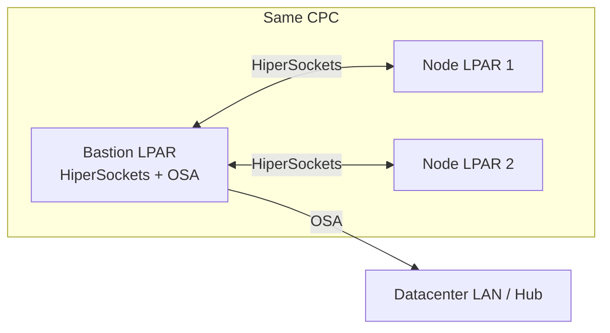

---
review:
  status: unreviewed
  notes: "Generic OSA vs HiperSockets primer for LPAR installs; 2026-07-22."
---

# LPAR networking — OSA vs HiperSockets

> **Audience:** Anyone configuring day-1 network for OCP on LPAR
> **Purpose:** Understand the two common paths without committing to one in automation yet
> **Topology note:** Lab target is **HA** (e.g. 3 control plane + workers); network mode is independent of HA vs compact

---

## One-sentence difference

| | **OSA-Express** | **HiperSockets** |
|---|-----------------|------------------|
| **What it is** | Physical Ethernet adapter on the mainframe — real network, cables, switches | Virtual in-memory link between LPARs on the **same CPC** (same physical machine) |
| **Analogy** | Normal NIC | Ultra-fast "backplane" between partitions on one box |

Both appear as Linux network devices. Install automation cares because **boot kernel parameters** (`rd.znet`, `ip=`, rootfs URL) differ.

---

## OSA-Express (OSA)

- Traffic leaves the CPC through **OSA-Express** hardware → your LAN/VLAN.
- Standard IP: gateway, DNS, bonding/VLAN, firewalls — same mental model as x86 bare metal (with Z-specific subchannel notation).
- LPARs reach the **ACM hub**, bastion, and each other over your **datacenter network** (if routed).
- Typical for: cluster API/ingress, north-south traffic, multi-CPC layouts, when bastion is not on the same CPC as all nodes.

**In install configs:** `networking.mode` is usually OSA (or RoCE for some high-speed Ethernet variants). Boot parms use OSA subchannels and external IPs.

---

## HiperSockets

- **No external wire** between LPARs on the same CPC — the hypervisor moves memory between partitions.
- Very low latency and high bandwidth; layer-2 virtual network between defined LPARs.
- Often used for: **bastion ↔ LPAR** bootstrap path (HTTP/PXE, ignition, rootfs) when bastion and LPARs share one CPC — keeps heavy install traffic off OSA.
- Still need OSA (or another path) for production cluster networking unless you design entirely around internal paths (unusual for full OCP).

**In install configs:** `networking.mode: hipersocket` (spelling varies in tooling). Bastion gets an **internal IP** on the HiperSockets device; LPARs use internal IPs for boot; bastion may **forward/NAT** to OSA for outbound/hub reachability.

---

## What changes at install time (either path)

| Concern | OSA | HiperSockets |
|---------|-----|--------------|
| Boot `ip=` / `rd.znet` | OSA subchannels, external IP | HiperSockets ifname, often internal IP |
| Rootfs / kernel URL | Bastion IP reachable on install network | Often bastion **internal** IP on HiperSockets |
| Bastion setup | DNS, HAProxy, firewall on OSA | Plus: enable device (`chzdev`), IP forward, masquerade |
| Reach hub (CIM) | LPAR routing to hub over LAN | LPAR may boot on internal net; must route/NAT to hub via bastion/OSA |
| AOP fork roles | `boot_LPAR` / `boot_LPAR_acm` standard path | Same roles + `lpar_hipersockets_bastion` on bastion |

Automation in the fork supports **both** — set `networking.mode` in each LPAR's `host_vars`; parm templates branch on that value.

---

## How to choose (generic guidance)

| Situation | Typical choice |
|-----------|----------------|
| Bastion and all OCP LPARs on **one CPC**, want install traffic off external LAN | HiperSockets for boot; OSA for cluster/API |
| Nodes and hub on **normal DC network** only | OSA |
| Bastion on different machine than LPARs | OSA (HiperSockets not available across CPCs) |
| Unsure | **OSA** — simpler; fewer moving parts on bastion |

You do not need to decide in this repo — document the choice in inventory `host_vars` when the lab is wired.

---

## HA topology (lab decision)

**HA** here means separate control plane and worker LPARs (e.g. 3 + N), with API/Ingress VIPs on the install network — not compact/SNO.

Network mode (OSA vs HiperSockets) is **orthogonal**: HA works with either; VIP and DNS planning are the same once L3 connectivity to the hub is correct.

---

## Related reading

| Resource | Link |
|----------|------|
| CIM ABI LPAR runbook | [cim-abi-lpar.md](cim-abi-lpar.md) |
| Mental model | [mental-model.md](mental-model.md) |
| ABI bonding/VLAN walkthrough | [references.md](references.md) (Neeraj Mishra blog) |

---

*This content was created with AI assistance. See [AI-DISCLOSURE.md](../../../AI-DISCLOSURE.md) for how to interpret AI-generated content in this workspace.*
