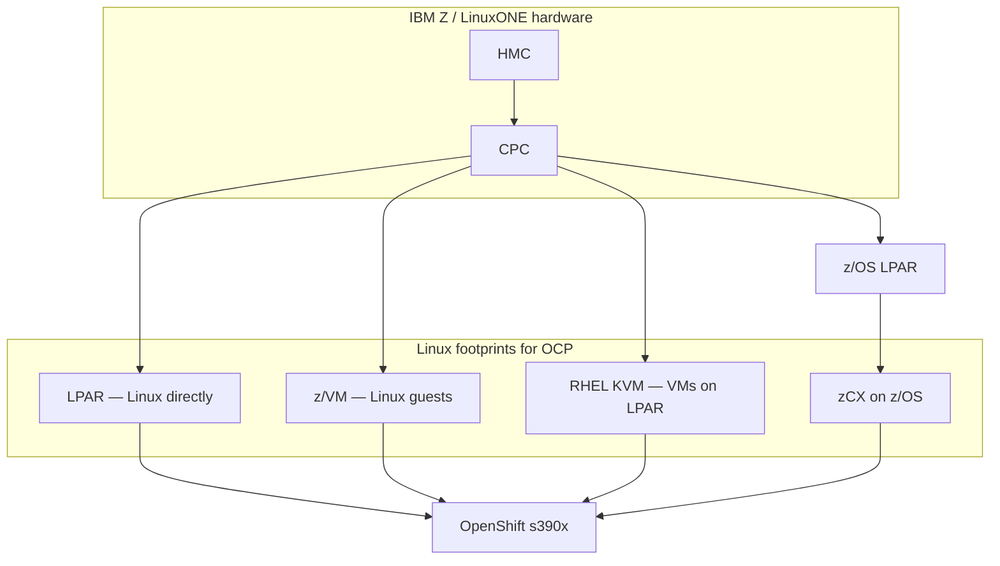

---
review:
  status: unreviewed
  notes: "Review block backfilled 2026-07-22. Content predates explicit review metadata."
---

# Mental model — OpenShift on IBM Z and LinuxONE

> **Audience:** Engineers new to the Z/LinuxONE + OpenShift intersection
> **Purpose:** Map vocabulary and deployment topologies before reading install docs or choosing automation

---

## Core fact

**OpenShift does not run on z/OS.**
It runs on **Linux on IBM Z** (`s390x`).

The mainframe story is about *where that Linux lives* and whether workloads need tight coupling to z/OS data and QoS.

---

## Vocabulary

| Term | What it is | Role for OpenShift |
|------|------------|-------------------|
| **IBM Z / zSystems** | Mainframe line; can run z/OS and Linux | OCP target platform (`s390x`) |
| **LinuxONE** | Linux-only mainframe (no z/OS) | Same OCP install paths as IBM Z |
| **CPC** | Central Processor Complex — the physical machine | Hardware under HMC management |
| **HMC** | Hardware Management Console | Creates/activates LPARs, attaches OSA networking and storage, loads boot media |
| **LPAR** | Logical partition — slice of real hardware | Can run Linux directly, or host z/VM / RHEL KVM |
| **IFL** | Integrated Facility for Linux — processor capacity for Linux workloads | Capacity planning unit (not the same as a core on x86) |
| **z/VM** | IBM hypervisor | Linux guest VMs become OCP nodes |
| **RHEL KVM** | KVM on a Linux LPAR (libvirt) | OCP nodes as VMs; closest analog to a KVM lab on x86 |
| **OSA** | OSA-Express network adapter | Primary networking on Z; subchannel-based, not "just a NIC" |
| **DASD / FCP** | Storage attachment models | Boot and persistent volume planning |
| **z/OS** | Traditional mainframe OS | Does not run OCP natively |
| **zCX** | z/OS Container Extensions | Runs containerized Linux *inside* z/OS address spaces |
| **zCX for OpenShift** | IBM product | Self-contained OCP cluster on z/OS via zCX — separate from standalone Linux LPAR OCP |

---

## Where OpenShift runs

### Path comparison

| Path | Hypervisor layer | Typical use | OCP install boot |
|------|------------------|-------------|------------------|
| **LPAR-native** | None (Linux on hardware partition) | Production, OpenShift Virtualization on bare LPAR | PXE + PRM via HMC |
| **z/VM** | z/VM guests | Shops with existing z/VM ops | PXE |
| **RHEL KVM** | libvirt on LPAR | Density, familiarity with KVM | PXE or ISO |
| **zCX on z/OS** | z/OS address space | Colocate with z/OS data, WLM, zIIP | z/OSMF workflows — different product |

---

## z/OS vs standalone Linux — when each matters

**Standalone Linux LPAR / z/VM / KVM** — standard RHOCP on s390x.
Full cluster on Linux; integrates with the rest of the enterprise like any other OCP.

**zCX Foundation for Red Hat OpenShift** — OCP cluster *inside* z/OS.
Use when containerized Linux apps must sit next to z/OS data with z/OS QoS, WLM, and operational model.
Requires z14+, z/OS 2.4+, and separate IBM licensing.
Managed via z/OSMF, not HMC LPAR boot in the usual sense.

Both can coexist on one physical Z server alongside traditional z/OS and Linux workloads.

---

## How this differs from x86 OpenShift

| Area | x86 (familiar) | IBM Z / s390x |
|------|----------------|---------------|
| **Architecture** | `amd64` | `s390x` — all images and operators must match |
| **Install platform** | `baremetal`, `aws`, `vsphere`, … | **`none`** only (user-provisioned) |
| **Machine API** | Often available | **Not available** — no autoscaling via MachineSet |
| **Networking** | Generic NICs, common bond modes | OSA, subchannels, `rd.znet` boot params; bonding often `active-backup` |
| **Boot** | iPXE, ISO common | LPAR/z/VM: **PXE required**; ISO only on RHEL KVM path |
| **Hardware management** | BMC (IPMI/Redfish) | **HMC** (not a BMC — different API and workflow) |
| **"Bare metal" in docs** | Often means BMO/Ironic IPI | Often means **LPARs without cloud provider** — not Bare Metal Operator |

Minimum hardware (current docs): **z14 ISA** or later; z17/LinuxONE 5 may require minimum OCP patch levels for kernel support.

---

## Install method landscape (high level)

Red Hat documents three installer postures on Z (no cloud-style IPI):

| Method | Best for |
|--------|----------|
| **Assisted Installer** (web) | Connected environments, learning, smaller clusters |
| **Agent-based Installer (ABI)** | Disconnected/air-gapped, declarative network in `agent-config.yaml`, ACM integration |
| **Full UPI** | Maximum control; manual ignition and boot orchestration |

All are **user-provisioned infrastructure**.
You prepare LPARs/VMs, networking, storage, and load balancers.

See [provisioning-and-automation.md](provisioning-and-automation.md) for ACM, Metal3, and Ansible.

---

## Capacity planning snapshot

Red Hat's *preferred* reference sizing (production-oriented, not minimum):

- ~**6 SMT2-enabled IFLs** per control-plane LPAR (three control plane nodes)
- **Two** network paths — cluster API/ingress and outbound/data traffic
- Workers sized per workload; OpenShift Virtualization on LPAR requires nodes **without** an extra hypervisor in the LPAR

LPAR weight, entitlements, and shared vs dedicated IFLs affect performance — resource sharing is a Z strength but must be sized deliberately.

---

## Related reading

| Resource | Link |
|----------|------|
| Provisioning and automation on Z | [provisioning-and-automation.md](provisioning-and-automation.md) |
| External canonical docs | [references.md](references.md) |
| Domain index | [README.md](README.md) |

---

*This content was created with AI assistance. See [AI-DISCLOSURE.md](../../../AI-DISCLOSURE.md) for how to interpret AI-generated content in this workspace.*
