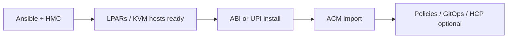
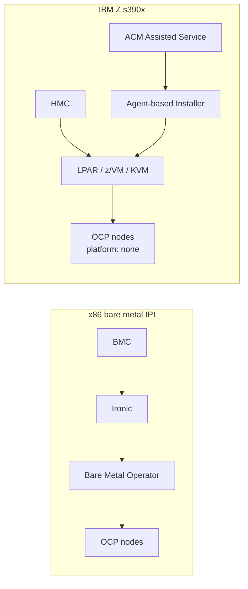

# Provisioning and automation on s390x

> **Audience:** Platform engineers choosing how to install and lifecycle-manage OCP on IBM Z
> **Purpose:** Clarify what ACM, Metal3/Ironic, Agent-based install, and IBM Ansible each do — and do not do — on s390x

---

## Short answer

| Tooling | Useful on s390x? | Role |
|---------|------------------|------|
| **ACM / MCE — import & governance** | Yes | Policy, compliance, apps, upgrades on existing Z clusters |
| **ACM / MCE — Assisted/Agent provisioning** | Yes (with caveats) | Orchestrates ABI; does not replace HMC LPAR boot |
| **ACM / MCE — hosted control planes** | Yes (OCP 4.19+ workers; 4.20+ s390x mgmt) | HyperShift node pools on Z |
| **Metal3 / Ironic / Bare Metal Operator** | **No** for Z LPAR provisioning | x86 BMC model; HMC is not Ironic's world |
| **GitOps ZTP / SiteConfig** | x86-centric | Assumes BMC credentials — not the Z LPAR path |
| **IBM Ansible-OpenShift-Provisioning** | Yes | HMC API → LPAR → KVM → cluster (infra below OCP) |

---

## Why `platform: none` changes everything

IBM Z installs use:

```yaml
platform:
  none: {}
```

Red Hat documents that clusters on `none` **cannot use Machine API features** — including managing or scaling compute via MachineSet — even when nodes are physical LPARs.

This is distinct from x86 `platform: baremetal` installer-provisioned infrastructure (IPI), where Bare Metal Operator and Ironic are in play.

**Terminology trap:** Z docs describe "bare-metal clusters" meaning *no cloud provider integration*, not *Bare Metal Operator provisioning*.

---

## Metal3, Ironic, and Bare Metal Operator

### What they do on x86

On x86 bare metal IPI, the stack is roughly:

```
BMC (IPMI/Redfish) → Ironic → Metal3 → Bare Metal Operator → Machine API → OCP nodes
```

`BareMetalHost` CRs represent physical servers.
Ironic drives discovery, inspection, and provisioning.

### Why this does not map to IBM Z LPARs

| Expectation (x86) | Reality (Z) |
|-------------------|-------------|
| BMC at `redfish://` or `ipmi://` | **HMC** manages LPARs — different API, different lifecycle |
| Generic NIC enumeration | **OSA-Express**, subchannels, z/Architecture boot parameters |
| Standard iPXE flow | **PXE + `.PRM` / `.INS`**, `rd.znet`, `rd.dasd`, `rd.zfcp` kernel args |
| Ironic provisions the server | **You** (or IBM Ansible) activate LPARs and load boot media via HMC |

There is no supported path where `BareMetalHost` + Ironic provisions IBM Z LPARs for OCP.

Your existing [RHACM bare metal integration notes](../../rhacm/examples/BARE-METAL-OPERATOR-INTEGRATION.md) describe the x86 model — valuable for hub concepts, not for Z infra provisioning.

---

## Agent-based Installer (ABI) — the primary OCP-native automation path

ABI combines Assisted Installer discovery with offline/disconnected flexibility.

### What it automates

- Host discovery and validation via agents
- Declarative host/network config in **`agent-config.yaml`**
- PXE artifact generation (`openshift-install agent create pxe-files`)
- Cluster install coordination (rendezvous node runs Assisted Service)

### What it does not automate

- HMC LPAR creation or activation
- OSA/VLAN/bond switch configuration (must be correct before boot)
- Storage provisioning (DASD, FCP, multipath)

### s390x boot constraints

| Infrastructure | Boot method |
|----------------|-------------|
| LPAR | **PXE** (via HMC — load from server, PRM parameters) |
| z/VM | **PXE** |
| RHEL KVM on LPAR | **PXE or ISO** |

Network complexity belongs in `agent-config.yaml`, not `install-config.yaml`.
Boot-time interface definitions must match agent config exactly.

ABI may reference `platform.baremetal.provisioningNetwork: Disabled` in agent config — that disables the provisioning network, **not** "use Metal3 to provision LPARs."

---

## ACM / Multicluster Engine

### Import and day-2 (fully supported)

Once a Z cluster exists, ACM handles the same multicluster concerns as other architectures: policy, governance, observability integration, application delivery, upgrade coordination.

Multi-arch hub (e.g. x86 hub managing s390x spokes) is a documented pattern.

### Provision via Assisted/Agent (partial automation)

ACM cluster creation uses the **Assisted Installer service** on the hub:

- `AgentServiceConfig` — enables CIM / Assisted Service on-prem
- `InfraEnv` — set `cpuArchitecture: s390x`
- `AgentClusterInstall` / `ClusterDeployment` — drives install

Hub prerequisite: see [cim-hub-setup.md](../../rhacm/notes/cim-hub-setup.md).

**Caveat:** ACM orchestrates agent registration and install; **LPAR boot via HMC remains a manual or Ansible-prepped step.**

### Hosted control planes on IBM Z

HyperShift via MCE is the strongest ACM-native *provisioning* story for Z in current releases.

| Component | OCP 4.19 | OCP 4.20+ |
|-----------|----------|-----------|
| HCP compute (node pools) on IBM Z | GA | GA |
| HCP control plane on s390x management cluster | — | GA |
| Management hub on s390x | — | GA (MCE 2.10+) |

Flow: management cluster runs HyperShift → `InfraEnv` with `cpuArchitecture: s390x` → agents register from LPAR/z/VM/KVM → node pools join.

LPAR agents still require HMC/PXE steps documented in the hosted-control-planes IBM Z guide.

### GitOps ZTP / SiteConfig — not the Z LPAR path

[GitOps ZTP](../../rhacm/git-driven-configuration.md) with `SiteConfig` / `ClusterInstance` assumes **BMC host credentials** and standard edge bare-metal discovery.
That is the x86 SNO/compact/standard edge model.

Do not assume ZTP templates drop onto IBM Z LPARs without custom work — validate before architectural commitments.

---

## IBM Ansible-OpenShift-Provisioning

For **infrastructure below OCP** — the supported IBM open-source automation path:

- HMC API: create LPARs, attach storage groups, networking
- Install RHEL on KVM host LPARs
- Deploy OCP via KVM-based topology

Docs: [Ansible-OpenShift-Provisioning](https://ibm.github.io/Ansible-OpenShift-Provisioning/)

This complements ACM (infra prep → ABI or UPI install → ACM import), it does not replace Assisted Service.

A plausible enterprise flow:



---

## Decision matrix

| Goal | Use | Avoid |
|------|-----|-------|
| Provision LPARs from HMC | IBM Ansible-OCP-Provisioning | Metal3 / BMO |
| Install standalone OCP on Z | Agent-based installer (+ optional ACM) | `platform: baremetal` IPI |
| Manage many Z clusters from hub | ACM import + policies | Assuming Machine API on Z |
| Shared control planes on Z | MCE hosted control planes | Classic BMO-based IPI |
| Edge ZTP at scale (BMC servers) | SiteConfig / ClusterInstance | — (wrong platform for Z LPARs) |
| Add workers post-install | Manual LPAR + join, or HCP NodePool scale | MachineSet autoscaling |
| Colocate with z/OS data | zCX for OpenShift | Standalone Linux LPAR (different integration) |

---

## Two stacks side by side



---

## Open questions (to validate in next iteration)

1. Supported `ClusterInstance` installation templates for s390x in SiteConfig Operator — if any
2. Full RHACM/MCE version matrix for standalone `AgentClusterInstall` on Z vs hosted-only
3. Whether customer environments use HMC automation vs manual LPAR ops in practice

Tracked in [.planning/ibm-z-openshift/whats-next.md](../../../.planning/ibm-z-openshift/whats-next.md).

---

## Related reading

| Resource | Link |
|----------|------|
| Mental model and vocabulary | [mental-model.md](mental-model.md) |
| External docs and Redbooks | [references.md](references.md) |
| RHACM hub / CIM setup | [cim-hub-setup.md](../../rhacm/notes/cim-hub-setup.md) |
| Fleet management posture | [fleet-control-spectrum.md](../../fleet-control-spectrum.md) |
| Domain index | [README.md](README.md) |
