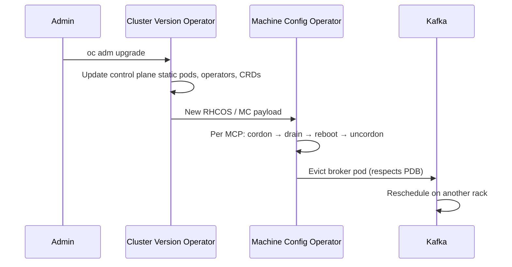

---
review:
  status: unreviewed
  notes: "Extracted from bare-metal-portworx example — cross-cutting Kafka-on-OCP tenancy reference."
---

# Kafka on OpenShift — Tenancy and Platform Internals

> **Audience:** Platform engineers running Kafka (Confluent, Strimzi, or AMQ Streams) on OpenShift — shared workers or dedicated pools.
>
> **Purpose:** Discover tenancy models, MCP/CVO upgrade interactions, PDB and network-policy pitfalls, and upgrade choreography that apply to any Kafka deployment on OCP — not only bare-metal Portworx examples.

**Related:**

- [Bare-metal Kafka + Portworx example](../examples/messaging/kafka/bare-metal-portworx/README.md) — rack-aware manifests (shared-worker default)
- [MachineConfig pools](machine-config-pools.md) — custom MCP patterns for dedicated kafka workers
- [Network policy and observability](network-policy-observability.md) — Strimzi vs CFK policies, Flink ports, OVN audit logging
- [Kafka broker init — kubernetes Service unreachable](../troubleshooting/kafka-broker-init-kubernetes-svc/README.md) — webhook vs OVN triage when init cannot reach the API VIP
- [Kafka example index](../examples/messaging/kafka/README.md)

---

## On this page

- [Discover the tenancy model](#discover-the-tenancy-model)
- [MachineConfigPool (MCP)](#machineconfigpool-mcp--what-to-know)
- [CVO vs MCO](#cvo-vs-mco--two-upgrade-paths)
- [Tenancy models compared](#tenancy-models-compared)
- [Other OpenShift internals](#other-openshift-internals-to-account-for)
- [Upgrade choreography](#upgrade-choreography-shared-workers)
- [Quick decision guide](#quick-decision-guide)

---

## Discover the tenancy model

Most examples in this workspace assume **Kafka brokers share worker nodes with other workloads** — no dedicated kafka hardware or custom MCP. Rack-aware scheduling and storage replication still apply; operational tradeoffs differ from a dedicated-node design.

```bash
# Kafka namespaces and footprint
oc get ns | grep -iE 'kafka|strimzi|confluent|amq'
oc adm top nodes
oc get pods -n <kafka-namespace> -o wide

# Rack labels on workers (zone-region variant)
oc get nodes -l node-role.kubernetes.io/worker \
  -o custom-columns=NAME:.metadata.name,ZONE:.metadata.labels.topology\\.kubernetes\\.io/zone,PX:.metadata.labels.px/rack

# Competing workloads on broker nodes
oc get pods -A --field-selector spec.nodeName=<worker-with-broker> \
  -o custom-columns=NS:.metadata.namespace,NAME:.metadata.name
```

| Signal | Likely model |
|--------|----------------|
| Brokers on workers that also run app pods; no kafka label/taints | **Shared multi-tenant** *(default in examples)* |
| Subset of workers labeled `kafka`, tainted `dedicated=kafka` | **Dedicated nodes on shared cluster** |
| Every worker runs only Kafka/Portworx/infra | **Kafka-dedicated cluster** |

---

## MachineConfigPool (MCP) — what to know

See **[MachineConfig and MachineConfigPool](machine-config-pools.md)** for targeting rules, custom pool patterns, rollout behavior, and diagnostics. Summary for **shared-worker examples**:

- Brokers use the default **`worker`** MCP — no custom `kafka-worker` pool.
- Optional [kafka kernel tuning MachineConfig](../examples/messaging/kafka/bare-metal-portworx/manifests/common/machineconfig-kafka-tuning.yaml) uses `role: worker` and affects **all** workers if applied.
- `maxUnavailable: 1` on the worker pool drains one node at a time; PDBs on kafka **and** app pods can block drain.

### MCP pitfalls with shared workers

1. **Drain coupling** — Draining a worker evicts Kafka **and** every other pod on that node. A misconfigured app PDB can block the drain and stall the entire MCP update.
2. **maxUnavailable on worker pool** — Raising `worker` pool `maxUnavailable` to speed upgrades drains multiple nodes in parallel — risky for Kafka ISR even with broker PDBs.
3. **Kernel tuning scope** — Do not apply kafka-specific MachineConfigs to `worker` unless acceptable for all colocated workloads.

---

## CVO vs MCO — two upgrade paths

Cluster upgrades involve two operators that are easy to conflate:



| Layer | What changes | Kafka impact |
|-------|--------------|--------------|
| **CVO** | API server, etcd, operators, platform images | Brief API blips; operators reconcile; generally no broker restart unless CRD/operand changes |
| **MCO** | Node OS, kubelet, kernel | **Broker pod evicted per node** during worker MCP rollout |

On a **shared cluster**, CVO may update the Kafka operator CSV while MCO is still draining unrelated workers — coordinate timing and watch operator logs.

---

## Tenancy models compared

### A. Shared workers *(default in examples)*

Kafka runs on the default worker pool alongside applications.

| Do | Why |
|----|-----|
| Strong `podAntiAffinity` + rack spread in operator CRs | Best-effort broker distribution across racks amid foreign pods |
| `Guaranteed` QoS on brokers (requests = limits) | CPU/memory not stolen by bursty neighbors |
| Namespace `ResourceQuota` + `LimitRange` on app namespaces | Cap app burst on shared nodes |
| Verify PDBs on **all** pods sharing a node before drain | App PDBs can block worker MCP rollout |

| Watch | Risk |
|-------|------|
| Foreign pods in a rack | May occupy slots needed for broker spread or drain rescheduling |
| Portworx on all storage nodes | PX replication traffic shares physical network with apps |
| Cluster-wide monitoring/logging | Collectors on workers consume disk IO |
| DaemonSets | `ovn-kube-node`, `portworx`, `node-exporter` always on workers — plan capacity |

### B. Dedicated nodes on a shared cluster

Kafka runs on a labeled, tainted subset of workers; apps run elsewhere. See [machine-config-pools.md](machine-config-pools.md) for custom MCP patterns.

### C. Kafka-dedicated cluster

Entire `worker` pool is kafka-capable. Simplest operationally when no app colocation is required.

---

## Other OpenShift internals to account for

| Component | Consideration |
|-----------|---------------|
| **PodDisruptionBudget** | Strimzi creates one for Kafka; verify `maxUnavailable: 1`. App PDBs on the **same node** do not block kafka drain directly, but they block **node** drain if those app pods are on the kafka node you are draining. |
| **Eviction API / descheduler** | Cluster descheduler (if installed) can move pods across nodes — may disturb kafka rack placement. Exclude kafka namespace or use anti-affinity hard rules. |
| **Scheduler** | `topologySpreadConstraints` with `DoNotSchedule` fails scheduling if a rack is full of **any** pods using that constraint key — foreign pods do not count unless they share the label selector. |
| **Storage** | CSI / Portworx / other storage runs as DaemonSet; volume replication uses node network. Dedicated cluster network or VLAN for storage replication reduces app interference. |
| **SCC** | Kafka brokers typically need `anyuid` or restricted SCC depending on image. Operator usually sets this; verify on install. |
| **NetworkPolicy / EgressFirewall** | Multi-tenant clusters often isolate namespaces — ensure kafka can reach clients, KRaft peers, and metrics scrapers across namespace boundaries. See [network-policy-observability.md](network-policy-observability.md). |
| **Ingress / Routes** | External clients hit the router layer — router pods on workers compete for resources unless on infra nodes. |
| **Machine API / scaling** | Bare metal: new nodes via MachineSet or BMH. Add nodes with rack labels **before** scaling kafka replicas. Removing a Machine without drain risks broker loss. |
| **Monitoring** | Platform + user workload metrics; kafka JMX exporter adds scrape load. Cardinality from many topics can stress Prometheus on small clusters. |
| **etcd** | Large numbers of Kafka-related CRs (topics, users, rebalance) increase etcd size — watch `etcd_cluster_database_size`. |

---

## Upgrade choreography (shared workers)

| Step | Action |
|------|--------|
| 1 | Verify kafka health, ISR, no under-replicated partitions |
| 2 | `oc adm upgrade` — resolve Upgradeable=false conditions |
| 3 | CVO completes control plane + operator updates |
| 4 | Upgrade `worker` MCP one node at a time |
| 5 | Rebalance if brokers landed suboptimally after rolls (operator-dependent) |

---

## Quick decision guide

```
Need dedicated kafka hardware or taints?
├── No  → shared workers (default in examples)
└── Yes → custom MCP + node labels — see machine-config-pools.md
```

---

*This content was created with AI assistance. See [AI-DISCLOSURE.md](../../../AI-DISCLOSURE.md) for how to interpret AI-generated content in this workspace.*
