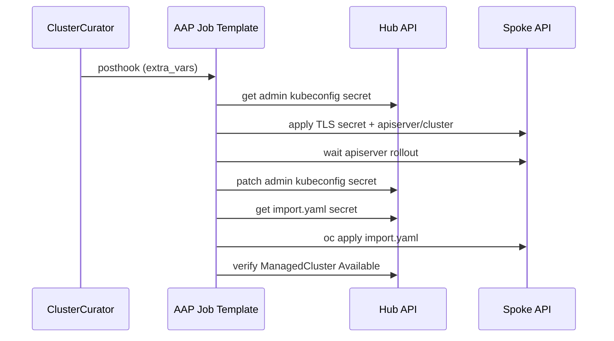

---
review:
  status: unreviewed
  notes: "AI-generated draft 2026-08-17. Playbook logic derived from ACM troubleshooting §1.7/§1.12 and managed-cluster-x509-after-api-cert-change.md. Not validated against a live AAP + CIM bare-metal hub."
---

# Post-Install API Cert + ACM Trust Sync (ClusterCurator)

**Audience:** Platform engineers using ACM CIM/Hive to provision bare-metal clusters who apply custom API serving certificates after install and need hub kubeconfig + klusterlet trust kept in sync automatically.

**Purpose:** Reference implementation for a `ClusterCurator` **postinstall** hook that:

1. Applies a custom API TLS secret and `apiserver/cluster` named certificate on the new spoke
2. Patches the hub's Hive admin kubeconfig secret (Path A)
3. Re-applies the ACM `import.yaml` on the spoke (Path B)

**Status:** Draft example — adapt secret names, AAP job template, and cert material to your PKI before production use.

**Related:**

- [managed-cluster-x509-after-api-cert-change.md](../../../../troubleshooting/managed-cluster-x509-after-api-cert-change.md) — failure mode and manual recovery
- [cluster-curator/README.md](../README.md) — ClusterCurator basics
- [bare-metal-lifecycle-hook-patterns.md](../../../../notes/bare-metal-lifecycle-hook-patterns.md) — hook timing and AAP wiring
- [Red Hat Solution 7076376](https://access.redhat.com/solutions/7076376)

---

## When to use this pattern

| Situation | Use this posthook? |
|-----------|-------------------|
| CIM bare-metal cluster just installed; custom API cert is next step | **Yes** |
| Corporate CA only (`additionalTrustBundle`) — API serving cert unchanged | **No** — set in install-config instead |
| Cert already applied manually; ACM is broken | **No** — run manual recovery in troubleshooting guide |
| Hub API cert changed | **No** — spoke klusterlet issue; different path |

**Design choice:** Install completes with **default** API certs → Hive auto-import succeeds → posthook swaps serving cert and immediately refreshes ACM trust.
Deferring custom certs until after import avoids the stale-kubeconfig race during provisioning.

---

## Architecture

```text
Cluster install completes (default API certs)
        │
        ▼
ClusterCurator posthook → AAP Job Template
        │
        ├─ 1. Read admin kubeconfig from hub (Hive secret) — still valid
        ├─ 2. Apply custom-api-tls + apiserver/cluster on spoke
        ├─ 3. Wait for kube-apiserver rollout
        ├─ 4. Patch kubeconfig CA → patch hub admin-kubeconfig secret
        ├─ 5. Re-apply import.yaml on spoke (klusterlet trust)
        └─ 6. Assert ManagedCluster Available
```



---

## Prerequisites

On the **hub:**

- RHACM + MCE with `cluster-curator-controller` running
- [AAP or AWX](../../../../notes/acm-ansible-integration.md) + Ansible Automation Platform Resource Operator
- `ClusterDeployment` with `hive.openshift.io/auto-import: "true"`
- `ClusterCurator` in the cluster namespace
- `towerAuthSecret` (AAP credentials) in the cluster namespace

On **AAP:**

- Job Template named `postinstall-api-cert-acm-sync` (or match `clustercurator.example.yaml`)
- **Prompt on launch → Extra Variables** enabled (required by ClusterCurator)
- Execution Environment with `oc`, `kubernetes.core` collection, Python 3
- Hub kubeconfig mounted or in-cluster SA with rights to:
  - Read/patch secrets in cluster namespace
  - Read `ClusterDeployment`, `ManagedCluster`
  - Apply manifests to spoke (via exported admin kubeconfig)

**Cert material** stored on hub (choose one):

- Kubernetes `Secret` in cluster namespace (see `manifests/cert-material-secret.example.yaml`)
- AAP credentials / HashiCorp Vault lookup in playbook

---

## Repository layout

```text
postinstall-api-cert-acm-sync/
├── README.md                              # This guide
├── clustercurator.example.yaml            # ClusterCurator posthook fragment
├── playbooks/
│   └── apply-api-cert-and-sync-acm-trust.yml
└── manifests/
    ├── cert-material-secret.example.yaml  # Hub: TLS key + CA for playbook
    ├── custom-api-tls-secret.example.yaml # Spoke: openshift-config TLS secret
    └── apiserver-cluster.example.yaml     # Spoke: apiserver/cluster named cert
```

---

## Step 1 — Store cert material on the hub

The playbook reads TLS cert, key, and the **CA clients should trust** from a hub secret.
The CA is used to update `certificate-authority-data` in the admin kubeconfig after the serving cert changes.

```bash
# Create from your PKI files (namespace = cluster name)
oc create secret generic api-cert-material \
  --namespace=prod-bm-01 \
  --from-file=tls.crt=/path/to/api.crt \
  --from-file=tls.key=/path/to/api.key \
  --from-file=ca.crt=/path/to/ca-chain.crt
```

See [manifests/cert-material-secret.example.yaml](manifests/cert-material-secret.example.yaml).

**SAN checklist:** `tls.crt` must include `api.<cluster>.<baseDomain>` and any VIP/DNS names clients use.

---

## Step 2 — Create the AAP Job Template

1. Add project/sync from this repo (or copy [playbooks/apply-api-cert-and-sync-acm-trust.yml](playbooks/apply-api-cert-and-sync-acm-trust.yml))
2. Create Job Template:
   - **Name:** `postinstall-api-cert-acm-sync`
   - **Playbook:** `playbooks/apply-api-cert-and-sync-acm-trust.yml`
   - **Inventory:** `localhost` (playbook targets `hosts: localhost`)
   - **Credentials:** Hub kubeconfig or K8s SA token with hub access
   - **Extra Variables → Prompt on launch:** **On**

Default extra vars (ClusterCurator can override):

```yaml
cluster_name: prod-bm-01
cluster_namespace: prod-bm-01
cert_material_secret: api-cert-material
api_tls_secret_name: custom-api-tls
api_dns_name: api.prod-bm-01.example.com
skip_api_cert_apply: false
skip_acm_sync: false
```

ClusterCurator also injects `cluster_deployment` automatically — the playbook uses it when `cluster_name` is omitted.

---

## Step 3 — Wire ClusterCurator

Add the posthook to your existing `ClusterCurator` (alongside OCM subscription or other hooks):

```bash
oc apply -f clustercurator.example.yaml
```

Or merge the `posthook` entry from [clustercurator.example.yaml](clustercurator.example.yaml) into your cluster bundle in Git.

**Hook order matters:** Run **after** install completes but **before** operators that depend on a stable ACM path need the spoke.
If you have other posthooks (OCM subscription, LDAP), run cert+ACM sync **first** or ensure downstream jobs tolerate brief `ManagedCluster` flapping.

---

## Step 4 — Monitor

```bash
CLUSTER=prod-bm-01

# Curator status
oc get clustercurator $CLUSTER -n $CLUSTER -o yaml

# Generated AnsibleJob
oc get ansiblejob -n $CLUSTER

# AAP job logs (controller UI) — look for "ACM trust sync complete"

# Validation
oc get managedcluster $CLUSTER \
  -o jsonpath='{range .status.conditions[*]}{.type}: {.status}{"\n"}{end}'

# Spoke klusterlet
oc --kubeconfig=/path/to/spoke-admin-kubeconfig get pods -n open-cluster-management-agent
```

---

## Playbook behavior (summary)

| Phase | Action | Failure symptom if skipped |
|-------|--------|---------------------------|
| Preflight | Confirm `ClusterDeployment` Provisioned, admin kubeconfig secret exists | Hook fails fast |
| Apply cert | Create `openshift-config/<api_tls_secret_name>`, patch `apiserver/cluster` | Spoke still on default cert |
| Rollout wait | Wait for `kube-apiserver` pods updated | Race — patch kubeconfig too early |
| Path A | Update CA in kubeconfig, patch hub admin secret | ACM hive-controller x509 |
| Path B | `oc apply` import.yaml on spoke | Klusterlet work-agent x509 |
| Validate | `ManagedClusterConditionAvailable == True` | Hook fails; investigate logs |

Set `skip_api_cert_apply: true` when cert is applied by GitOps elsewhere but ACM sync is still required.
Set `skip_acm_sync: true` for cert-only test runs.

---

## GitOps bundle example

Typical cluster namespace on hub:

```text
prod-bm-01/
├── clusterdeployment.yaml
├── agentclusterinstall.yaml
├── infraenv.yaml
├── clustercurator.yaml          # includes postinstall-api-cert-acm-sync posthook
├── secret-api-cert-material.yaml  # sealed secret or external-secrets ref
└── kustomization.yaml
```

Keep cert material and Curator hook in the **same** Git change as the `apiserver/cluster` SAN list so they cannot drift.

---

## Limitations and follow-ups

- **Cert renewal:** This posthook covers **initial** install.
  Schedule the same playbook (or a slim "ACM sync only" variant) for cert rotation via `ClusterCurator.spec.upgrade.posthook` or a standalone AAP workflow.
- **Multiple posthooks:** Each hook is a separate AAP job — use a Workflow Template if you need strict sequencing with rollback.
- **No AAP:** Use the manual steps in [managed-cluster-x509-after-api-cert-change.md](../../../../troubleshooting/managed-cluster-x509-after-api-cert-change.md) or Tekton equivalent ([cluster-curator README](../README.md#practical-alternative-tekton-pipeline-as-post-install-hook)).
- **EE dependencies:** Playbook uses `kubernetes.core` and `oc` CLI — confirm both exist in your Execution Environment.

---

## Troubleshooting the hook

| Symptom | Check |
|---------|-------|
| AnsibleJob stuck | `oc describe ansiblejob -n $CLUSTER`; AAP connectivity from hub |
| `adminKubeconfigSecretRef` empty | Install not fully Provisioned; wait for Hive |
| Apply cert fails on spoke | SAN mismatch; apiserver operator degraded |
| Path A ok, klusterlet still x509 | Path B skipped — confirm `import.yaml` applied on spoke |
| `ManagedCluster` Unknown after hook | Re-run playbook with `skip_api_cert_apply: true` to retry sync only |

---

*This content was created with AI assistance. See [AI-DISCLOSURE.md](../../../../../../AI-DISCLOSURE.md) for how to interpret AI-generated content in this workspace.*
