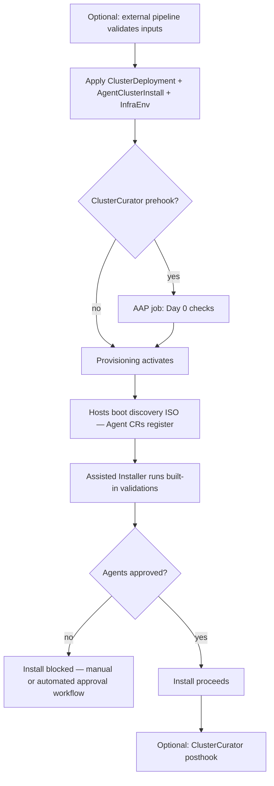

---
review:
  status: unreviewed
  notes: "AI-generated 2026-06-29. Synthesized from ACM ClusterCurator docs, assisted-service Hive integration, and workspace RHACM examples. Not yet validated against a live agent-based provisioning run in this environment."
---

# ACM Agent-Based Install — Preflight Orchestration

A practical map of how to run checks **before** an ACM-provisioned cluster installs via the Assisted Installer (agent-based / CIM path).

**Audience:** Platform engineers learning ACM who need to gate or automate pre-install validation for peers.

**Purpose:** Decide *where* preflight fits in the agent install lifecycle and which ACM mechanism to use at each stage.

**Prerequisites on the hub:** CIM enabled (`AgentServiceConfig`, etc.).
See [cim-hub-setup.md](./cim-hub-setup.md).
**Downstream install objects:** `InfraEnv`, `AgentClusterInstall`, `ClusterDeployment`.
See [BARE-METAL-OPERATOR-INTEGRATION.md](../examples/BARE-METAL-OPERATOR-INTEGRATION.md).

**Not covered here:** Importing an already-installed cluster, cloud IPI provisioning (Hive without agents), or standalone `openshift-install agent` outside ACM.

---

## The organizing question

ACM does not ship a single `PreflightCheck` CR.
Preflight is a **composition** of mechanisms at different points in the lifecycle.

The first decision is timing:

| When you need the check | Typical examples |
|-------------------------|------------------|
| **Before provisioning activates** | DNS records, IPAM reservations, BMC reachability, mirror catalog on hub, CMDB registration |
| **After agents register, before install runs** | Hardware inventory review, per-host role/disk selection, site-specific network validation |
| **Before ACM CRs exist** | Validate git inputs, render manifests only if prerequisites pass |

Most teams need at least two layers: hub-side Day 0 checks **and** a gate on agent approval.

---

## Lifecycle map



**Install starts only when** the Assisted Installer has enough ready hosts, validations pass, and agents are approved.
See [assisted-service Hive integration](https://github.com/openshift/assisted-service/blob/master/docs/hive-integration/README.md).

---

## Mechanism 1 — ClusterCurator install prehooks (ACM-native)

**ClusterCurator** runs Ansible jobs (via Ansible Automation Platform or AWX) around cluster lifecycle events.
For install, the curator job sequence is:

```
prehook Ansible → activate-and-monitor → Assisted Installer → posthook Ansible
```

This is the ACM-native way to orchestrate **custom** pre-install automation.

### Example

```yaml
apiVersion: cluster.open-cluster-management.io/v1beta1
kind: ClusterCurator
metadata:
  name: prod-bm-01
  namespace: prod-bm-01
spec:
  desiredCuration: install
  install:
    towerAuthSecret: aap-credentials
    prehook:
      - name: Pre-Installation Check
        extra_vars:
          check_network: true
          check_storage: true
          cluster_name: prod-bm-01
    posthook:
      - name: Post-Installation Validation
        extra_vars:
          validate_operators: true
```

### Pausing until prehooks complete

To make prehooks run **before** Hive activates provisioning, pause the `ClusterDeployment` first:

```yaml
apiVersion: hive.openshift.io/v1
kind: ClusterDeployment
metadata:
  name: prod-bm-01
  namespace: prod-bm-01
  annotations:
    hive.openshift.io/reconcile-pause: "true"
```

Create the `ClusterCurator` in the same namespace.
The curator runs prehooks, then `activate-and-monitor` resumes provisioning.
Documented in the [cluster-curator-controller README](https://github.com/stolostron/cluster-curator-controller).

### What prehooks are good for

- DNS / VIP / ingress record verification
- Out-of-band BMC or Redfish checks from the hub network
- IPAM reservations, CMDB updates
- Disconnected mirror / `osImages` readiness on the hub
- Any check that does **not** require agents to have booted yet

### What prehooks are not

Prehooks run **before provisioning activates**, not after agents have registered.
They do not replace per-host hardware review after ISO boot.

**Deeper examples:** [ClusterCurator education guide](../examples/ocm-subscription-automation/cluster-curator/README.md) and [architecture decision](../examples/ocm-subscription-automation/cluster-curator/CLUSTERCURATOR-ARCHITECTURE-DECISION.md).

**ZTP / GitOps:** Day 0 prehooks ship in the same bundle as `AgentClusterInstall` / `InfraEnv`.
See the ZTP section in [vmware-admins learning path](../../learning-path/vmware-admins/README.md).

---

## Mechanism 2 — Assisted Installer built-in validation (automatic)

Once hosts boot the discovery ISO and register as `Agent` CRs, the Assisted Installer runs its own validation suite.
`AgentClusterInstall` will not proceed until requirements are met.

Common checks include host count, CPU/memory/disk, network connectivity, DNS, and NTP.

### Inspect status

```bash
# Cluster-level requirement gate
oc get agentclusterinstall prod-bm-01 -n prod-bm-01 \
  -o jsonpath='{.status.conditions[?(@.type=="RequirementsMet")]}' | jq .

# Per-agent validation detail
oc get agents -n prod-bm-01 -o yaml | grep -A 20 validationsInfo
```

### Ignoring specific validations

`AgentClusterInstall` supports annotations to ignore named validations (cluster or host scope).
Red Hat documents this as a bypass for known edge cases — not a general preflight replacement.
See [Ignoring cluster and host validations](https://github.com/openshift/assisted-service/blob/master/docs/hive-integration/README.md#ignoring-cluster-and-host-validations) in assisted-service.

**Troubleshooting:** [AgentClusterInstall fails validation](../examples/BARE-METAL-OPERATOR-INTEGRATION.md#2-agentclusterinstall-fails-validation) in the bare metal integration guide.

---

## Mechanism 3 — Agent approval as an install gate

Install proceeds only when agents are **approved** in addition to passing validations.

Unapproved agents are excluded from the installation.
This is the practical hook for **post-discovery, pre-install** gating.

### Manual approval

```bash
oc -n prod-bm-01 patch agents.agent-install.openshift.io <agent-name> \
  -p '{"spec":{"approved":true}}' --type merge
```

### Automated approval workflow

A common pattern:

1. Leave `InfraEnv.spec.agentApproval.autoApprove` unset (default: manual).
2. Run an AAP playbook (or small controller) that watches `Agent` CRs.
3. Approve only when custom checks pass (inventory, role, disk, site labels).

`InfraEnv` can set `agentApproval.autoApprove: true` for hands-off provisioning.
Use that only when built-in validations are sufficient.

---

## Mechanism 4 — External pipeline before ACM CRs

When preflight must complete **before the hub sees any cluster objects**, run it outside the curator loop:

```
AAP / CI validates prerequisites
  → renders InfraEnv + AgentClusterInstall + ClusterDeployment (+ ClusterCurator)
  → applies to hub (or commits to Git for Argo CD)
```

This pattern appears in fleet automation where Jinja/Ansible renders CRs from inventory and only applies when upstream checks pass.
See [automate OCP cluster deployment with RHACM and AAP](../../../library/automate-ocp-cluster-deployment-rhacm-aap.md).

---

## Choosing a combination

| Goal | Recommended approach |
|------|----------------------|
| Learn ACM agent install with minimal moving parts | Built-in validations + manual agent approval |
| Day 0 hub/network checks before ISO generation | `ClusterCurator` install prehook (+ optional `reconcile-pause`) |
| Per-host gate after discovery | Agent approval workflow (manual or AAP) |
| GitOps / ZTP at scale | External render validation + `ClusterCurator` in Day 1 bundle + approval automation |
| Block install on custom business logic only | AAP prehook **and** approval workflow — neither alone covers both windows |

A workable default for production bare metal:

1. **ClusterCurator prehook** — site DNS, BMC, mirror, IPAM
2. **Assisted Installer validations** — accept as the hardware/network baseline
3. **Agent approval automation** — final human or policy gate before install

---

## Quick audit commands

Run on the **hub** during a provisioning attempt:

```bash
# Curator status (if using ClusterCurator)
oc get clustercurator -n <cluster-ns> -o yaml

# Provisioning pause annotation
oc get clusterdeployment -n <cluster-ns> \
  -o jsonpath='{.metadata.annotations.hive\.openshift\.io/reconcile-pause}{"\n"}'

# Agent registration and approval state
oc get agents -n <cluster-ns> -o custom-columns=\
NAME:.metadata.name,APPROVED:.spec.approved,ROLE:.spec.role,STATE:.status.debugInfo.state

# Install requirement gate
oc get agentclusterinstall -n <cluster-ns> -o yaml | grep -A5 'type: RequirementsMet'
```

---

## Limitations worth knowing

- **No generic preflight CR** — custom logic requires AAP/ClusterCurator, external pipeline, or approval automation.
- **Prehook timing** — runs before provisioning activates; not a substitute for post-ISO host review.
- **ClusterCurator scope** — install and upgrade hooks are the primary supported lifecycle integrations; validate destroy/scale needs against your ACM version.
- **Posthook timing on upgrades** — some upgrade posthooks have fired before all ClusterOperators finished updating (Red Hat KB [6992335](https://access.redhat.com/solutions/6992335)); design post-install validation accordingly.

---

## Related reading

| Topic | Location |
|-------|----------|
| Hub CIM / Assisted Installer setup | [cim-hub-setup.md](./cim-hub-setup.md) |
| `InfraEnv`, `AgentClusterInstall`, install workflow | [BARE-METAL-OPERATOR-INTEGRATION.md](../examples/BARE-METAL-OPERATOR-INTEGRATION.md) |
| ClusterCurator CRD examples | [cluster-curator/README.md](../examples/ocm-subscription-automation/cluster-curator/README.md) |
| Curator vs Ansible-as-provisioner | [CLUSTERCURATOR-ARCHITECTURE-DECISION.md](../examples/ocm-subscription-automation/cluster-curator/CLUSTERCURATOR-ARCHITECTURE-DECISION.md) |
| ZTP Day 0 / Day 1 framing | [vmware-admins learning path](../../learning-path/vmware-admins/README.md) |
| Red Hat — configure ClusterCurator | [ACM 2.10+ clusters docs](https://access.redhat.com/documentation/en-us/red_hat_advanced_cluster_management_for_kubernetes/2.10/html/clusters/managing-your-clusters#configuring-cluster-curator) |
| Assisted Installer + Hive API | [assisted-service Hive integration](https://github.com/openshift/assisted-service/blob/master/docs/hive-integration/README.md) |

---

*This content was created with AI assistance. See [AI-DISCLOSURE.md](../../../AI-DISCLOSURE.md) for how to interpret AI-generated content in this workspace.*
