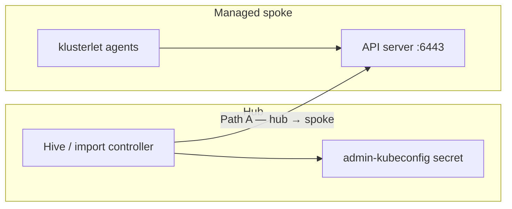

---
review:
  status: unreviewed
  notes: "AI-generated 2026-08-18. Synthesizes troubleshooting session on ACM x509 after spoke API cert rollout, GitOps/cert-manager delivery model, and Argo CD PostSync hook design. Not validated end-to-end on a live fleet."
---

# Custom API Certificates and ACM Trust — What We Learned

**Audience:** Platform engineers and architects operating an ACM hub with CIM-provisioned bare-metal spokes, applying custom API TLS via GitOps (cert-manager), and needing fleet management to stay healthy across cert rollouts.

**Purpose:** Share a concise mental model of why ACM breaks after API certificate changes, how to recover, and how to automate trust sync so day-2 cert work does not require manual firefighting.

**Context:** We hit `tls: failed to verify certificate: x509: certificate signed by unknown authority` on managed bare-metal clusters after custom API certificates were applied. Communications had been fine until the cert rollout. This document captures the root cause, recovery steps, and a recommended GitOps-native prevention pattern.

---

## Executive summary

| Point | Takeaway |
|-------|----------|
| **What broke** | ACM lost trust in the spoke API — not a generic network outage |
| **Why** | Hive captured an admin kubeconfig at import time; custom API certs changed what the API serves without updating ACM's stored trust |
| **Two paths** | Hub → spoke (hive/import controller) **and** spoke klusterlet → spoke API can both fail independently |
| **GitOps scope** | cert-manager + `Certificate` + `apiserver/cluster` = cert delivery; **ACM trust sync is a separate imperative step** |
| **Recommended fix** | Per-spoke Argo apps: `api-cert-<cluster>` on spoke + `acm-trust-sync-<cluster>` on hub with a PostSync Job |

---

## Background — how ACM uses TLS on managed clusters

ACM is not a single TLS session. At minimum, two independent HTTPS paths matter after a cluster is imported:



| Path | Client | Server | Trust stored in |
|------|--------|--------|-----------------|
| **A** | Hub controllers (Hive, policies, scaling) | Spoke API `:6443` | Hub secret: Hive admin kubeconfig in the cluster namespace |
| **B** | `klusterlet-registration-agent`, `klusterlet-work-agent` | Spoke API `:6443` | Klusterlet bootstrap / ACM import manifests on the spoke |

**Path A** is what we most often see in ACM console errors and `hive-controller` logs when a custom API cert is applied without updating hub state.

**Path B** shows up in `open-cluster-management-agent` pod logs on the spoke — the agents cannot verify their **own** cluster API after the serving cert changes.

ACM auto-rotates klusterlet **mTLS client** certs for hub registration. That is separate from API **serving** cert trust. Changing `apiserver/cluster` does not cause ACM to refresh the hub admin kubeconfig or re-bootstrap klusterlet.

---

## What triggers the failure

Typical sequence on CIM bare-metal:

```text
1. Cluster installs with default API certs
2. Hive auto-import succeeds — ManagedCluster Available
3. Day-2: custom API cert applied (manual, GitOps, cert-manager, corporate PKI)
4. Spoke API now serves a different cert chain
5. Hub still has old CA in admin kubeconfig → Path A breaks
6. Klusterlet agents still trust old spoke CA → Path B may break
7. ACM reports x509 / cluster Unknown / scaling and policies fail
```

This matches [Red Hat Solution 7076376](https://access.redhat.com/solutions/7076376) and ACM troubleshooting guidance for clusters that fail after API certificate changes.

**Common misread:** treating it as firewall or hub connectivity. If `curl -k https://api.<spoke>:6443/healthz` returns `ok` but `oc` fails TLS verification, the API is up — trust is wrong.

---

## Diagnosis (five minutes)

### On the hub

```bash
CLUSTER=<spoke-name>

oc get managedcluster $CLUSTER \
  -o jsonpath='{range .status.conditions[*]}{.type}: {.status} — {.message}{"\n"}{end}'

oc logs -n multicluster-engine \
  -l app=managedcluster-import-controller-v2 --tail=50 \
  | grep -iE 'x509|unknown authority'
```

Path A confirmed if logs show `Get "https://api.<spoke>...": x509: certificate signed by unknown authority`.

### On the spoke

```bash
oc logs -n open-cluster-management-agent \
  -l app=klusterlet-work-agent --tail=30 \
  | grep -iE 'x509|unknown authority'
```

Path B confirmed if errors reference the **spoke's own** API URL.

### Prove hub kubeconfig is stale

```bash
kubeconfig_secret=$(oc -n $CLUSTER get clusterdeployment $CLUSTER \
  -o jsonpath='{.spec.clusterMetadata.adminKubeconfigSecretRef.name}')

oc -n $CLUSTER get secret $kubeconfig_secret \
  -o jsonpath='{.data.kubeconfig}' | base64 -d > /tmp/hub-stored.kc

export KUBECONFIG=/tmp/hub-stored.kc
oc get ns   # expect x509 if stale
```

Full procedure: [managed-cluster-x509-after-api-cert-change.md](../troubleshooting/managed-cluster-x509-after-api-cert-change.md).

---

## Recovery (both paths)

Run after confirming the spoke API is healthy with a **fresh** kubeconfig (`oc get nodes` works).

### Path A — patch hub admin kubeconfig

```bash
# Export current cluster-admin kubeconfig from spoke (trusts new cert)
oc --kubeconfig=/path/to/fresh-spoke.kc config view --raw --minify > /tmp/new.kc

kubeconfig_b64=$(base64 -w0 /tmp/new.kc)
oc -n $CLUSTER patch secret $kubeconfig_secret \
  --type=json \
  -p="[{\"op\":\"replace\",\"path\":\"/data/kubeconfig\",\"value\":\"${kubeconfig_b64}\"}]"
```

### Path B — re-apply ACM import on spoke

```bash
oc get secret -n $CLUSTER ${CLUSTER}-import \
  -o jsonpath='{.data.import\.yaml}' | base64 -d > import.yaml

oc --kubeconfig=/path/to/fresh-spoke.kc apply -f import.yaml
```

Validate: `ManagedClusterConditionAvailable: True`, klusterlet pods healthy.

**Note:** Hive may resync admin kubeconfig on a ~2-hour cadence for provisioned clusters. Do not rely on that for intentional cert rollouts — and it does not fix Path B.

---

## Prevention — three approaches (pick by maturity)

| Approach | Cert apply | ACM sync trigger | Best for |
|----------|------------|------------------|----------|
| **Manual runbook** | GitOps or console | Engineer after cert merge | Few clusters, learning phase |
| **ClusterCurator postinstall** | Imperative in AAP job | Install posthook | No GitOps cert stack; see [draft example](../examples/ocm-subscription-automation/cluster-curator/postinstall-api-cert-acm-sync/README.md) |
| **Argo CD per-spoke apps** | GitOps on spoke | PostSync Job on hub | Fleet with ApplicationSets — **recommended** |

If certs are delivered via **GitOps + cert-manager**, install-time ClusterCurator is the wrong trigger: the cert Application syncs **after** install, often minutes later. ACM sync must run when the cert is **actually serving**, not when Hive finishes provisioning.

---

## GitOps scope — what cert-manager owns vs what ACM needs

### GitOps repo (spoke) should include

| Resource | Purpose |
|----------|---------|
| cert-manager operator | Issuance engine (early sync wave) |
| `ClusterIssuer` / `Issuer` | CA relationship |
| `Certificate` | API DNS SANs (`api.<cluster>.<domain>`, VIPs) |
| `Secret` in `openshift-config` | Where apiserver reads cert/key |
| `apiserver/cluster` `namedCertificates` | **Required** — cert-manager does not wire this automatically |

### GitOps does **not** solve

| Gap | Owner |
|-----|-------|
| Patch hub Hive admin kubeconfig secret | ACM trust sync automation |
| Re-apply `import.yaml` on spoke | ACM trust sync automation |
| Detect CA chain change vs leaf-only renewal | Sync job idempotency logic |

**Corporate CA only** (`additionalTrustBundle` in install-config) is a different problem — it adds trusted CAs cluster-wide and may not require kubeconfig patch if the API serving cert is unchanged.

---

## Recommended architecture — Argo CD per-spoke applications

Split cert delivery and ACM trust into **two sibling Applications** from the same ApplicationSet generator.

```text
ApplicationSet (one entry per cluster)
│
├── api-cert-prod-bm-01              destination: spoke
│     wave 30: Issuer, Certificate, apiserver/cluster
│
└── acm-trust-sync-prod-bm-01        destination: hub, namespace prod-bm-01
      wave 40: PostSync Job + RBAC
```

### Why two apps?

| Single app on spoke | Two apps |
|---------------------|----------|
| PostSync Job on spoke needs hub kubeconfig mounted | Hub-destined app runs where secrets live |
| Hub credentials on every spoke | Hub RBAC stays on hub |
| Couples cert Git to imperative ACM logic | Clear ownership: platform vs fleet glue |

Sync-wave the **Applications** themselves (your fleet framework already uses this for cert-manager at wave 10). The trust-sync app should run only after the cert app is Healthy.

### Inside `api-cert-<cluster>` — resource waves

```text
wave 10   ClusterIssuer
wave 20   Certificate
wave 25   apiserver/cluster namedCertificates
```

Argo marks the app Healthy when resources sync. The sync Job must **also** wait for:

- `Certificate` condition `Ready=True`
- `kube-apiserver` ClusterOperator `Progressing=False`

Issued cert ≠ apiserver finished rolling.

### Inside `acm-trust-sync-<cluster>` — PostSync hook

Argo CD [sync hooks](https://argo-cd.readthedocs.io/en/stable/user-guide/resource_hooks/) run imperative work at defined points in the sync lifecycle. Use **`PostSync`**: runs after all resources in the app are Synced and Healthy.

```yaml
apiVersion: batch/v1
kind: Job
metadata:
  name: acm-trust-sync
  namespace: prod-bm-01
  annotations:
    argocd.argoproj.io/hook: PostSync
    argocd.argoproj.io/hook-delete-policy: BeforeHookCreation
spec:
  backoffLimit: 2
  template:
    spec:
      restartPolicy: Never
      serviceAccountName: acm-trust-sync
      containers:
        - name: sync
          image: registry.example.com/platform/acm-trust-sync:v1
          env:
            - name: CLUSTER_NAME
              value: prod-bm-01
```

**Job logic (conceptual):**

```text
1. Wait Certificate Ready + kube-apiserver stable (poll spoke via admin kubeconfig from hub secret)
2. Read CA from issued Secret (openshift-config)
3. Update certificate-authority-data in admin kubeconfig → patch hub secret   (Path A)
4. Fetch *-import secret → oc apply on spoke                                  (Path B)
5. Wait ManagedCluster Available
6. Exit 0 (fail → Application Degraded → alert)
```

Structural reference for hook RBAC + waves: [vgpu-drain-check PreSync pattern](../../argo/examples/helm-component-pattern/components/nvidia-gpu-operator/instance/templates/vgpu-drain-check.yaml) and [Argo sync hooks lab](../../argo/labs/lab-argocd-sync/lab/LAB-SESSION-3.md).

### Hub RBAC (minimal)

ServiceAccount in namespace `<cluster-name>`:

| API | Verbs | Why |
|-----|-------|-----|
| `secrets` (admin kubeconfig, import) | get, patch / get | Paths A and B |
| `managedclusters` | get | Validate Available |

Spoke access uses the admin kubeconfig pulled from the hub secret — no extra spoke SA required if the Job runs on the hub.

---

## Idempotency and cert renewal

PostSync runs when the Argo Application syncs. Design the Job to avoid noise:

| Event | Action |
|-------|--------|
| Leaf renewal, same CA | Compare CA fingerprint in hub kubeconfig vs spoke Secret → exit 0, skip |
| CA or issuer change | Full Path A + B |
| Every Argo sync with no cert change | Fingerprint match → no-op |

cert-manager renews before expiry. Same CA usually means ACM stays healthy without re-sync. Re-run trust sync when the **chain** changes or x509 reappears.

For forced re-convergence on every sync, some teams use `Sync` hook + `BeforeHookCreation` instead of `PostSync` — same tradeoff as [Kafka GitOps Pattern C](../../ocp/examples/messaging/kafka/CLUSTER-LINK-GITOPS.md#pattern-c--argo-postsync--sync-hook-job).

---

## Alternative — Argo CD Notifications → AAP

If you already run Ansible Automation Platform with a trust-sync playbook:

```text
api-cert app → sync succeeds → Argo Notifications webhook → AAP Job Template
```

**Pros:** no custom container image; credentials in AAP.  
**Cons:** extra moving parts; must still wait for apiserver rollout inside the playbook.

See [acm-ansible-integration.md](./acm-ansible-integration.md) for native ACM → AAP paths.

---

## Team responsibility split

| Team / concern | Owns |
|----------------|------|
| **GitOps / platform** | cert-manager, Issuer, Certificate, apiserver/cluster manifests |
| **Fleet / ACM** | `acm-trust-sync` Application, hub RBAC, Job image or AAP template |
| **PKI / security** | CA chain, SAN list, renewal policy |
| **Network** | Hub ↔ spoke 6443/443 (unchanged by cert issue — unless TLS inspection in path) |

Store cert manifests and ACM sync automation in the **same Git change** when possible so they cannot merge independently.

---

## Failure modes to expect

| Symptom | Likely cause |
|---------|--------------|
| Cert app Healthy, ACM still x509 | Trust-sync app missing, failed, or not deployed yet |
| Path A fixed, klusterlet still errors | Path B skipped — import.yaml not re-applied |
| Hook runs before apiserver rollout | Job exited too early — add CO/Certificate wait |
| x509 after "successful" hook | Wrong CA in kubeconfig update (leaf vs issuing CA) |
| Works until next cert renewal | CA changed; idempotency gate needs chain comparison |

---

## What we would do on a greenfield fleet today

1. **`additionalTrustBundle`** in install-config when a corporate root must be trusted cluster-wide.
2. **Default API certs through Hive auto-import** — let import succeed cleanly.
3. **GitOps cert stack** on spoke (ApplicationSet, sync waves 10–30).
4. **Hub-destined `acm-trust-sync` app** at wave 40 with PostSync Job.
5. **Runbook** for manual recovery when automation is bypassed or fails.
6. **Alert** on `ManagedCluster` not Available + cert app recently synced.

---

## References

| Topic | Link |
|-------|------|
| Troubleshooting guide (recovery) | [managed-cluster-x509-after-api-cert-change.md](../troubleshooting/managed-cluster-x509-after-api-cert-change.md) |
| ClusterCurator imperative example (draft) | [postinstall-api-cert-acm-sync](../examples/ocm-subscription-automation/cluster-curator/postinstall-api-cert-acm-sync/README.md) |
| Red Hat KB | [Solution 7076376](https://access.redhat.com/solutions/7076376) |
| ACM docs — offline after cert change | [ACM 2.4 troubleshooting §1.12](https://docs.redhat.com/en/documentation/red_hat_advanced_cluster_management_for_kubernetes/2.4/html/troubleshooting/troubleshooting#clusters-offline-after-certificate-change) |
| Spoke API cert deadlock | [apiserver-cert-deadlock](../../ocp/troubleshooting/apiserver-cert-deadlock/README.md) |
| Git-driven fleet model | [git-driven-configuration.md](../git-driven-configuration.md) |
| Argo sync hooks lab | [LAB-SESSION-3.md](../../argo/labs/lab-argocd-sync/lab/LAB-SESSION-3.md) |
| Bare metal ACM networking | [acm-bare-metal-network-requirements.md](./acm-bare-metal-network-requirements.md) |

---

## Discussion questions for the team

1. Do we standardize on **two Applications per cluster** or accept hub kubeconfig on spokes for a single-app model?
2. Who owns the **acm-trust-sync** container image / AAP playbook lifecycle?
3. At what **sync wave** does api-cert sit relative to cert-manager and other platform apps?
4. Do we require **PostSync success** before promoting a cluster to production traffic?
5. How do we handle **break-glass** cert apply outside Git — mandatory trust-sync runbook step?

---

*This content was created with AI assistance. See [AI-DISCLOSURE.md](../../../AI-DISCLOSURE.md) for how to interpret AI-generated content in this workspace.*
