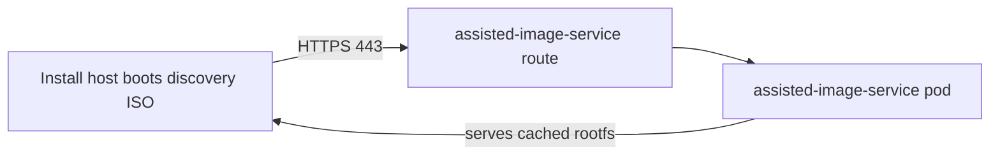

---
review:
  status: unreviewed
  notes: "AI-generated 2026-06-29 from live ACM agent-install diagnostic session. Diagnostic flow not yet validated end-to-end in this workspace environment."
---

# Troubleshooting: Agent Install Rootfs Download Fails (SSL Reset)

**Symptom:** A host booting the ACM discovery ISO (agent installer) stalls early in boot with a connectivity error to `assisted-image-service` on the hub.

Typical console output:

```text
Couldn't establish connectivity with the server specified by:
coreos.live.rootfs_url=https://assisted-image-service-multicluster-engine.apps.<hub-domain>/boot-artifacts/rootfs?arch=x86_64&version=4.20

curl: (35) OpenSSL SSL_connect: Connection reset by peer in connection to assisted-image-service-multicluster-engine.apps.<hub-domain>
```

**Audience:** Platform engineers provisioning on-prem clusters via ACM (CIM / Assisted Installer).

**Purpose:** Decide whether the failure is install-network reachability, DNS, proxy, or hub-side `assisted-image-service` health — and which team owns the fix.

**Prerequisite:** CIM enabled on the hub (`AgentServiceConfig`, assisted pods running).
See [cim-hub-setup.md](../notes/cim-hub-setup.md).

---

## What is failing

During early RHCOS live boot, the install host downloads a rootfs image from the hub's `assisted-image-service` route over HTTPS (port 443).
This is **install target → hub** traffic — separate from hub → Red Hat mirror egress.



The hub must already have cached the rootfs (from `mirror.openshift.com` or `AgentServiceConfig.spec.osImages`).
The booting host only pulls it from the hub route.

`curl: (35) Connection reset by peer` means TCP likely reaches something on 443, but the TLS handshake is aborted.
That pattern usually points to routing/firewall/proxy/DNS — not a missing RHCOS version on the hub.

---

## Step 1 — Reproduce from the install network

Run from a jump host on the **same VLAN/network** as the provisioning server — not from the hub or your laptop unless that network is identical.

```bash
HUB_DOMAIN=<hub-apps-domain>   # e.g. apps.hub.example.com
AIS_HOST="assisted-image-service-multicluster-engine.${HUB_DOMAIN}"
ROOTFS_URL="https://${AIS_HOST}/boot-artifacts/rootfs?arch=x86_64&version=4.20"

# DNS — must resolve to hub ingress / router VIP or LB
dig +short "$AIS_HOST"

# TLS — reproduce the boot failure
curl -v "$ROOTFS_URL"
```

If your install network uses a corporate proxy, also test with it:

```bash
curl -v -x http://proxy.example.com:8080 "$ROOTFS_URL"
```

### Interpret results

| `curl` / `dig` result | Likely cause | Typical owner |
|-----------------------|--------------|---------------|
| `Could not resolve host` | Install DNS lacks `*.apps.<hub-domain>` | DNS / network |
| `Connection timed out` | No route or firewall block to hub ingress | Network / firewall |
| `Connection reset by peer` (this symptom) | Middlebox RST, wrong backend on 443, or proxy needed but not in ISO | Network / proxy config |
| `SSL certificate problem` | TLS inspection without trusted CA on install path | Security / proxy |
| HTTP 200 or download starts | Install network OK — check hub pods (Step 2) | Platform |

Record the resolved IP from `dig` and confirm it matches the hub ingress VIP your firewall team expects.

---

## Step 2 — Confirm hub health

On the **hub** cluster:

```bash
# Route exists
oc get route -n multicluster-engine | grep assisted-image

# Pods ready
oc get pods -n multicluster-engine -l app=assisted-image-service
oc get pods -n multicluster-engine -l app=assisted-service

# InfraEnv already produced an ISO (hub cached images successfully)
oc get infraenv <name> -n <cluster-ns> \
  -o jsonpath='ImageCreated={.status.conditions[?(@.type=="ImageCreated")].status}{"\n"}'

oc get infraenv <name> -n <cluster-ns> \
  -o jsonpath='{.status.isoDownloadURL}{"\n"}'

# Image service logs — errors fetching or serving rootfs
AIS_POD=$(oc get pod -n multicluster-engine -l app=assisted-image-service \
  -o jsonpath='{.items[0].metadata.name}')
oc logs -n multicluster-engine "$AIS_POD" --tail=80
```

| Hub check | If unhealthy |
|-----------|--------------|
| `ImageCreated=False` | Fix hub-side mirror/proxy first — see [cim-hub-setup.md](../notes/cim-hub-setup.md) |
| `assisted-image-service` not Ready | Storage, proxy env, or `osImages` misconfiguration on hub |
| `ImageCreated=True` but Step 1 fails | Install-network path — not a hub image-cache problem |

---

## Step 3 — Work through common causes

### 1. Install network cannot reach hub ingress (most common)

Bare metal hosts often sit on a provisioning VLAN with BMC access but **no route** to the hub's apps ingress.

**Required:** Install target → hub `assisted-image-service` route on **HTTPS 443**.
See [networking-requirements-2.16.md](../notes/networking-requirements-2.16.md#assisted-installer--cim-on-prem-cluster-provisioning).

**Fix:** Open firewall/routing from the provisioning network to the hub ingress IP on 443.
Validate with `curl` from Step 1 before re-booting hosts.

### 2. DNS on install hosts differs from hub DNS

`assisted-image-service-multicluster-engine.apps.<domain>` must resolve from the **install host's DNS servers** — the ones configured in DHCP or static host config.

**Fix:** Add forward records (or conditional forward for `*.apps.<domain>`) on the DNS servers install targets actually use.

### 3. Corporate proxy required on install path

Hub-side proxy configuration does **not** propagate to booting install hosts.
Set proxy on the `InfraEnv`, then regenerate the discovery ISO:

```yaml
apiVersion: agent-install.openshift.io/v1beta1
kind: InfraEnv
metadata:
  name: example
spec:
  proxy:
    httpProxy: "http://proxy.example.com:8080"
    httpsProxy: "http://proxy.example.com:8080"
    noProxy: ".svc,.cluster.local,apps.<hub-domain>,10.0.0.0/8"
```

Include the hub ingress domain in `noProxy` when traffic to the hub should be direct.
See [cim-hub-setup.md — Install-target proxy](../notes/cim-hub-setup.md#install-target-proxy-infraenv).

Recreate or update the `InfraEnv` and wait for `ImageCreated=True` before re-booting.

### 4. Firewall / IDS SSL inspection or hard-deny

Some edge devices **RST** TLS sessions they cannot inspect instead of returning a certificate error.
Symptom matches `Connection reset by peer`.

**Fix:** Allowlist hub ingress, or bypass inspection for the assisted-service routes.
If inspection is required, ensure the discovery ISO / install config includes the proxy CA (TLS cert errors — different from RST — point here).

### 5. Hub `assisted-image-service` serving errors (less common for RST)

If the route targets a broken backend, clients may see failed handshakes or abrupt closes.
Confirm pods are Ready and logs are clean.

For disconnected hubs, verify `AgentServiceConfig.spec.osImages` includes a valid `rootFSUrl` for your OCP version and that the hub pod can fetch it.
That problem usually blocks `ImageCreated` before any host boots — but worth checking if hub logs show fetch failures.

---

## Decision tree

```text
InfraEnv ImageCreated=True?
├─ No  → hub mirror/proxy/storage (cim-hub-setup.md)
└─ Yes → curl rootfs URL from install network
         ├─ DNS fails        → fix install-network DNS
         ├─ timeout          → firewall / routing to hub ingress :443
         ├─ reset by peer    → proxy on InfraEnv, or firewall/IDS allowlist
         ├─ cert error       → proxy CA / TLS inspection trust
         └─ HTTP 200         → rare; collect assisted-image-service logs
```

---

## Information to collect for escalation

When handing off to network or Red Hat support, include:

```bash
# From install network
dig +short assisted-image-service-multicluster-engine.apps.<hub-domain>
curl -v "https://assisted-image-service-multicluster-engine.apps.<hub-domain>/boot-artifacts/rootfs?arch=x86_64&version=<ocp-version>" 2>&1 | tail -30

# From hub
oc get infraenv <name> -n <ns> -o yaml | grep -A5 'type: ImageCreated'
oc get route,pods -n multicluster-engine | grep assisted
oc logs -n multicluster-engine -l app=assisted-image-service --tail=50
```

---

## Related reading

| Topic | Location |
|-------|----------|
| CIM hub setup, corporate proxy, mirror | [cim-hub-setup.md](../notes/cim-hub-setup.md) |
| Required ports (install target → hub) | [networking-requirements-2.16.md](../notes/networking-requirements-2.16.md) |
| InfraEnv, AgentClusterInstall workflow | [BARE-METAL-OPERATOR-INTEGRATION.md](../examples/BARE-METAL-OPERATOR-INTEGRATION.md) |
| Preflight before ISO boot | [agent-install-preflight.md](../notes/agent-install-preflight.md) |
| Disconnected mirror stack | [disconnected-install working guide](../../ocp/disconnected-install/working-guide.md) |

---

*This content was created with AI assistance. See [AI-DISCLOSURE.md](../../../AI-DISCLOSURE.md) for how to interpret AI-generated content in this workspace.*
