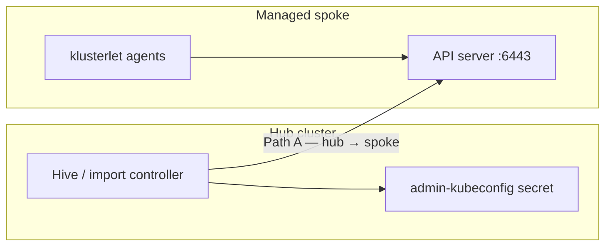

---
review:
  status: unreviewed
  notes: "AI-generated 2026-08-17 from live troubleshooting session. Recovery steps sourced from ACM 2.4+ troubleshooting docs and Red Hat Solution 7076376. Automation/prevention section not yet validated against a CIM bare-metal fleet."
---

# Troubleshooting: x509 Unknown Authority After API Certificate Change

**Symptom:** ACM reports TLS failures against a managed cluster after custom or corporate API certificates are applied — commonly:

> `tls: failed to verify certificate: x509: certificate signed by unknown authority`

**Audience:** Platform engineers managing ACM hub + spoke bare-metal fleets where day-2 certificate rollouts (custom API serving certs, corporate CA, `additionalTrustBundle`) break fleet management.

**Purpose:** Identify which TLS path broke (hub → spoke vs spoke internal), recover connectivity, and choose an install-time or automated pattern so cert rollouts do not require manual firefighting.

**Typical trigger:** Communications worked until API certificates were applied on one or more clusters.
Most often the **spoke** API cert changed while the hub still holds a **stale admin kubeconfig** from import time.

---

## How ACM Uses TLS (Two Independent Paths)

After a spoke API cert changes, **both** paths can break independently:

| Path | Client | Server | Stale trust stored in |
|------|--------|--------|------------------------|
| **A — Hub → spoke** | Hive, import controller, policies | Spoke API `:6443` | Hub secret: admin kubeconfig in cluster namespace |
| **B — Spoke klusterlet → spoke API** | `klusterlet-registration-agent`, `klusterlet-work-agent` | Spoke API `:6443` | Klusterlet bootstrap / import manifests on spoke |

Path **A** is the usual root cause when ACM console, scaling, or `hive-controller` logs show x509 against the spoke API URL.
Path **B** shows x509 in `open-cluster-management-agent` pod logs on the **spoke**, often with the cluster going `offline` in the console.



**Not this guide:**

- x509 on **hub API** from spoke klusterlet → spoke does not trust hub cert.
  See [managed-cluster-lease-not-updated.md](./managed-cluster-lease-not-updated.md) Scenario D.
- x509 during **worker provisioning** (MCS `:22623`) → [Worker Node TLS Certificate Failure](../../ocp/troubleshooting/worker-node-tls-cert-failure/README.md).
- Spoke `oc` fails TLS before ACM is involved → fix spoke API cert first:
  [API Server Certificate Deadlock](../../ocp/troubleshooting/apiserver-cert-deadlock/README.md).

---

## Step 1 — Confirm the Spoke API Is Healthy

Before patching ACM, verify the spoke API serves a consistent cert chain:

```bash
# From a host that can reach the spoke API
oc --kubeconfig=/path/to/current-spoke-kubeconfig get nodes

echo | openssl s_client -connect api.<spoke-domain>:6443 \
  -servername api.<spoke-domain> 2>/dev/null \
  | openssl x509 -noout -subject -issuer -dates
```

If `oc` fails here, remediate the spoke API cert before continuing.

---

## Step 2 — Identify Which Path Broke

### 2a. Hub-side symptoms (Path A)

On the **hub**:

```bash
CLUSTER=<spoke-name>

oc get managedcluster $CLUSTER \
  -o jsonpath='{range .status.conditions[*]}{.type}: {.status} — {.message}{"\n"}{end}'

# Hive / import controller (CIM-provisioned clusters)
oc logs -n multicluster-engine \
  -l app=managedcluster-import-controller-v2 --tail=80 \
  | grep -iE "x509|unknown authority|$CLUSTER"

oc logs -n hive -l hive.openshift.io/cluster-deployment=true --tail=80 \
  | grep -iE "x509|unknown authority|$CLUSTER"
```

Common log pattern (Path A confirmed):

```text
Get "https://api.<spoke-domain>:6443/api?timeout=32s": x509: certificate signed by unknown authority
```

### 2b. Spoke klusterlet symptoms (Path B)

On the **spoke**:

```bash
oc logs -n open-cluster-management-agent \
  -l app=klusterlet-work-agent --tail=50 \
  | grep -iE 'x509|unknown authority'

oc logs -n open-cluster-management-agent \
  -l app=klusterlet-registration-agent --tail=50 \
  | grep -iE 'x509|unknown authority'
```

Path B logs reference the **spoke's own** API URL in failed `Get`/`watch` calls.

---

## Step 3 — Prove the Hub Admin Kubeconfig Is Stale (Path A)

On the **hub**:

```bash
CLUSTER=<spoke-name>

# CIM / Hive-provisioned
kubeconfig_secret_name=$(oc -n $CLUSTER get clusterdeployment $CLUSTER \
  -o jsonpath='{.spec.clusterMetadata.adminKubeconfigSecretRef.name}' 2>/dev/null)

# Manually imported — if no ClusterDeployment, find the secret:
# oc get secrets -n $CLUSTER | grep -i kubeconfig

echo "Secret: ${kubeconfig_secret_name:-NOT FOUND}"

oc -n $CLUSTER get secret "$kubeconfig_secret_name" \
  -o jsonpath='{.data.kubeconfig}' | base64 -d > /tmp/hub-stored-kubeconfig

export KUBECONFIG=/tmp/hub-stored-kubeconfig
oc get ns
# Expected if stale: x509: certificate signed by unknown authority
```

Compare CAs:

```bash
# CA embedded in hub's stored kubeconfig
grep certificate-authority-data /tmp/hub-stored-kubeconfig | awk '{print $2}' \
  | base64 -d | openssl x509 -noout -subject -issuer

# Issuer the spoke API presents now
echo | openssl s_client -connect api.<spoke-domain>:6443 \
  -servername api.<spoke-domain> 2>/dev/null \
  | openssl x509 -noout -issuer
```

Different issuers → Path A confirmed.

---

## Step 4 — Recover Path A (Patch Hub Admin Kubeconfig)

### 4a. Export a current kubeconfig from the spoke

Use any valid cluster-admin kubeconfig that trusts the **new** spoke API cert:

```bash
oc --kubeconfig=/path/to/current-spoke-kubeconfig config view --raw --minify \
  > /tmp/spoke-kubeconfig-new
```

### 4b. Patch the secret on the hub

```bash
CLUSTER=<spoke-name>
kubeconfig_secret_name=<from step 3>

kubeconfig=$(base64 -w0 /tmp/spoke-kubeconfig-new)

oc -n $CLUSTER patch secret "$kubeconfig_secret_name" \
  --type=json \
  -p="[{\"op\":\"replace\",\"path\":\"/data/kubeconfig\",\"value\":\"${kubeconfig}\"}]"
```

### 4c. Verify

```bash
oc -n $CLUSTER get secret "$kubeconfig_secret_name" \
  -o jsonpath='{.data.kubeconfig}' | base64 -d > /tmp/hub-stored-kubeconfig

export KUBECONFIG=/tmp/hub-stored-kubeconfig
oc get nodes

oc get managedcluster $CLUSTER \
  -o jsonpath='{range .status.conditions[*]}{.type}: {.status} — {.message}{"\n"}{end}'
```

Official references:

- [ACM troubleshooting — reimporting cluster fails with unknown authority error](https://docs.redhat.com/en/documentation/red_hat_advanced_cluster_management_for_kubernetes/2.4/html/troubleshooting/troubleshooting#reimporting-cluster-fails-with-unknown-authority-error)
- [Red Hat Solution 7076376](https://access.redhat.com/solutions/7076376)

---

## Step 5 — Recover Path B (Re-import on Spoke)

Required when klusterlet agents on the spoke cannot verify the spoke API cert.

**On hub** — extract import manifest:

```bash
CLUSTER=<spoke-name>

oc get secret -n $CLUSTER ${CLUSTER}-import \
  -o jsonpath='{.data.import\.yaml}' | base64 -d > import.yaml
```

**On spoke** — re-apply:

```bash
oc apply -f import.yaml
```

Watch recovery:

```bash
oc get pods -n open-cluster-management-agent
oc logs -n open-cluster-management-agent \
  -l app=klusterlet-registration-agent --tail=30
```

Per ACM docs, Hive-provisioned clusters may also resync admin kubeconfig on a ~2-hour cadence — manual re-import is faster for Path B.

Reference: [ACM troubleshooting — clusters offline after certificate change](https://docs.redhat.com/en/documentation/red_hat_advanced_cluster_management_for_kubernetes/2.4/html/troubleshooting/troubleshooting#clusters-offline-after-certificate-change).

---

## Recovery Checklist (Both Paths)

Use after any spoke API cert rollout:

```text
[ ] Spoke oc get nodes works with a fresh kubeconfig
[ ] Hub admin kubeconfig secret patched (Path A)
[ ] import.yaml re-applied on spoke if klusterlet logs show x509 (Path B)
[ ] ManagedCluster conditions return Available: True
[ ] Hive / import controller logs clean of x509 for this cluster
```

---

## Prevention — Install-Time and Lifecycle Integration

The failure mode is predictable: **Hive captures admin kubeconfig at provision time**.
Any later API cert change invalidates that snapshot unless something updates it.

### Option 1 — Corporate CA in `install-config` (recommended baseline)

If the goal is trust for a **corporate root/intermediate** (not replacing the API serving cert), add `additionalTrustBundle` to the install-config secret **before** the cluster installs:

```yaml
# In the install-config Secret referenced by ClusterDeployment.spec.provisioning.installConfigSecretRef
additionalTrustBundle: |
  -----BEGIN CERTIFICATE-----
  ... corporate CA ...
  -----END CERTIFICATE-----
```

This does **not** replace custom API **serving** certs — it adds trusted CAs cluster-wide.
See [disconnected-install working guide](../../ocp/disconnected-install/working-guide.md) and [cim-hub-setup.md](../notes/cim-hub-setup.md#proxy-ca-tls-inspection).

### Option 2 — Defer custom API serving certs until post-install automation exists

Custom API serving certs (`openshift-config` TLS secret + `apiserver/cluster`) change what clients see on `:6443`.
Applying them **after** auto-import without updating hub secrets triggers this guide.

**Safer sequence for CIM bare metal:**

1. Let Hive auto-import complete with default API certs (`hive.openshift.io/auto-import: "true"`).
2. Apply custom serving cert on spoke ([apiserver-cert-deadlock Step 5](../../ocp/troubleshooting/apiserver-cert-deadlock/README.md#step-5-user-provided-api-server-certificates-openshift-config)).
3. Immediately run Path A + Path B recovery (or automated equivalent below).

### Option 3 — ClusterCurator postinstall hook (automate recovery)

For fleets using [ClusterCurator](../examples/ocm-subscription-automation/cluster-curator/README.md), a **postinstall** Ansible job can:

1. Apply custom API cert manifests (if not applied during install).
2. Export fresh admin kubeconfig from the new cluster.
3. Patch the hub `adminKubeconfig` secret (Step 4b).
4. Re-apply `import.yaml` on the spoke (Step 5).

**Draft example:** [postinstall-api-cert-acm-sync](../examples/ocm-subscription-automation/cluster-curator/postinstall-api-cert-acm-sync/README.md) — ClusterCurator wiring, playbook, and manifest templates.

Pattern reference: [bare-metal-lifecycle-hook-patterns.md](../notes/bare-metal-lifecycle-hook-patterns.md).

Illustrative curator fragment:

```yaml
apiVersion: cluster.open-cluster-management.io/v1beta1
kind: ClusterCurator
metadata:
  name: prod-bm-01
  namespace: prod-bm-01
spec:
  install:
    posthook:
      - name: postinstall-api-cert-acm-sync   # AAP Job Template name
        extra_vars:
          cluster_name: prod-bm-01
          api_tls_secret_name: custom-api-tls
          api_dns_name: api.prod-bm-01.example.com
  towerAuthSecret: aap-credentials
```

The Ansible playbook (or Go binary in a custom EE) owns the imperative steps — ACM does not auto-patch hub kubeconfig when `apiserver/cluster` changes.

### Option 4 — Extra manifests at install time (advanced)

Custom API serving certs **can** be applied during install by including manifests in the install-config or via `AgentClusterInstall` manifest references — but the cluster must come up serving the final cert **before** Hive snapshots the admin kubeconfig.

Tradeoffs:

| Approach | Pros | Cons |
|----------|------|------|
| Certs in install-config / day-0 manifests | Hub snapshot matches final cert from first import | Harder to debug install failures; cert rotation still needs Path A/B on renewal |
| Certs via postinstall Curator hook | Install uses defaults; automation handles ACM sync | Requires AAP/EE; two-phase install |
| Manual day-2 cert + manual recovery | Simple to start | Does not scale; caused this incident |

### Option 5 — Hive periodic resync (passive, not sufficient alone)

Hive may refresh admin kubeconfig for `ClusterDeployment`-managed clusters on a ~2-hour interval.
Do not rely on this for intentional cert rollouts — ACM stays broken until sync, and klusterlet Path B is not fixed by hub kubeconfig patch alone.

### What ACM does **not** do automatically

- Patch hub admin kubeconfig when spoke `apiserver/cluster` serving certs change.
- Re-bootstrap klusterlet trust when spoke API CA changes (requires `import.yaml` re-apply or equivalent).
- Propagate corporate `trustedCA` from hub proxy to spoke klusterlet (klusterlet bypasses HTTP proxy; see [acm-bare-metal-network-requirements.md](../notes/acm-bare-metal-network-requirements.md)).

ACM **does** auto-rotate klusterlet **mTLS client** certs for hub registration — that is separate from API **serving** cert trust.

---

## Automation Design Notes

When building a cert rollout pipeline for CIM-provisioned bare metal:

```text
Cert change requested
├─ Is this additionalTrustBundle / corporate CA only?
│   └─ Yes → install-config or MachineConfig + hub/spoke proxy trustedCA; may not need kubeconfig patch
└─ Is this custom API serving cert (apiserver/cluster)?
    ├─ Apply cert on spoke (openshift-config secret + apiserver/cluster)
    ├─ Verify oc get nodes on spoke
    ├─ Patch hub admin-kubeconfig secret (Path A) — automate via Curator/AAP or script
    ├─ Re-apply import.yaml on spoke (Path B)
    └─ Validate ManagedCluster Available + hive-controller logs clean
```

**GitOps tip:** Store the post-cert remediation playbook beside the cert manifests so the cert PR and ACM-sync PR land together — or use a single Curator posthook so they cannot diverge.

**Governance:** ACM cert policies (`cert-policy-controller`) enforce cert expiry on workloads — they do not reconcile hub admin kubeconfig trust.

---

## Quick Reference

| Symptom location | Path | Fix |
|----------------|------|-----|
| `hive-controller` / import controller logs | A | Patch hub admin kubeconfig secret |
| `klusterlet-work-agent` logs on spoke | B | Re-apply `import.yaml` on spoke |
| Both | A + B | Step 4 then Step 5 |
| `oc` fails on spoke before ACM | Spoke API | [apiserver-cert-deadlock](../../ocp/troubleshooting/apiserver-cert-deadlock/README.md) |
| x509 to **hub** API from spoke | Spoke → hub | Delete `hub-kubeconfig-secret`; restart registration agent |

---

## Related Reading

| Topic | Location |
|-------|----------|
| Klusterlet lease / hub connectivity | [managed-cluster-lease-not-updated.md](./managed-cluster-lease-not-updated.md) |
| Spoke API cert deadlock | [apiserver-cert-deadlock](../../ocp/troubleshooting/apiserver-cert-deadlock/README.md) |
| Bare metal ACM network (klusterlet + proxy) | [acm-bare-metal-network-requirements.md](../notes/acm-bare-metal-network-requirements.md) |
| CIM provisioning objects | [BARE-METAL-OPERATOR-INTEGRATION.md](../examples/BARE-METAL-OPERATOR-INTEGRATION.md) |
| Lifecycle hooks / Curator patterns | [bare-metal-lifecycle-hook-patterns.md](../notes/bare-metal-lifecycle-hook-patterns.md) |
| Postinstall cert + ACM sync example | [postinstall-api-cert-acm-sync](../examples/ocm-subscription-automation/cluster-curator/postinstall-api-cert-acm-sync/README.md) |
| Peer share — GitOps + Argo trust sync design | [custom-api-certs-and-acm-trust.md](../notes/custom-api-certs-and-acm-trust.md) |
| RHACM troubleshooting index | [README.md](./README.md) |

---

*This content was created with AI assistance. See [AI-DISCLOSURE.md](../../../AI-DISCLOSURE.md) for how to interpret AI-generated content in this workspace.*
