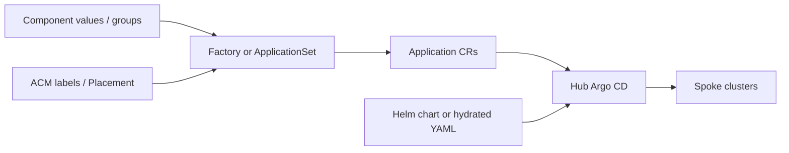

# GitOps patterns for an OpenShift fleet

> **Audience:** Platform engineers choosing how Argo CD should multiply Applications and author payloads across a fleet.
> **Purpose:** Separate *control plane* from *payload*, and *Git-time* from *sync-time*, then map those choices onto the examples already in this workspace.

Helm-in-Argo, ApplicationSets, and a values-driven factory that emits Application CRs are not three substitutes.
They sit on two axes.
A fleet that picks one pattern for every layer usually fails at the layer that did not match.

The widget is the half-step: markdown for the argument, HTML for the comparison you can click.

---

## What this workspace already implements

The abstract names map onto concrete trees.

| Pattern in the widget | What it is here | What Git stores today |
| --- | --- | --- |
| Values factory → Applications | [Helm component pattern](devops/argo/examples/helm-component-pattern/README.md) | Group and cluster *values*. Hub Applications are committed under `hub/rendered/`. Component Applications are live-rendered by `hub-clusters`. |
| ApplicationSet | [Fleet framework](devops/argo/examples/framework/README.md) | One ApplicationSet per app. ACM labels come from [cluster-label-sync](devops/argo/examples/framework/hub/applicationsets/cluster-label-sync.yaml) — a hub Application, not an AppSet. |
| Argo App + Helm payload | Standalone [Applications](devops/argo/examples/README.md) and most operand charts | Application CR + chart + value files. Argo expands Helm at sync. |

That split is already visible in [diffing and visibility](devops/argo/examples/helm-component-pattern/docs/diffing-and-visibility.md):
a values change in `groups/all/values.yaml` is not the same artifact as the Application objects that will exist after merge.
`hub/rendered/` exists because reviewers needed a Git-time snapshot of the *control plane*, not because Helm was abandoned as *payload*.

RHACM vs Argo CD as products is a different question — see [Fleet control spectrum](devops/fleet-control-spectrum.md).
This page is only about how GitOps *authoring* expands.

---

## Two questions

**What is being templated?**

- **Control plane** — which `Application` CRs exist, on which clusters.
- **Payload** — the objects those Applications apply (Subscriptions, MachineConfigs, Deployments).

**When does expansion happen?**

- **Sync-time** — Argo Helm or the ApplicationSet controller expands in-cluster. Git stores inputs.
- **Git-time** — CI (`helm template`, or `argocd appset generate`) writes the output. The PR shows Applications, or the final YAML.

The Helm component pattern is a control-plane factory.
Cluster types become data (`virt-enabled`, SNO, `installPlanApproval: Manual`).
The chart emits Applications.
Whether those Applications are committed or live-rendered is the Git-time vs sync-time fork *inside* that pattern — already documented as a partial-render design.

---

## OpenShift fleet layers

ACM, GitOps, Policy, and Helm fail when one of them is asked to own inventory, mandates, composition, and application delivery at once.

| Layer | Source of truth | Control plane | Payload |
| --- | --- | --- | --- |
| Cluster lifecycle | ACM / Hive / Assisted | ACM | Install-time config, not Argo |
| Mandates | Policy + Placement | ACM | Policy templates. Sync status is not compliance. |
| Cluster settings / addons | Git catalog of cluster types | Factory and/or AppSet from ACM labels | Thin OLM Subscriptions. Hydrate MachineConfig / OAuth / SCC when blast radius demands it. |
| Tenant contract | One folder or repo per tenant | ApplicationSet git generator | Platform-owned Helm or Kustomize package |
| Tenant applications | App team chart + values | Self-service Application, or AppSet per team | Helm-in-Argo unless audit requires hydration |

---

## A composition that has held in practice

Render — or generate into Git — the control plane for cluster addons, so a values change shows *which Applications appear on which clusters* before the hub applies anything.
Automatic membership is often the wrong default for operators.

Let ApplicationSet live-generate where membership *is* the point: ACM labels, tenant folder drops.

Keep Helm as payload when the chart is the product.
Tired of cloning Application YAML is a multiplier problem.
The factory and ApplicationSet are the multipliers; abandoning Helm does not fix that.

Hydrate payload YAML where blast radius or policy demands it.
A one-line values change that rewrites a `MachineConfig` should not be reviewed as a values change.

ApplicationSet and the values factory do the same job with different inventories.
ApplicationSet wins when ACM or a directory tree already *is* the list.
The factory wins when people think in a component catalog and want a values schema.
The helm-component-pattern and the fleet framework in this repo are those two inventories, not competing religions.

---

=== "Factory"

    Use when cluster types are data and reviewers need to see the Application matrix.
    Start at [helm-component-pattern](devops/argo/examples/helm-component-pattern/README.md) and [architecture opinions](devops/argo/examples/helm-component-pattern/docs/architecture-opinions.md).

=== "ApplicationSet"

    Use when ACM Placement or a tenant folder tree is the inventory.
    Start at the [fleet framework](devops/argo/examples/framework/README.md).

=== "Helm payload"

    Use when the chart *is* the contract.
    Keep Application CRs boring; multiply them with one of the other two.

---

## Related

- [Argo CD hub](devops/argo/README.md)
- [Interactive PoC](interactive-poc.md) — how this kind of page is wired (CSS/JS mount, Material tabs)
- [argocd-diff-preview](https://github.com/dag-andersen/argocd-diff-preview) — desired-state-to-desired-state diffs on a PR

*This content was created with AI assistance. See [AI-DISCLOSURE.md](AI-DISCLOSURE.md) for how to interpret AI-generated content in this workspace.*
