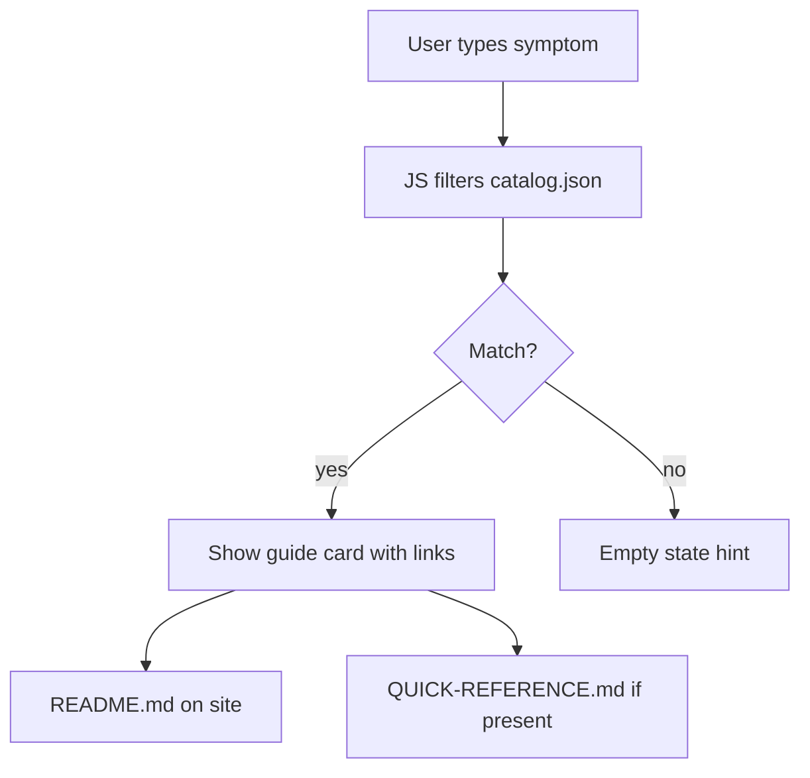

# Interactive PoC — Advanced Site Behaviors

> **Audience:** You, learning what this MkDocs setup can do beyond static markdown.
> **Purpose:** Demonstrates custom CSS/JS, build-time JSON export, Mermaid, and Material tabs on one page.

This page is **not** part of the main `devops/` or `docs/` trees.
It lives in `docs-site/` at the repo root and is staged into the build explicitly.

---

## What this proves

| Technique | Where it lives (repo) |
|-----------|------------------------|
| Custom CSS + JS on a doc page | `docs-site/assets/poc/` |
| Build-time data for the browser | `scripts/export-catalog-json.py` → `catalog.json` |
| Raw HTML mount point in markdown | `#symptom-picker-app` below |
| Mermaid diagram | fenced `mermaid` block |
| Material tabs | `pymdownx.tabbed` (in `mkdocs.yml`) |

The widget below reads **`catalog.json`** (exported from `devops/catalog.yaml`) and filters guides client-side.
See also the [Symptom index](devops/SYMPTOM-INDEX.md) for the static table view.

---

## Interactive symptom picker

Type an error or symptom, or click a category chip.

---

=== "Static markdown"

    Troubleshooting content stays in markdown under `devops/`.
    The site generator copies it unchanged; links resolve on GitHub and in the built site.

=== "Build-time JSON"

    `scripts/export-catalog-json.py` flattens `catalog.yaml` for the browser.
    Regenerated on every `bash scripts/build-docs.sh`.

=== "Client-side JS"

    `symptom-picker.js` loads only when `#symptom-picker-app` exists.
    Category chips and search filter without a round-trip to the server.

---

## Mermaid — static diagram (rendered at build time)

---

## How to extend

1. Add assets under `docs-site/assets/<demo>/`
2. Export any YAML/JSON in `scripts/` during `build-docs.sh`
3. Register global or page-specific JS in `mkdocs.yml` → `extra_javascript`
4. For heavy apps (React/Vite), build separately and iframe or link from here

*PoC page — see [AI-DISCLOSURE.md](AI-DISCLOSURE.md).*
